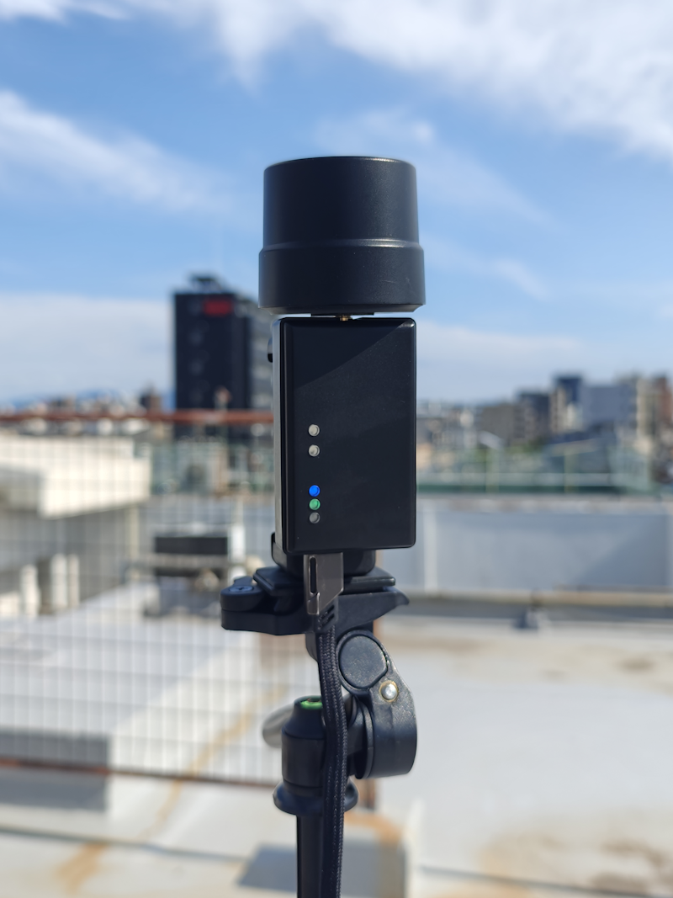
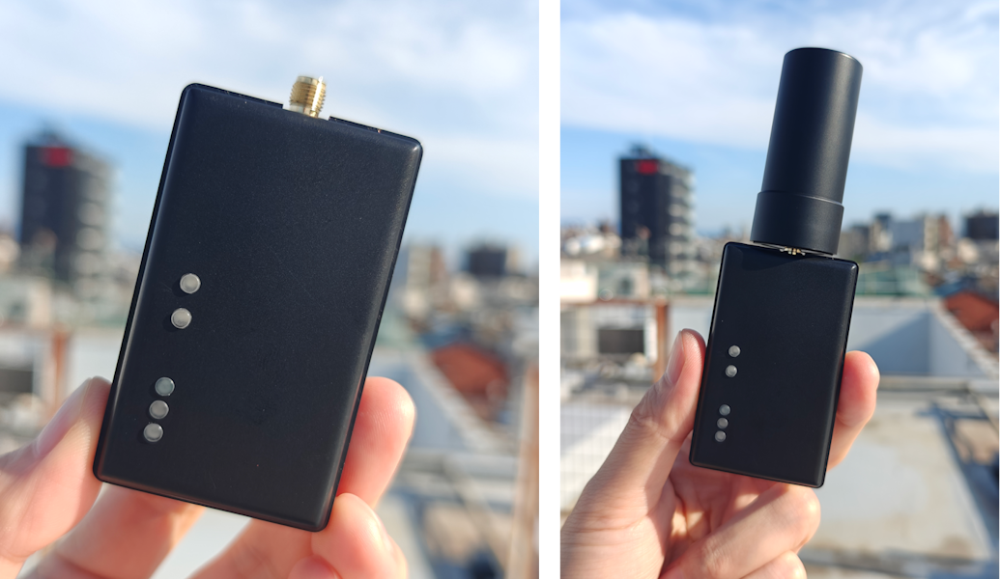
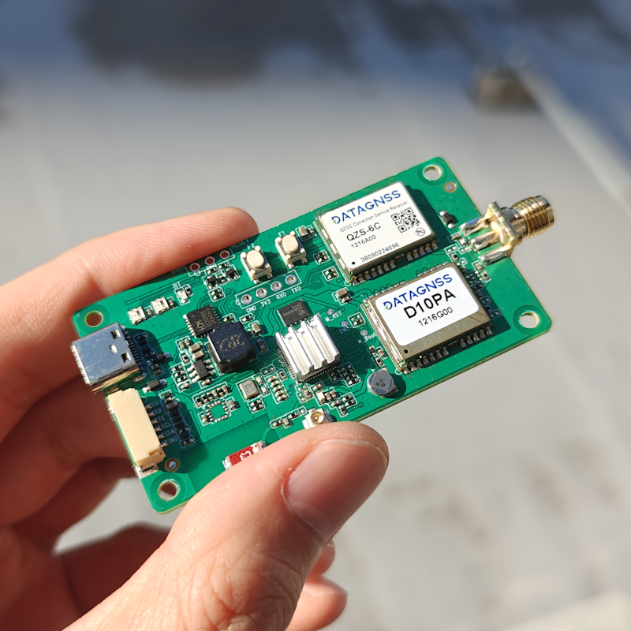
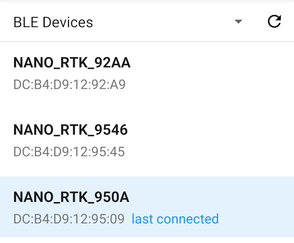
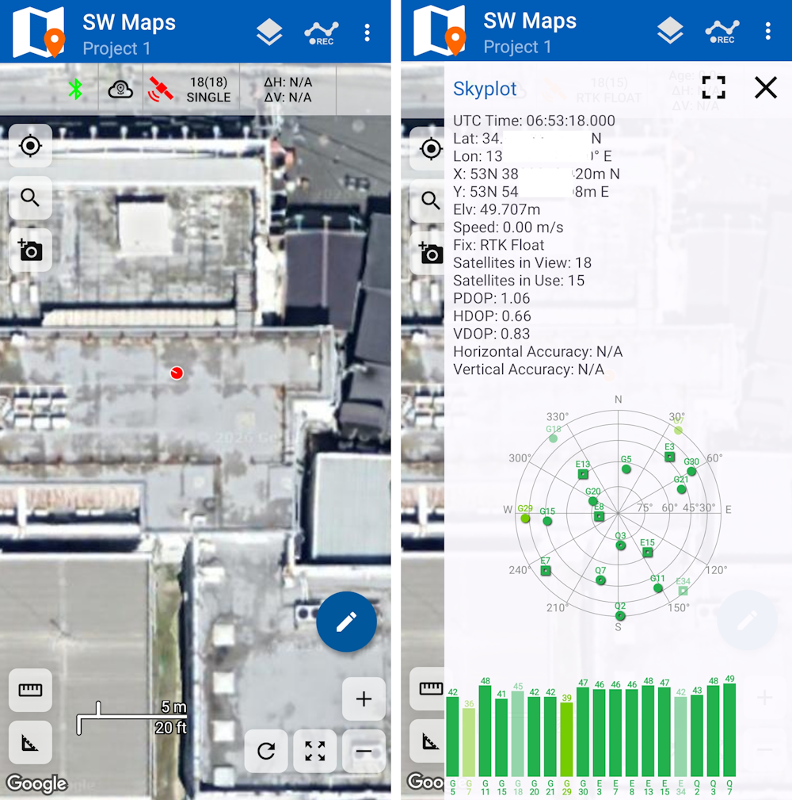

# MA-10P を CLAS 測位対応にする - 低コスト高精度端末レシピ

MA-10P は、日本の `QZSS / CLAS` を中心に設計した高精度測位端末です。目的は明確で、従来は敷居が高かった高精度 GNSS の利用フローを、より接続しやすく、より実用的な形に整理することです。

一般的な GNSS 受信機と比べて、MA-10P は次の 3 点を重視しています。

- `CLAS` をより使いやすくすること
- スマホ / タブレット / PC から接続しやすいこと
- 外業での運用をすぐ使える形に近づけること

本稿では、技術ブログとしてそのまま公開しやすいように、構成、使い方、性能の見込み、実測用のプレースホルダをまとめています。画像と一部のパラメータはプレースホルダのまま残してあるので、後からそのまま差し替えできます。

## TL;DR

- `D10P` と `QZS6C` を内蔵
- `QZSS / L6 CLAS` サービスを前提に設計
- `QZS6C` はデュアルチャネル入力に対応
- テストでは最短約 `2` 分で `RTK fixed`
- `ESP32-S3` ベース
- `BLE` と `USB` に対応
- `SW Maps` と組み合わせて測量データを取得可能
- 総コストは `100` USD 未満

一言でまとめると、MA-10P の価値は、`CLAS` の接続・表示・収集・現場運用を、一本の短いワークフローにまとめた点にあります。

## はじめに

高精度 GNSS の分野には、よく次の 2 つの課題があります。

1. 高価であること
2. 学習コストが高いこと

多くの構成は「使えない」のではなく、「使えるが、モジュール、アンテナ、プロトコル、上位ソフト、収集アプリを自分でつなぐ必要がある」点に負担があります。MA-10P は、その分散した工程をできるだけまとめ、導入の手間を減らすことを狙っています。

### このソリューションが狙うもの

- 高精度測位の入門障壁を下げる
- `CLAS` の利用を直感的にする
- 既存ソフトウェアとの接続を容易にする
- 実験板ではなく、製品として扱いやすい形にする

## 構成の全体像

MA-10P の構成は比較的シンプルです。

1. `D10P` が基本的な GNSS 機能を担当する
2. `QZS6C` が `QZSS / CLAS` 系の補強データを受信する
3. `ESP32-S3` が制御と外部接続を担当する
4. `BLE` / `USB` がスマホ、タブレット、PC との接続を担う
5. `SW Maps` が最終的な現場収集の入口になる

### この構成で重要なポイント

- `QZS6C` がデュアルチャネル入力に対応していること
- テスト条件では最短約 `2` 分で `RTK fixed` に到達していること
- 電源投入後すぐに動作し、複雑な初期設定を前提としないこと
- 一般的なモバイル向けツールチェーンにそのままつなげること

## コアハードウェア

### D10P + QZS6C

このソリューションの中心は、`D10P` と `QZS6C` の組み合わせです。

特に `QZS6C` のデュアルチャネル入力対応は重要で、`correction data` をより早く取り込むことで、実用状態への移行を早めやすくなります。

### QZSS / CLAS

`CLAS` は、日本の `QZSS` が提供する高精度補強サービスです。MA-10P は、この仕組みを実際のワークフローに組み込みやすくすることを重視しています。

期待できる価値は、主に次の通りです。

- 難しい環境での測位性能向上
- 安定解に到達するまでの時間短縮
- 一般ユーザーでも扱いやすいこと

【画像プレースホルダ 2：QZSS / CLAS の仕組み図】

入れたい内容：

- 衛星、受信機、補強データの関係
- 簡略化したフロー図

## プラットフォームと接続

### ESP32-S3

`ESP32-S3` を採用することで、単なるモジュールの寄せ集めではなく、一体感のあるデバイスに近づきます。結果として、手作業での統合作業が減り、学習コストも下がります。

### BLE と USB

- `BLE` はスマホやタブレットとの接続に向いている
- `USB` はデバッグ、給電、PC 設定に向いている

実際の運用では、まず `USB` で安定調整し、その後 `BLE` に切り替える流れが扱いやすいです。

【画像プレースホルダ 3：USB デバッグ画面 / シリアル出力】

入れたい内容：

- 起動ログ
- プロトコル出力
- 接続完了後の状態画面

入れたい内容：

- Bluetooth 接続完了画面
- 測位ステータス画面
- データ更新画面

## ソフトウェアと収集

### SW Maps

MA-10P は `SW Maps` と組み合わせて、測量や地図データの収集に利用できます。重要なのは、ハードウェアが動くことだけでなく、既存ソフトへすぐ接続できることです。

向いている用途は以下です。

- ポイント収集
- 測量記録
- 現場メモ

### 典型的な流れ

1. デバイスを起動し、初期化を完了する
2. `USB` または `BLE` で端末と接続する
3. `SW Maps` 側で測位データを確認する
4. `RTK` もしくは補強測位の安定を待つ
5. 取得した点群や座標を保存する

入れたい内容：

- 地図画面
- 現在位置の表示
- `RTK fixed` もしくは高精度状態の表示

## 性能の見込み

既存のテストでは、`QZS6C` のデュアルチャネル入力により、最短で約 `1`〜`2` 分で `RTK fixed` に到達しています。

この結果から分かることは 2 つあります。

- 収束が速いこと
- 条件が良ければ高精度状態へ入りやすいこと

ただし、実際の所要時間は次の要因で変化します。

- アンテナ位置
- 空の見通し
- 基準局品質
- 干渉状況
- 衛星配置

【画像プレースホルダ 6：環境差による状態変化のグラフ】

追記したい項目：

- 屋内 / 屋外
- 開けた場所 / 都市環境
- 初回固定時間
- float までの時間
- `RTK fixed` 到達時間

## コストの位置づけ

総コストが `100` USD 未満であることは、単に安いというだけでなく、試行錯誤や学習にかかるコストも下げる意味があります。

向いているのは次のようなケースです。

- 個人開発者
- 小規模な試作チーム
- 教育・実験用途
- `CLAS` の実用的な使い方を知りたい人

言い換えると、`CLAS` を低コストで現実的に使える形にするソリューションです。

## 実測

ここは「結果だけ」ではなく、「実測記録」として残しておくと、あとから画像や数値を追加したときに記事全体が締まります。

### 実測構成

- 端末：MA-10P
- アンテナ：`[要追記：AT400 などの多周波アンテナ / あるいは実際の型番]`
- 給電：`[要追記：モバイルバッテリー / スマートフォン給電 / USB 給電]`
- テスト端末：`[要追記：Pixel 9 / iPhone / その他]`
- テスト環境：`[要追記：屋外の開けた場所 / 駐車場 / 都市環境]`

### 接続互換性

| 端末 | 給電 | USB 通信 | BLE 通信 |
| --- | --- | --- | --- |
| Android | ✓ | ✓ | ✓ |
| iPhone | ✓ | ✗ | ✓ |

補足：

- Android は `USB` / `BLE` の両方に対応
- iPhone は主に `BLE` 通信を使用
- 実測結果が変わる場合は、この表も更新する

### テスト結果

> 下記の数値はプレースホルダです。公開前に必ず実測値へ差し替えてください。

- 初回測位までの時間：`[要追記]`
- float に入るまでの時間：`[要追記]`
- `RTK fixed` 到達時間：`[要追記]`
- 連続安定時間：`[要追記]`

【画像プレースホルダ 7：初回固定 / float / RTK fixed のスクリーンショット】

入れたい内容：

- タイムスタンプ
- 状態変化
- 衛星数
- 精度情報

【画像プレースホルダ 8：現場での実写写真】

入れたい内容：

- 端末の設置状況
- アンテナの設置位置
- スマホ / タブレットとの接続状態
- 測量現場の雰囲気

## 向いている用途

- 屋外測量
- ポイント収集
- GNSS / RTK の学習
- 低コスト高精度構成の検証
- スマホやタブレットを使ったモバイル収集

「電源を入れてすぐ使える、接続が簡単、収集しやすい `CLAS` ソリューション」を探しているなら、この方向性は十分に成立します。

## まだ補うべき情報

公開前に、次の項目は必ず埋めておくのがおすすめです。ここが空だと、記事としては成立していても説得力が弱くなります。

- `QZS6C` と `D10P` の正確な型番表記
- モジュールの入手元や供給形態
- アンテナの型番と設置方法
- 給電方法と連続稼働時間
- `SW Maps` への具体的な接続方法
- `RTK fixed` の判定条件
- テスト環境の説明
- 実測スクリーンショットと写真
- 価格の定義

## まとめ

MA-10P は、`QZSS / CLAS` を中心に、低コストかつ低い学習負担で使えるようにした高精度測位ソリューションです。`D10P`、`QZS6C`、`ESP32-S3`、`BLE`、`USB`、`SW Maps` を組み合わせることで、現場で扱いやすいワークフローを作っています。

この構成の価値を一言で表すなら、次のようになります。

> 高精度測位を「より強くする」のではなく、「実際に使われる形に近づける」こと。

---

## 公開前チェックリスト

- [ ] タイトルは最終版か
- [ ] `D10P` / `QZS6C` の型番表記は正確か
- [ ] 価格表記の基準は統一されているか
- [ ] `RTK fixed` の時間に実測値が入っているか
- [ ] 画像がすべて揃っているか
- [ ] 英語版 / 中国語版との同期が必要か
- [ ] システム構成図を追加するか
- [ ] 外観写真を追加するか

## 画像・素材リスト

1. 本体外観写真
2. モジュール組み合わせのクローズアップ
3. アンテナの設置写真
4. スマホ側の `BLE` 接続画面
5. `SW Maps` の収集画面
6. `RTK fixed` のスクリーンショット
7. 現場での実測写真
8. システム構成図 / フローチャート
