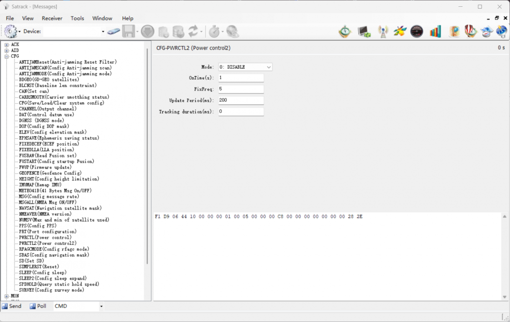
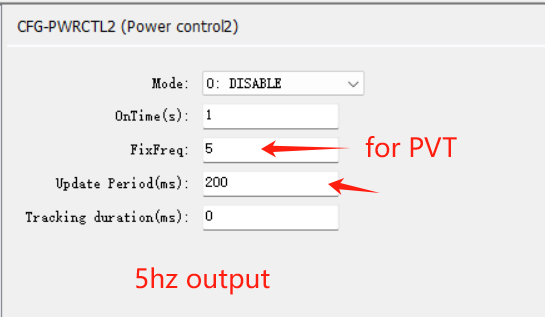

## How to config output rate

1. open the AS message window

2. tap to "CFG-PWRCTL2 "

3. tap menu "tools" - "set NMEA message" or "set RTCM message" 

The menu here is primarily for setting the sampling rate. For instance, if the setting in cfg-pwrctl2 is 200ms, that equates to 5Hz.
 
If you set it to 1 here, the output rate would be 5Hz. If you set it to 5, the output rate would then become 1Hz.

However, it is generally not recommended to have a sampling rate that is a multiple other than 1. If you desire a 1Hz rate, 

it is more advisable to set it to 1Hz directly in cfg-pwrctl2.

## Reference
You can also refer to this FAQ here.

[How-to-enable-specific-message-output](../common_enable_msg_output.md)
