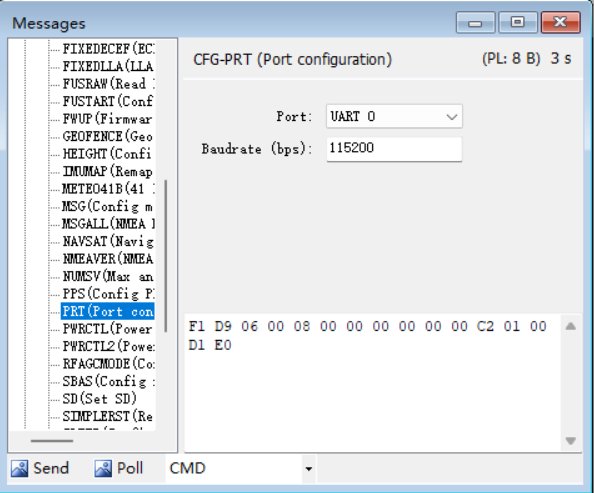
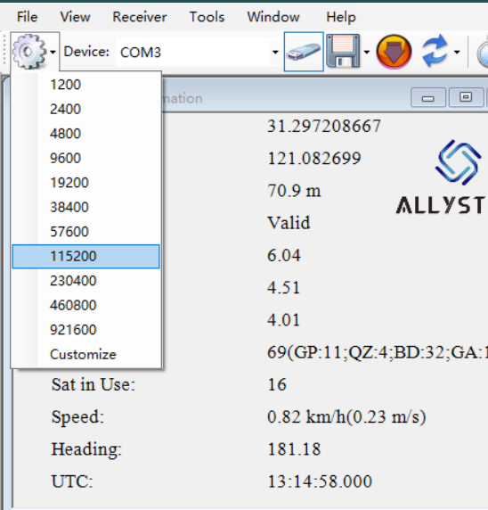

## Config UART Baud Rate
### Conenect your device

To connect your devices, use the correct baud rate and make sure communication is working. 

Then, open the message page and find the CFG-PRT command page as shown in the image. 

Here you can set your desired baud rate. Common baud rates include 9600, 19200, 38400, 57600, 115200, and 230400.

Next, click the "send" button at the bottom of this page.

### Change baudrate and reconnect

Click on the location shown in the image and select the new baud rate. Confirm that the new baud rate is working correctly by checking if the data output is normal.

### Save baudrate

Finally, return to the Message page and find CFG-SAVE as shown in the image. Configure it accordingly. This will save your settings. 

