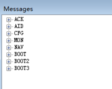
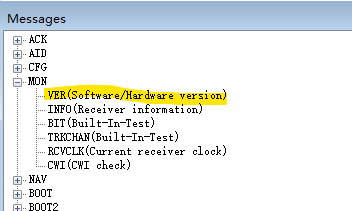

### Firmware updating

 
[Satrack download](../rtk-board/firmware/Satrack_client.zip)
 

Find out current version:

"View"-"AS Messages" ("HD Messages" in previous versions)

#### user mode
1) Connect to the EVK through COM ports.

2) Select “HD User Update” from the tool bar, and the file choosing dialog will be shown.

3) Find the file to send and press “Open” to start sending the file and finish firmware updating.

#### boot mode

***Boot mode is only used if the upgrade fails in user mode.***  

1) Connect to the EVK through COM ports.

2) Use the PRRSTX and PRTRG buttons to set the module to enter Boot mode.

3) Disconnect the module first by clicking “DisConnect” from the tool bar and then reconnect the module
again by clicking “Connect” from the tool bar. The module will enter the Boot mode.

4) Select “HD BOOT Update” from the tool bar.

5) Find the file to send and press “Open”.

6) Press “Send” to start sending the file and click “Close” to close the updating window after firmware
updating finishes.

7) After firmware updating completed, press RESET button on the EVK to restart the module.

**DO NOT interrupt the file transfer, keep program running and make sure all cables are well connected when
the file is transmitting.** 