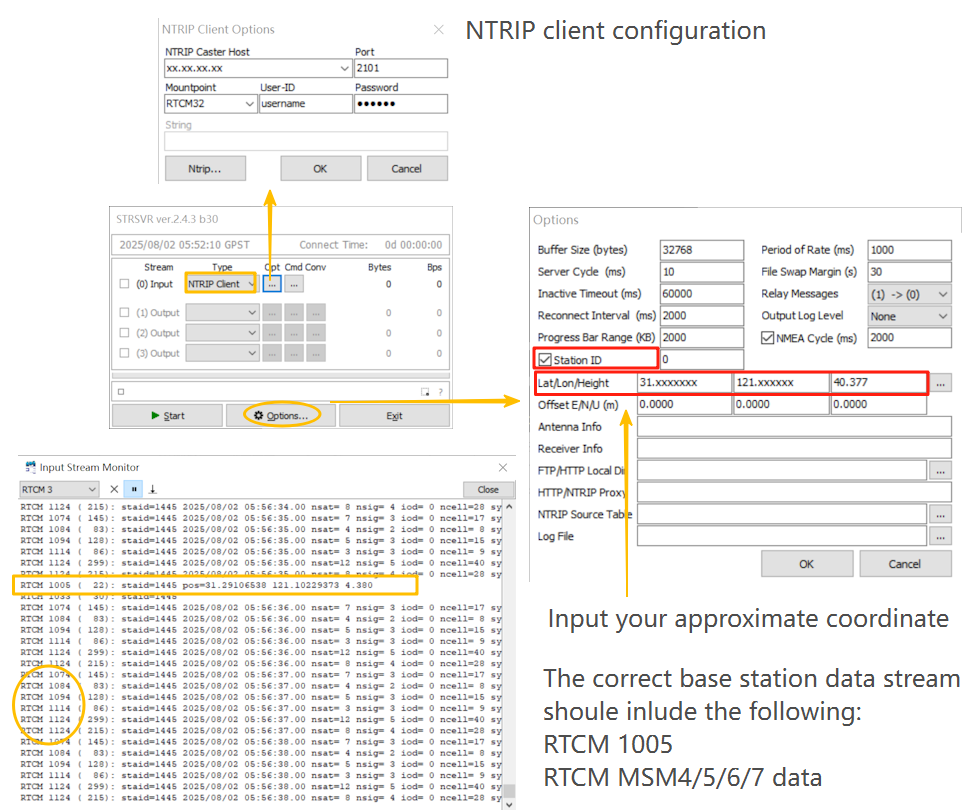

# How to verify your base station configuration

## Overview

Please download STRSVR from [here](../assets/software/strsvr.zip), which is part of [RTKLIB](https://github.com/tomojitakasu/rtklib).

## Instructions

Finally, use the Input Stream Monitor to confirm whether the data stream contains:
- RTCM 1005
- RTCM measurement data, supporting MSM4/MSM5/MSM6/MSM7

For VRS or MAC CORS networks, it is often necessary to send a GGA sentence (your position coordinates) to enable data transmission. Therefore, make sure to enable this option in your software settings if required.