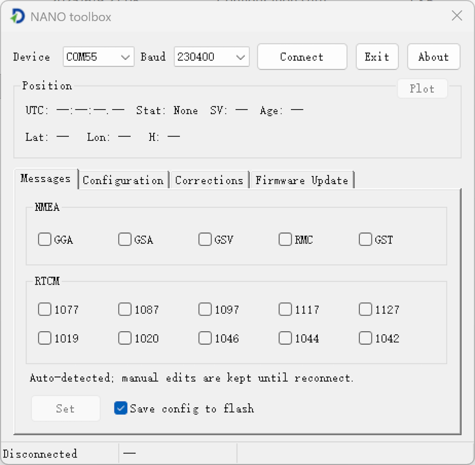
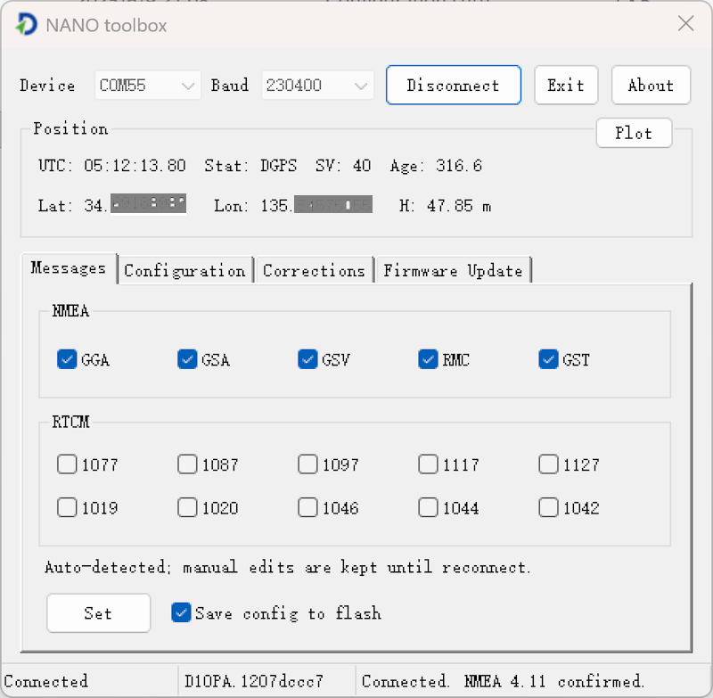
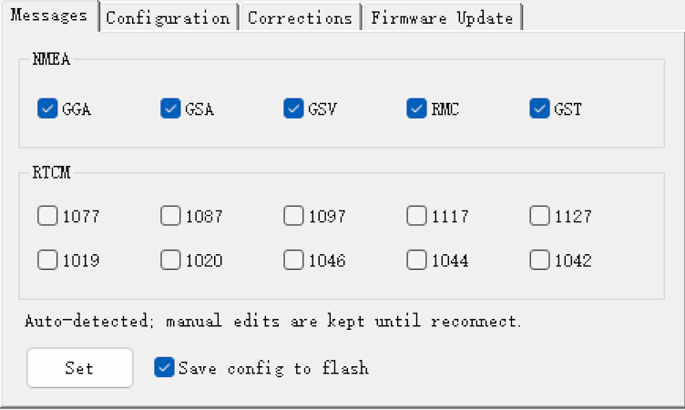
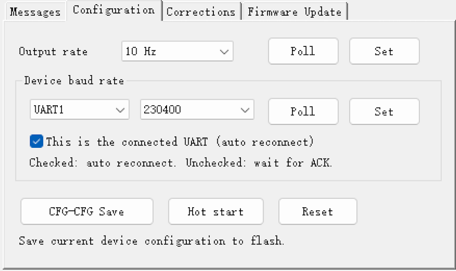
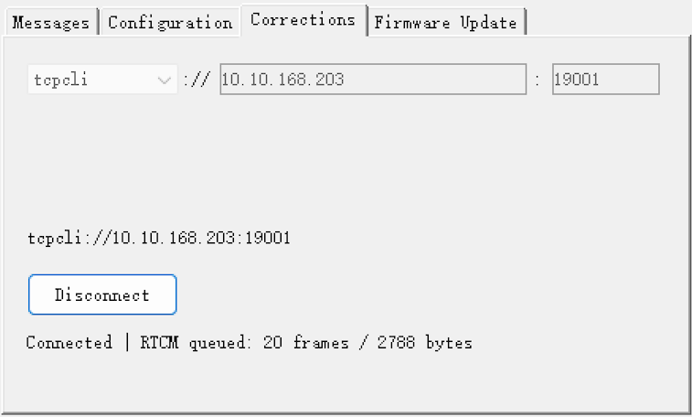

# NANO Toolbox

## Overview

[NANO Toolbox](../assets/software/NANO-toolbox.zip) is a simple software tool for configuring NANO GNSS receivers.

## Configure output messages

You can configure the output of common NMEA or RTCM messages.

## Configure the receiver

- Output rate
- Baud rate
- Hot start / Reset

## Correction data input

NANO Toolbox supports correction data input via TCP and NTRIP.

The "Send GGA to Caster" option is supported.

