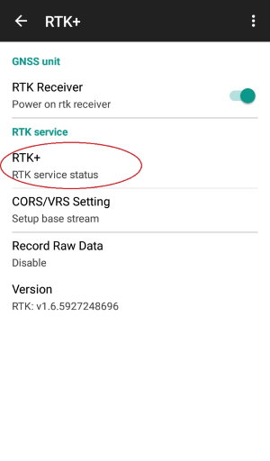
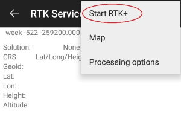
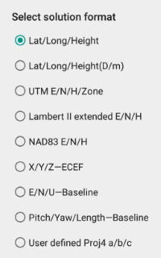
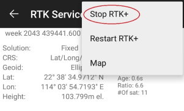

# Start your RTK work
 

⚠
Before using the device, please make sure data connection via WiFi or 3G/4G is on service normally.

RTK+ service working directory:

 

⚠
raw data and csv point file will be saved in a workday directory(by date, named:yyyyMMdd)

## 2.1.3 Start  RTK

Enter RTK Service status screen by pressing: &quot;RTK+&quot;

 
Click &quot;…&quot; in the right-up corner :

Press the &quot;Start RTK+&quot; button to start RTK service:

Normally in one minute, the solution status will change from single→Float→Fixed. And the color indicator will change from black →Orange →Green.

When the solution status becomes &quot;Fixed&quot;. It&#39;s in RTK fix mode.

#### 2.1.4 Switch solution view

Long press the circled area for 2 seconds, there will be a menu pops up to choose different solution format:

 

 
#### 2.1.5 Stop RTK

There are several cases you need to turn off RTK service first:

1. (1)Finish working
2. (2)Change GNSS constellations system
3. (3)Change CORS/VRS/Base station setting
4. (4)Change other RTK Services settings

<iframe width="560" height="315" src="https://www.youtube.com/embed/Thqg7SXMlAE" frameborder="0" allow="accelerometer; autoplay; encrypted-media; gyroscope; picture-in-picture" allowfullscreen></iframe>

