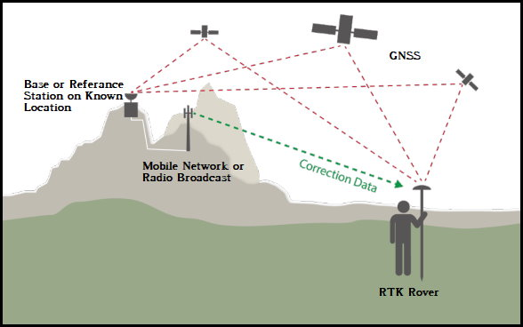
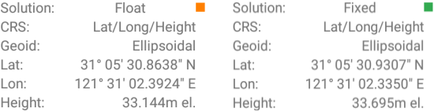
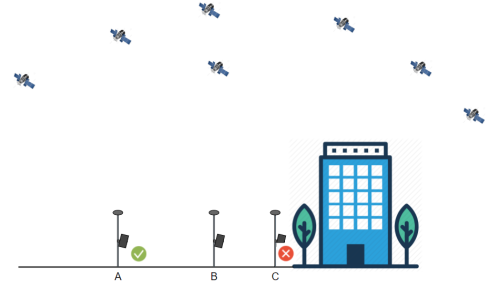
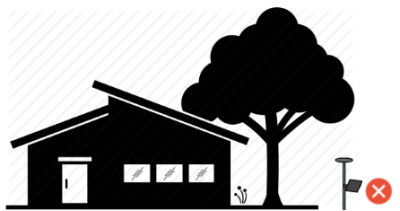
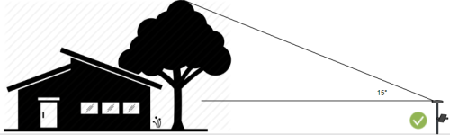
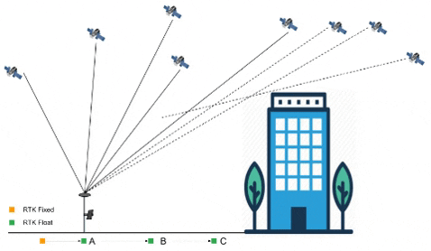
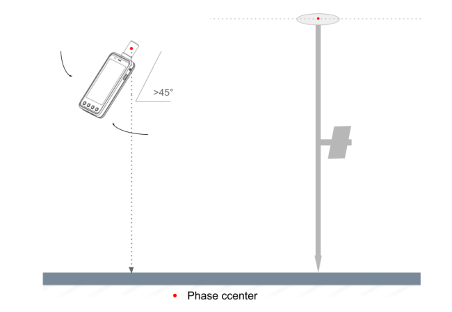

## About RTK

### What is RTK?
  
  
  
  Real-time kinematic (RTK) positioning is a satellite navigation technique used to enhance the precision of position data derived from satellite-based positioning systems (global navigation satellite systems, GNSS) such as GPS, GLONASS, Galileo, and BeiDou. It uses 
measurements of the phase of the signal's carrier wave in addition to the information content of the signal and relies on a single reference station or interpolated virtual 
station to provide real-time corrections, providing up to centimetre-level accuracy. 

  - [Wikipedia:RTK](https://en.wikipedia.org/wiki/Real-time_kinematic)

### Requirement

* Base station receiver(public service or owned)
* Rover station receiver
* Data link (Internet or radio communication) 
* GNSS Antenna

### Accuracy

  | solution state | accuracy | indicator |
  | :--- | :--- | --- |
  | Single position | 5-10m |  |
  | RTK Float | 1-3m,even worse |  |
  | RTK Fixed | 1-2cm 99.99% |  |
  
   
  
  In D300 series receiver,the solution like the following:
  
  
  
  RTK float state means the accuracy is uncertain, maybe 1-3m even worse. 
  
  RTK fixed state means the accuracy is less than 1-2cm.
  

  
### Where to place your rtk receiver?
  
  In general, the more satellites received, the faster the RTK initialization time.RTK initialization time means the time from rtk float to rtk fixed.
  
   
  
  Therefore, in our actual use, we should try our best to let the device receive more satellite signals.The purpose of supporting more satellite systems and supporting multiple frequency signals is also to receive more signals.

   

#### Open sky environment
  In the following picture:
  
  {: style="width:500px;"}
  
  the better, A > B > C.
  
  **Too close to the outer wall of the house, it will block too much satellite signal**
  
  
  You need to have a clear sky view about **15° above horizon**.
  
  
 

  
  
 

   if we need survey the point C, **How can we do?**
  
  First, place your receiver in point A to get rtk fixed and wait about 5-10 seconds for stable solution,then move to point B,then point C slowly.
  
  In your moving, please keep the antenna to sky to track all gnss satellites continuously.
  
  
  
#### Hold on the device

  For handheld mode(left image),in your job,please keep your device like the following picture:
  
  *Hold on the device at an angle greater than 45° from the horizon*
  
  For rover rod mode(right image),keep rover antenna at level.
  
  {:style="width: 550px;"} 
  

  
