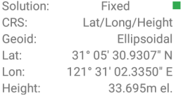

## About RTK

### What is RTK?
    Real-time kinematic (RTK) positioning is a satellite navigation technique used to enhance 
	the precision of position data derived from satellite-based positioning systems (global 
	navigation satellite systems, GNSS) such as GPS, GLONASS, Galileo, and BeiDou. It uses 
	measurements of the phase of the signal's carrier wave in addition to the information 
	content of the signal and relies on a single reference station or interpolated virtual 
	station to provide real-time corrections, providing up to centimetre-level accuracy. With
	reference to GPS in particular, the system is commonly referred to as carrier-phase enhancement,
	or CPGPS. It has applications in land survey, hydrographic survey, and in unmanned aerial 
	vehicle navigation.[1]

  - [Wikipedia:RTK](https://en.wikipedia.org/wiki/Real-time_kinematic)

### Accuracy

  | solution state | accuracy |
  | :--- | :--- |
  | Single position | 5-10m |
  | RTK Float | 1-3m,even worse |
  | RTK Fixed | 1-2cm 99.99% |
  
  for D303:
  
  if get the solution like the following:
  
  
  
  We call it is rtk float state, the accuracy is uncertain, maybe 1-3m or even worse.

  If we get rtk fixed solution(green small rectangle), it means accuracy is less than 1-2cm.
  
  
  
### How to place your rtk receiver in your applications
   
  In general, the more satellites received, the faster the RTK initialization time.
  
  RTK initialization time means the time from rtk float to rtk fixed.
  
  Therefore, in our actual use, we should try our best to let the device receive more satellite signals.
  Therefore, the purpose of supporting more satellite systems and supporting multiple frequency signals is also to receive more signals.
  
  In the following picture:
  
  {: style="width:500px;"}
  
  the better, A > B > C.
  
  **Too close to the outer wall of the house, it will block too much satellite signal**
  
  But if we need survey the point C, **How to do?**
  
   First, place your receiver in point A to get rtk fixed and wait about 5-10 seconds for stable solution,then move to point B,then point C slowly.
  in your moving, please keep the antenna to sky to track all gnss satellites continuously.