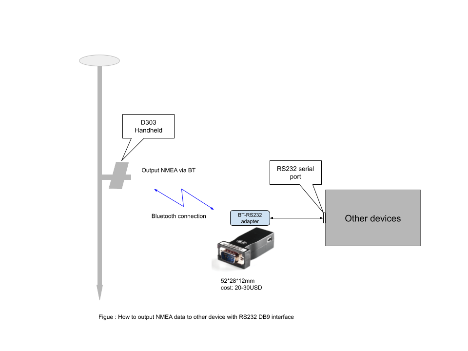

## Output NMEA data to other devices via RS232 serial port

 

{:style="width: 600px;"}

### Steps:

{:style="width: 400px;"}

{:style="width: 400px;"}

{:style="width: 400px;"}

{:style="width: 400px;"}
