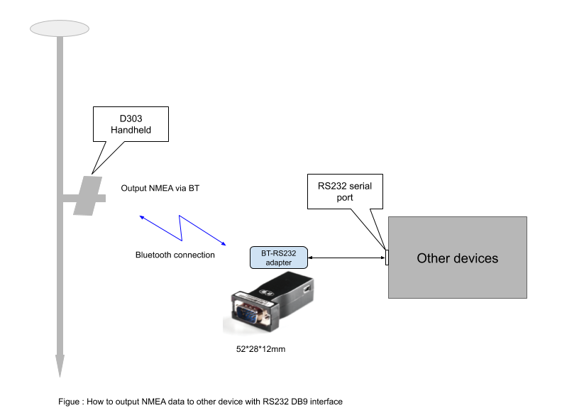

## Output NMEA data to other devices via RS232 serial port

 

{:style="width: 600px;"}

### Steps:

 connect adapter to your device, then power on adapter

#### 1.Paired Bluetooth device(adapter) with D303 Android system
  - Android "Settings" - "Bluetooth" - Select adapter
  

#### 2.Config D303 output solution (NMEA) via Bluetooth

{:style="width: 300px;"}  {:style="width: 300px;"}

{:style="width: 300px;"}  {:style="width: 300px;"}
