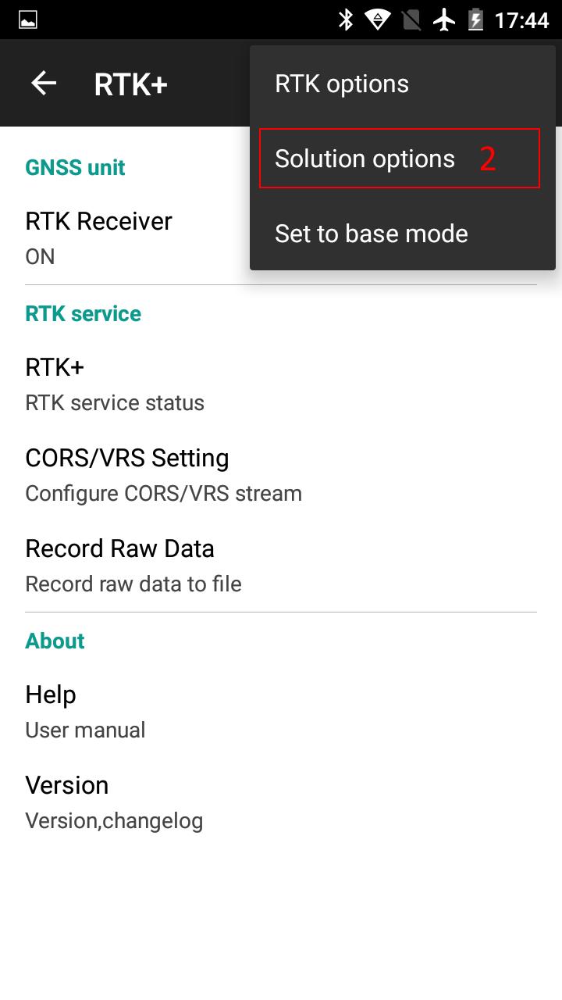
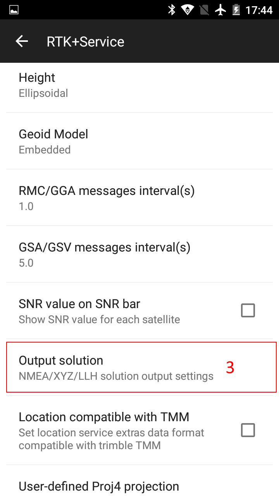
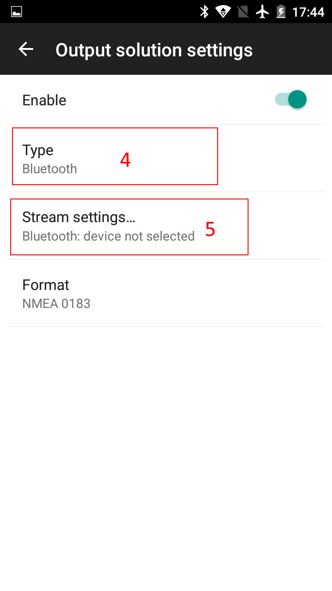

## Record NMEA data to file

 

### Steps:

#### 1.find menu "Solution options"
{:style="width: 300px;"}  {:style="width: 300px;"}

#### 2.Config output solution (NMEA) to file

{:style="width: 300px;"}  

Please choose "file" in "type" field
{:style="width: 300px;"}

saved nmea file located in RTK+ folder in root of storage.