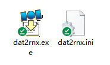

## How to convert raw data to rinex format file?

Download the dat2rnx[^1] utility: [dat2rnx.zip](download/dat2rnx.zip)

execute "dat2rnx.exe".

 

step 1: choose the raw data".dat" file

step 2: press "Convert"

you will find rinex file in the same folder with the original raw data file.

If you want to config the conversion parameters, please press Options...

Reference

- Download the dat2rnx utility: [dat2rnx.zip](download/dat2rnx.zip)

[^1]: dat2rnx is the rtkconvert of rtklib, just change the name, optimized some codes for our format.