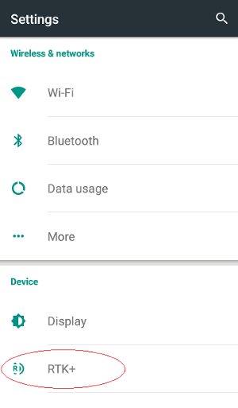
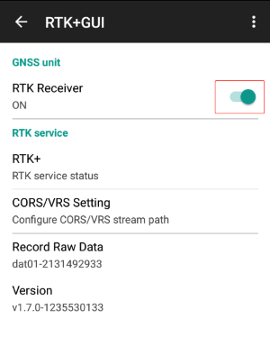
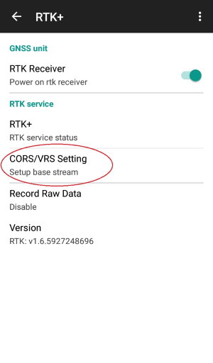
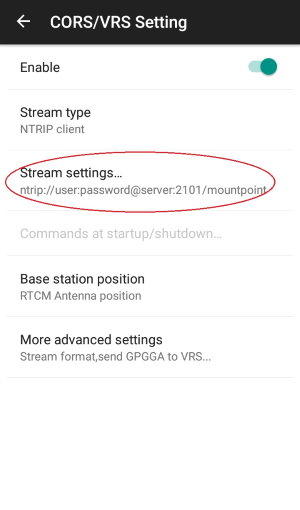
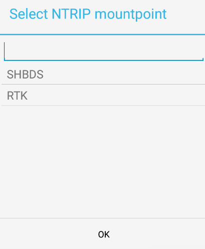
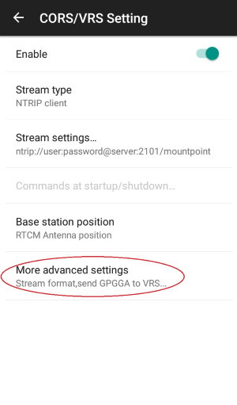

# D30x RTK User Manual
 

⚠
Before using the device, please make sure data connection via WiFi or 3G/4G is on service normally.

RTK+ service working directory:

 

# ⚠
raw data and csv point file will be saved in a workday directory(by date, named:yyMMdd)

1. GNSS Module Setting

1.1 Power On/Off GNSS Module

Enter RTK setting page from system &quot;Settings&quot;:

Power on GNSS module by turning on the power switch

1.2 Switch GNSS Constellation

⚠
By default, the GNSS module is running on supporting all constellation.

 

2. Working as Rover Mode

2.1 CORS/VRS/Base Station Setting:

2.1.1 CORS/VRS Setting

Configure NTRIP client settings:**

 

press Item &quot;mount point&quot;, pop up the window:

 

then choose the correct mountpoint from the list.

# ⚠
it still supports input mount point manually.

2.1.2 Transmit GPGGA to Base Station

When using VRS as the base station, rover needs to report its position to VRS firstly.

# ⚠
Please keep default &quot;single solution&quot;.

 

 
2.1.3 Start  RTK

Enter RTK Service status screen by pressing: &quot;RTK+&quot;

 
Click &quot;…&quot; in the right-up corner :

Press the &quot;Start RTK+&quot; button to start RTK service:

Normally in one minute, the solution status will change from single→Float→Fixed. And the color indicator will change from black →Orange →Green.

When the solution status becomes &quot;Fixed&quot;. It&#39;s in RTK fix mode.

2.1.4 Switch solution view

Long press the circled area for 2 seconds, there will be a menu pops up to choose different solution format:

 
2.1.5 Stop RTK

There are several cases you need to turn off RTK service first:

1. (1)Finish working
2. (2)Change GNSS constellations system
3. (3)Change CORS/VRS/Base station setting
4. (4)Change other RTK Services settings

3. Working as Base Station Mode

3.1 Set to Base Mode

To set the device working as Base Station mode, choose &quot;set to Base mode&quot; in the menu.

# ⚠

if you want to use datagnss ntrip service, please keep the default Stream settings.

Choose &quot;station position&quot; and fill up the known position.

3.2 D30x-RTK Rover working with D30x-RTK Base Station

When use D30X RTK as base, the Stream settings as following:

Host: ntrip.datagnss.com, Port：2101，NTRIP Mountpoint. NTRIP Mountpoint = base s/n (serial number), user name: gps1, password: 123456

# ⚠
Please Keep &quot;Base station position&quot; to &quot;RTCM Antenna position&quot;:

4. Applications Update

When power on the D30x-RTK device for the first time, or received application update notification from DataGNSS, please open the &quot;AppBus&quot; application and check for update

After entering AppBus application, updatable applications will be downloaded and upgraded automatically. Please wait for a few minutes to finish update.

After the update finished, the icon on the right will change to green.

5. FAQ

# ⚠
**NOTE:**

All the software mentioned below can be downloaded here.:

[https://download.datagnss.com](https://download.datagnss.com)

5.1 How to record raw data?

# ⚠
Then &quot;Start RTK+&quot;，rtk+ will record raw data to file.

Press &quot;Stop RTK+&quot; to finish record raw data.

File Manager App，please find folder &quot;RTK+&quot;

5.2 How to convert raw data to rinex format file?

 Copy file to your PC from D30x device via usb.

 then go to &quot;dat2rnx&quot; folder, execute &quot;dat2rnx.exe&quot;.

step 1: choose the raw data &quot;.dat&quot; file

step 2: press &quot;Convert&quot;

you will find rinex file in the same folder with the original raw data file.

5.3 How to post-process raw data?

step 1: choose rover rinex file

step 2: choose base rinex file

step 3: process.

5.4 How to record rtk solution to csv file?

Please find a named date folder in RTK+ project folder.

\*.crw is the csv file.