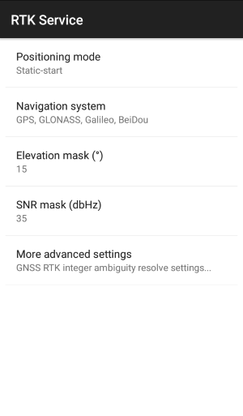
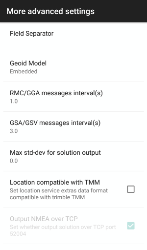
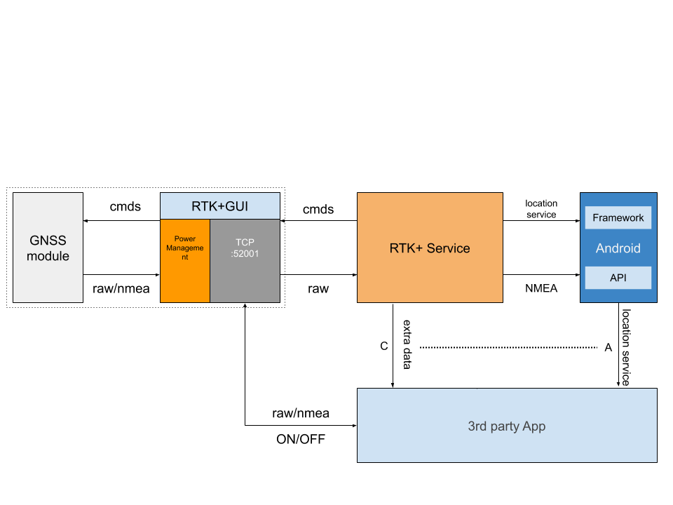
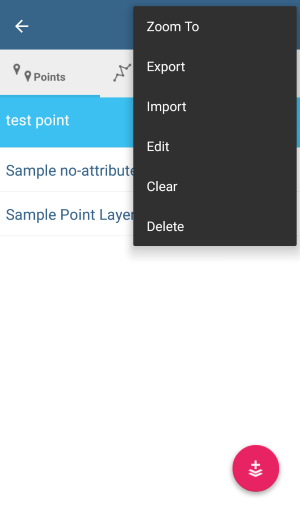

# RTK+ Service Developer Manual

Welcome to choose datagnss D30x rtk receiver!

<div style="text-align:left;"></div>


[1.RTK+ service Intro](#1)

[2.Intent service](#2)

[3.Location service extra data](#3)

[4.Input and Output stream](#4)

[5.How to access rtk module in your App](#5)

[6.Sample Screenshot from Partner](#6)

[7.Change logs](#7)

[Online version please visit](https://docs.google.com/document/d/1AIcTQmQSaHh65YmJhTeNAmGT1eiS76RZu6wDORrwrKs/edit?usp=sharing)


<span id="1"></span>
## 1.RTK+ service Intro

RTK+ service is a core service integrated in android on D30x-RTK device.

RTK+ can configure the following options:

- GNSS constellation type,GPS/GLONASS/GALILEO/BDS
- VRS/CORS base station ntrip/tcp protocol setting
- Receiver mode setting
- Elevation/SNR mask setting
- rtk engine optimized setting
- output solution setting
- log data stream setting
- Geoid model setting

<div style="text-align: left;"></div>
<div style="text-align: left;"></div>
<div style="text-align: left;"></div>

<span id="2"></span>
## 2.Intent service

RTK+ provide an intent service, so third party software can launch rtk+ setting pages from its own main UI.

This allow an easy integration without open rtk+ from system setting section.
<div style="text-align: left;"></div><br>

Please reference the following way:
```java
Intent intent = new Intent();

intent.setClassName("com.datagnss.rtkgui","com.datagnss.rtkgui.ui.MainActivity");

try {
      startActivity(intent);
} catch (Exception e) {
   e.printStackTrace();
}
```

<span id="3"></span>
## 3.Location service extra data

RTK+  adds a set of location extra information while it&#39;s running. Details on location extras can be found in the corresponding [Google Android help](https://developer.android.com/reference/android/location/package-summary.html).
<div style="text-align: left;"></div>
**Extra data description:**

| Key | type | Details |
| --- | --- | --- |
| hdop | float | HDOP value |
| vdop | float | VDOP value |
| pdop | float | PDOP value |
| diffAge | float | Message age of any RTK message in seconds |
| diffRatio | double | RTK ambiguity resolution,ratio |
| diffStatus | int | Position solution status: 1=Autonomous, 2=DGPS, 4=Fixed, 5=Float |
| vrms | float | Vertical accuracy (RMS) in meters |
| hrms | float | Horizontal accuracy (RMS) in meters |
| speed | float | speed, m/s |
| bearing | float | bearing,degree |
| receiverModel | string | Receiver model string,here is D302-RTK |
| mockProvider | string | Mock location provider string,here is DATAGNSS RTK+ |
| utcTime | long | UTC time,millisecond,from Jan 1,1970 |
| AccuracyEstimated | int | accuracy grade estimated,0-none,1-centimeter grade,2-submeter grade,3:1-3m grade,4:\&gt;3m grade |
| satellitesUsed | int | Number of satellites used for rtk |
| satellitesView | int | Number of satellites in view |
| satellitesId | int[] | Array containing IDs of satellites in view. The number of elements in the array is indicated by the satellitesView data specified above. |
| satellitesElv | int[] | Array containing elevation angles of satellites in view expressed in rad. The number of elements in the array is indicated by the satellitesView data specified above. Satellite elevations are stored in the same order as their IDs in the satellitesId array specified above. |
| satellitesAzm | double[] | Array containing azimuth angles of satellites in view expressed in rad. The number of elements in the array is indicated by the satellitesView data specified above. Satellite azimuth angles are stored in the same order as their IDs in the satellitesId array specified above. |
| satellitesSnr | double[] | Array containing signal-to-noise ratio (SNR) values for the satellites in view. The number of elements in the array is indicated by the satellitesView data specified above. SNR values are stored in the same order as the corresponding satellite IDs in the satellitesId array specified above. |
| satellitesUse | boolean[] | Array of flags indicating if a particular satellite has been used in a rtk position computation. The number of elements in the array is indicated by the satellitesView data specified above. The flags are stored in the same order as the corresponding satellite IDs in the satellitesId array specified above. |
| proj\_a | double | user-defined proj4 projection a |
| proj\_b | double | user-defined proj4 projection b |
| proj\_c | double | user-defined proj4 projection c |


<span id="4"></span>
## 4.Input and Output stream

RTK+ service provide the following stream:

- NMEA-0183 data output,TCP server 52004
`*`GGA
`*`GSA
`*`GSV
`*`GST

- transmit RTCM data to TCP server 52009

- output LLH format solution over TCP server 62010


<span id="5"></span>
## 5.How to access rtk module in your App

two steps:

user need switch on receiver in RTKGUI app.

you must integrate the following code in your app.

1.Power on rtk module

```java
private static final String ACTION_RUN_CMD_CPUBOOST_START = "com.datagnss.receiver.CPUBOOST.start";
private static final String ACTION_RUN_CMD_CPUBOOST_STOP = "com.datagnss.receiver.CPUBOOST.stop";
private static final String RTKGUI_PKG_NAME = "com.datagnss.rtkgui";

Intent intent = new Intent(ACTION_RUN_CMD_CPUBOOST_START);
intent.setPackage(RTKGUI_PKG_NAME);
startService(intent);
```

2.create tcp client connect localhost:52001

3.Power off rtk module

before close your app, you need power off rtk module

```java
Intent intent = new Intent(ACTION_RUN_CMD_CPUBOOST_STOP);
intent.setPackage(RTKGUI_PKG_NAME);
startService(intent);
```

<span id="6"></span>
## 6.Sample Screenshot from Partner

MapIt GIS App is an affordable field gis data collector software.

It fully supports D302/303 rtk+ service.

**Mapit Pro is preinstalled on each D303 receiver.**

Google play download from [Mapit GIS](https://play.google.com/store/apps/details?id=com.osedok.gisdatacollector&amp;hl=en).
<div style="text-align: left;">   </div>

<div style="text-align: left;">   </div>

<span id="7"></span>
## 7.Change logs
- 2019-01-30 add projection coordinate to extra data structure, proj\_a/proj\_b/proj\_c

2019.01 Ver 1.0.2 updated:2019-09-20
