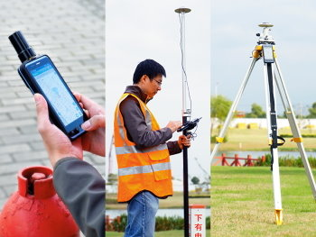

## Support center

 

### Introduction

  [D302/D303 open box and quick star ](common/openbox.md)

  [D302/D303 do calibration in HK ](common/d303-calibration-in-hk.md)
  
  [Helix antenna or Patch antenna](common/choice-of-antenna.md)

### Operation

  [Power on receiver](d303.md#1-gnss-module-setting)

  [Config NTRIP for VRS/CORS station](d303.md#21-corsvrsbase-station-setting)

  [RTK service overview](rtk-service-intro.md)

  [start RTK work](d303.md#213-start--rtk)
  
  [convert raw data to rinex format](d303.md#52-how-to-convert-raw-data-to-rinex-format-file)

  [do ppk solution](d303.md#53-how-to-post-process-raw-data)

  [user manual](d303.md)

### Other software

  [connect with Supersurv ](common/connect-supersurv.md)

  [connect with survey master ](common/connect-survey-master.md)

  [connect with EGStar ](common/connect-egstar.md)

  [connect with tMap ](common/connect-tMap.md)

### Developer guide

  [developer manual](developer-docs.md)

