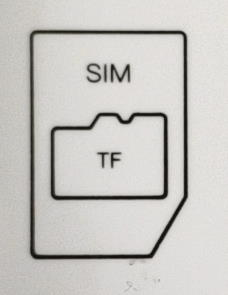

## Install sim card

 1. Power off device
 
 2. Unscrew the screw, open the battery cover
 
 3. Remove the battery
 
 4. Insert the sim card as indicated in the figure
 
  {: style="padding-left:25px;"}
 
 5. Power on device again

 *support standard-size sim card*
