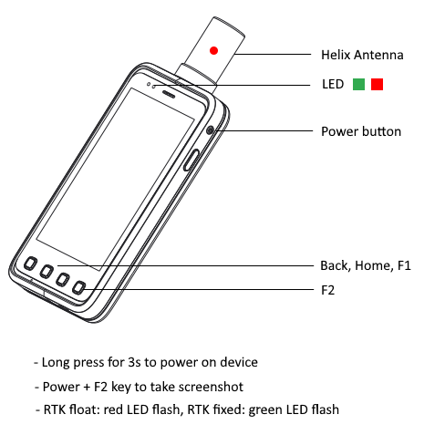
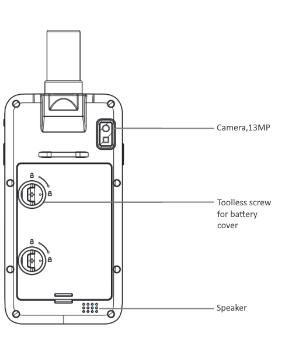

D300 series quick guide

 
 

  Please follow below quick guides to configure and use the product.

 

 

### Install battery and SIM card or TF card

  - Screw up back battery cover screw
  - Remove batter cover
  - Install SIM card or TF card follow the instructions
  
  
### Activate Mapit GIS 
 
  - MapIt-GIS application is pre-installed on device for end user. We offer the unlimited license
  - Open "MapIt GIS" on device, Press "Activate" on splash screen, and then scan the QR code on the D30x-RTK package box. 
  - If the activation process is successful, it will turn off automatically. Re-open MapIt GIS application and you can begin to use the application.
  
  [Activate QR code](common/activate-mapit.md)

### RTK operation
 
  - Enter "RTK+" service from system "Settings". 
  - Switch on RTK module 
  - Config "CORS/VRS Setting"
  - "Start Service" 
  - After solution being rtk fixed, press Home button to keep service background.
  - Run Mapit Pro or any other software.
  - For further usage help of RTK service, please visit [User manual(for Android 5.x)](d303.md) , or [New user manual(for Android 8.1)](d303-2021.md).
  - Any other questions please visit [Support center](../index.md) .
  - or send email to info@datagnss.com .
