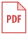

D30x Specification

 
 

  | Items | D303 | D302 |
  | :----- | :----- | :---- |
  | OS | Android-Based customized OS | - |
  | CPU | quad core,1.3GHz | - |
  | RAM+Storage | 2+16GB | - |
  | Display | 5" 1280*720 | - |
  | Touch Panel | Capacitive | - |
  | Wireless | WiFi a/b/g/n,Bluetooth 4.1 | - |
  | WWAN | 4G LTE,FDD/TDD | - |
  | Camera | 13MP, Rear | - |
  | Constellation | Multi-band, Multi-constellation[1] | [2]Single frequency |
  | RTK initial[2] | 10s | 120s |
  | RTK accuracy | 1cm+1ppm (H),2cm+1ppm (V) | - |
  | Battery | 3200mAh,support full work day | - |
  | Interface | microusb for power and data | - |
  | Antenna | SMA connector | - |
  | Environment | Operation:-20 &deg;C to +60&deg;C,Storage:-30&deg;C to +70&deg;C | - |
  | Weight | 295g | - |
  
  - [&nbsp;D302/D303 datasheet](download/D30X_DS_EN.pdf)
 
 
*[1]GPS/QZSS L1/L2,BDS B1/B2,GLO L1/L2,GAL E1*
*[2]GPS+GLO+GAL or GPS+BDS+GAL*
*[3]depend on sv number and PDOP, test in the condition of GPS and BDS, the total sv is more than 12*