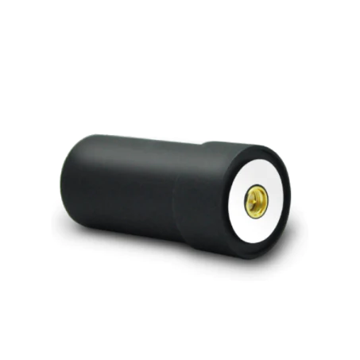

# Helix Antenna for RTK

The ATH-3601 is a full-frequency quadrifilar helix antenna that covers GPS L1/L2/L5, BDS B1/B2/B3, GLONASS L1/L2, GALILEO E1/E2/E5a/E5b.
It has the characteristics of small size and light weight and is widely used in navigation dispatching, tracking monitoring, measurement and control fields.
Based on the low requirement for antenna attitude of the quadrifilar helix antenna, it is especially suitable for many applications such as drones, aerial photography, traffic monitoring, remote telemetry, etc.
It can also be applied to various handheld device and high-precision positioning modules.

## Feature

- Support GPS L1/L2/L5, BDS B1/B2/B3, GLONASS L1/L2, GALILEO E1/E2/E5a/E5b
- Stable phase center and high gain
- Equipped with a high out-of-band suppression LNA, which can effectively resist external electromagnetic interference
- Small size and lightweight

## Specifications

| Item | Specs |
|------|--------|
| Frequency Range(MHz) | GPS/QZSS L1/L2/L5, BDS B1/B2/B3,  GLONASS L1/L2, GALILEO E1/E2/E5a/E5b |
| Polarization | Right-hand circular |
| Gain(dBi) | 90°≥2.0 |
| Axial Ratio (dB) | 90°≤3.0 |
| LNA Gain(dB) | 36±2 |
| V.S.W.R | ≤2.0 |
| Noise Figure (dB) | ≤2.0 |
| DC Voltage (V) | 3.3～12 |
| Current (mA) | ≤45mA |
| Impedance(Ω) | 50 |
| Relative Humidity | 95% |
| Operating Temperature(℃) | -40～+85 |
| Storage Temperature (℃) | -55～+85 |
| Dimensions(mm) | Φ28×58.5 |
| Connector | SMA-J |
| Weight (g) | ≤17g |

