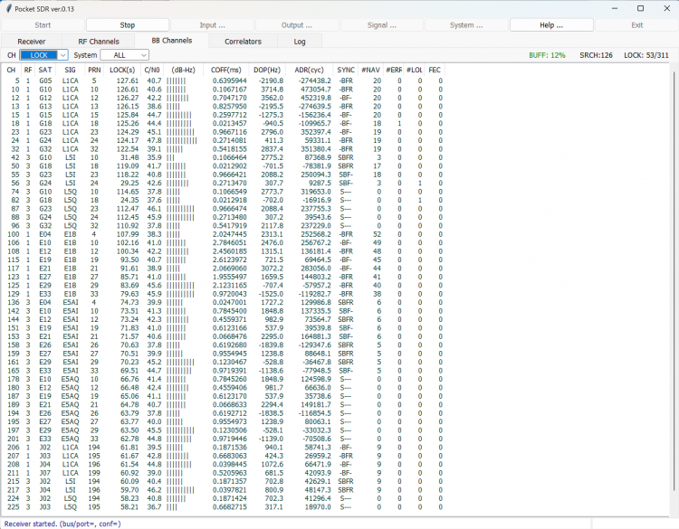
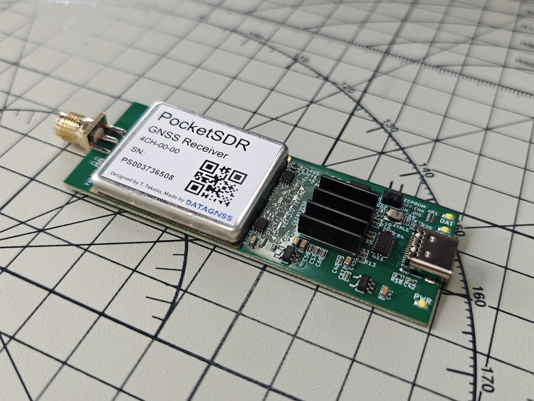
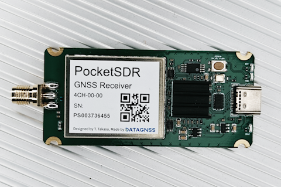
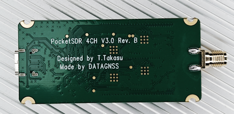

## Overview

Pocket SDR FE 4CH is an open-source GNSS SDR RF frontend device for Pocket SDR.
The device consists of 4 CH Maxim MAX2771 GNSS RF front-end ICs (LNA, mixer, filter, ADC, frequency synthesizer) and a Cypress EZ-USB FX3 USB 3.0 controller to connect to host PCs.
All the RF CHs are able to be configured for GNSS L1 band (1525 - 1610 MHz), or GNSS L2/L5/L6 band (1160 - 1290 MHz).
The frequency of the reference oscillator (TCXO) is 24.000 MHz, and the ADC sampling rate can be configured up to 48 Msps.

## Specifications

- Number of RF channels: 4 CH
- LO (PLL) Frequency: 1525 ~ 1610 MHz (GNSS L1 band) or 1160 ~ 1290 MHz (GNSS L2/L5/L6 band)
- IF Bandwidth: 2 ~ 36 MHz
- Sampling Rate: 4, 6, 8, 10, 12, 16, 20, 24, 32, 40 or 48 Msps
- Sampling Type: I or I/Q sampling, 2 bits resolution
- Host I/F: USB 3.0, type-C (high-speed 480 Mbps or super speed 5 Gbps)
- Power: 5V, USB bus power

## Test

- [PocketSDR with Raspberry Pi](../gnss/pocketsdr_with_raspberrypi)

## How to test it

## Product

## PocketSDR with case

We also provide the V3.0 Rev.B PocketSDR with case.

The PocketSDR has also been upgraded to Rev.B version:

The major changes:

- change jumper wire to button
- change the dimensions for casing

## Package list

- PocketSDR with case *1 (for Rev.B)
- jumper wire cap*1 (for Rev.A)
- USB Type-C cable *1
- Heatsink *1 (installed on board)

## Drives and Utilities

- [CyUSB3-Driver](../assets/driver/CyUSB3-Driver.zip)

## Resources

- [Github PocketSDR Project](https://github.com/tomojitakasu/PocketSDR)
- [PocketSDR 8CH-8ANT 2D Drawing](../assets/drawing_files/PocketSDR_FE_8CH-08_V1.0REVA_20260206_2D.pdf.pdf)
