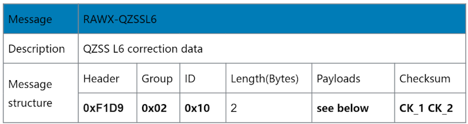

# QZSS correction service receiver QZS-6C

## 1. Overview

### 1.1 Introduction

The QZS-6C receiver supports QZSS L6 signals, the Centimeter Level Augmentation Service (CLAS), and the experimental MADOCA service, output L6 correction service message data. 
The CLAS offers high-accuracy augmentation for GNSS receivers and is freely available across mainland Japan. When paired with other PPP-enabled receivers, it forms a complete, standalone high-precision system, delivering free access to high-accuracy correction services and achieving centimeter-level GNSS accuracy.

Order information

|Item P/N|default configuration|
|---|---|
|**QZS-6C-00**|12*16mm, L1 and L6, QZSS correction service, 115200bps, **default L6E firmware**|

### 1.2 Block Diagram

## 2. Pin definition

### 2.1 PINOUT

### 2.2 PIN DESCRIPTION

## 3. ELECTRICAL CHARACTERISTICS

### 3.1 Absolute Maximum Rating

### 3.2 IO Characteristics

#### 3.2.1 PRRSTX and PRTRG

#### 3.2.2 USB I/O

#### 3.2.3 Others

### 3.3 DC Characteristics

#### 3.3.1 Operating Conditions

### 3.3.2 Power consumption

## 4. Hardware description

### 4.1 Power supply

QZS-6C RTK receiver has two power supply pins: VDD and AVDD_BAK. The VDD pin
provides the main supply voltage, and the AVDD_BAK pin provides the backup supply voltage. In

order to ensure the positioning performance, please control the ripple of the module power supply. It is recommended to use the LDO with max output current above 100 mA.
If the power for VDD pin is off, the real-time clock (RTC) and battery backed RAM (BBR) are supplied through the AVDD_BAK pin. Thus, orbit information and time can be maintained and will allow a Hot or Warm start. If no backup battery is connected, the module performs a cold start at every power up if no aiding data are sent to the module.
Note: If no backup supply is available, connect the AVDD_BAK pin to VDD or leave it floating.

### 4.2 Power on/off Sequence

The module has two independent power domains (backup and main domain). In data backup mode, main power supply can be completely shut down for further power reduction for ultra-low power application.
To meet the requirement of controlling the power on/off sequence of the module, please connect
the external reset pin (PRRSTX) to the Host.

#### 4.2.1 Initial system power on

When both backup and main supply power on from their off state, external reset (PRRSTX) must be active and hold more than 5 ms after both backup supply and main supply reach the minimum
operating voltage. Initial system power on sequence is illustrated in Figure 4.

#### 4.2.2 Main power supply off/on in application

If application intends to shut down main power supply (VDD) while keep backup power supply
(AVDD_BAK) alive to save backup data, the following rules should be applied:
External reset (PRRSTX) must be active when main power supply is under power off. In this case,
external reset must be hold active more than 5 ms after main power supply resumes to minimum

operating voltage. Main power on sequence in application is illustrated in Figure 5.

### 4.3 Antenna design

There is no built-in LNA and SAW in the GNSS module. It is recommended to use an active antenna
with gain less than 50 dB and noise figure less than 1.5 dB. The module has built-in short circuit
detection and open circuit detection functions, which can detect the status of normal connection,
and send out antenna status prompt message in NMEA data.

#### 4.3.1 Short circuit protection

The module includes internal short circuit antenna detection. Once an over-current is
detected at the ANT_BIAS port, the module will restrict the current output automatically to
protect from damage.

#### 4.3.2 Open circuit detection

The module can detect an open circuit in the antenna. Users can judge it from antenna
status messages.

### 4.4 Reset and mode control

The operation mode of GNSS module is controlled by PRRSTX (nRESET) and PRTRG (BOOT) pin. While the module works in normal operation, keep PRRSTX and PRTRG pins at high level. The module will enter reset state when PRRSTX being low level. Operate PRTRG and PRRSTX pins as the following instructions to enter BootROM Command Mode to update firmware.

- Keep PRTRG pin floating during system power-up or the external reset (PRRSTX from low to high), and the module will enter User Normal Mode.
- When the module powers up or PRRSTX from low to high, the module will execute an external reset. (If the power for AVDD_BAK is always on, the external reset will not affect the ephemeris data in the backup domain)

- Drive PRTRG pin to low or connect PRTRG to GND directly (not by pull-down resistance) during system power-up or the external reset (PRRSTX from low to high), and the system enters BootROM Command Mode at PRTRG pin being released from low to floating state, and ready for firmware upgrading command.
- When connecting PRRSTX and PRTRG to any host IO, DO NOT use the pull-up or pull-down resistance

## 5.DEFAULT MESSAGE

### 5.1 Default configuration

- UART OUTPUT
115200 baud, 8 data bits, no parity bit, 1 stop bit|Configured to transmit both NMEA and L6 Raw data|

- UART INPUT
115200 baud, 8 data bits, no parity bit, 1 stop bit, autobauding disabled|Automatically accepts the following protocols without need of explicit configuration: Binary sentence, NMEA, RTCM.|

- Timepulse
1 PPS, synchronized at rising edge, pulse length 100 ms

When the module is applied to the specific application where the main supply needs to be cut, in this case, it is recommended to cut the serial interface connection at the same time or set the serial port to input mode or high impedance state

### 5.2 L6 Message data

The L6 data is transmitted from the satellites in 250-symbol subframes with duration of 1000 ms.
Each subframe starts with a fixed 4-symbol preamble (0x1A, 0xCF, 0xFC, 0x1D), followed by 214 data symbols and 32 Reed-Solomon parity symbols. This message structure applies to both L6D and L6E signals.

The detailed explanation of the L6 message is in this document: IS-QZSS-L6-001 specification for the QZSS L6D/E service.
The QZS-6C receiver only receives and forwards L6 data without parsing, processing, or other actions. To achieve subsequent PPP data processing, other models of products are required. 

For details, please refer to other products at [www.datagnss.com](https://www.datagnss.com).

[1] [IS-QZSS-L6-001](https://qzss.go.jp/en/technical/download/pdf/ps-is-qzss/is-qzss-l6-001.pdf)

[2] [MALIB PPP Project](https://github.com/JAXA-SNU/MALIB) support QZS-6C receiver

[3] Refer to [dgs.c](https://github.com/datagnss/MALIB/blob/main/src/rcv/dgs.c) to parse the L6 message from the QZS-6C receiver

## 6.MECHANICAL SPECIFICATION

## 7. REFERENCE DESIGN

### 7.1 Minimal design

This is a minimal design for the QZS-6C GNSS module. The 82 nH inductor is used only when an
active antenna is connected, and no need with a passive antenna. The characteristic impedance
from RF_IN pin to the antenna connector should be 50Ω.

