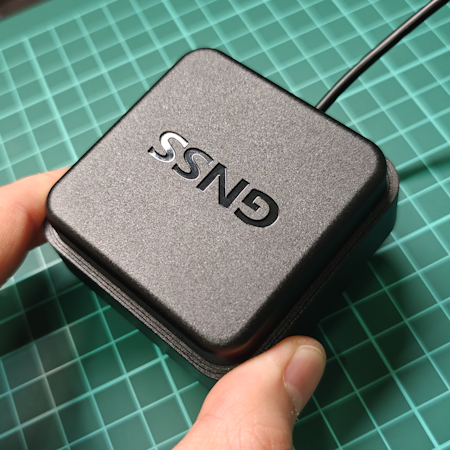
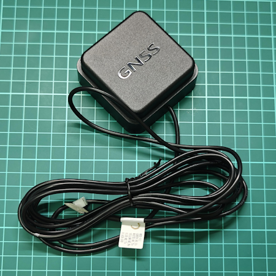
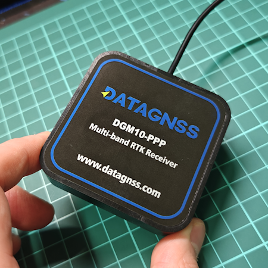

# DGM10-PPP RTK Receiver

## Overview

The DGM10-PPP RTK Receiver is a high-precision PPP/RTK receiver with build-in antenna based on the D10P module, supporting Japan's QZSS PPP service.

It supports navigation systems including GPS/QZSS, GALILEO, BDS and GLONASS, and receives signals on L1/L5 bands and L6 band for QZSS PPP corrections service.

With a built-in PPP positioning engine, it enables PPP positioning based on the MADOCA/CLAS service. When conditions permit, PPP-AR positioning is also achievable.

 

 

### Features

- Supports GPS, BDS, GLONASS, Galileo, QZSS
- Integrated PPP(MADOCA/CLAS)
- State-of-the-art low power consumption design
- The best cost-effective high precision GNSS positioning solution integrated with antenna
- Compact size 65x65x25mm with high performance
- One cable for power and data

### Specifications

#### Antenna

| Item                   | Specs                                                          |
| ---------------------- | -------------------------------------------------------------- |
| Frequency Range(MHz)   | GPS/QZSS L1/L5, QZSS L6, BDS B1/B2, GLONASS L1, GALILEO E1/E5a |
| Polarization           | Right-hand circular                                            |
| Gain(dBi)              | 90° L1≥5.5 L2≥5 L5≥2.5                                     |
| Phase center error(mm) | ≤±2.0                                                        |
| Axial Ratio (dB)       | 90°≤3.0                                                      |
| LNA Gain(dB)           | 38±2                                                          |
| V.S.W.R                | ≤2.0                                                          |
| Noise Figure (dB)      | ≤1.8                                                          |
| DC Voltage (V)         | 5.0～5.5                                                       |
| Current (mA)           | ≤80mA                                                         |
| Impedance(Ω)          | 50                                                             |

#### GNSS

| Parameter                | Specifications                                                                                                       |
| - | - |
| Constellations           | BDS, GPS, QZSS, GLONASS, Galileo, NavIC, SBAS |
| Channel                  | 128 hardware channels  |
| Update rates             | 1Hz default, max up to 5Hz (PPP)  |
| Position accuracy        | GNSS 1.0m CEP ` `SBAS ＜1.0m CEP |
| PPP                      | 0.1~0.6 m (MADOCA, 600-900s converage time) <0.06m (CLAS, 60-120s converage time)|
| TTFF                     | Hot start 1s ` `Cold start 27s                                                                                  |
| Converage time           | MADOCA/PPP<900s CLAS/PPP<120s |
| Reliability              | ＞99.9% |
| Sensitivity              | Cold start -148 dBm ` `Hot start -155 dBm ` `Reacquisition -158 dBm ` `Tracking & navigation -165 dBm |
| Protocol                 | NMEA-0183 ` `RTCM 3.X |
| Baudrate                 | 230400 bps, by default |
| Operating condition      | Main supply 4.75-5.25V  |
| Power consumption        | Tracking GNSS 30 mA @ 3.3V ` `Single system 18 mA @ 3.3V ` `Standby Data backup 16 uA ` `RTC 1.4 uA   |
| Serial                   | UART, 6pins, JST-GH-1.25 |
| Cable                    | 2m default, other length upon request |
| Operating limit          | Velocity 515 m/s ` `Altitude 18,000m |
| Environmental conditions | Operating temp. -40°C to +85°C ` `Storage temp. -40°C to +90°C ` `Humidity 95% RH                      |
| Dimensions(mm)           | 65 x 65 x 25 |
| Weight (g)               | 120 |

[1] tested with a good external LNA
[2] Supported upon request with special firmware

## Hardware

1.25mm pitch 6P connector Pinout:

- Black: GND
- Red: 5V
- Green: Tx0 of GNSS module
- White: Rx0 of GNSS module

## Installation

- Magnet installation

## Package list

- DGM10-PPP receiver

## Test report

Please download this [test report](https://docs.datagnss.com/gnss/rtk_receiver/MA-10P/MA10P-TEST-REPORT-2512.pdf)

## Order Info

Order link: [DGM10-PPP](https://www.datagnss.com/collections/evk/products/qzss-l6-receiver?variant=41500430172195)

| Item Desc.| P/N |Remark|
|-|-|-|
| MADOCA PPP| DGM10-PPP-00 | MADOCA/PPP, L1+L5/L6|
| CLAS PPP | DGM10-PPP-01 | CLAS/PPP, L1+L5/L6|

