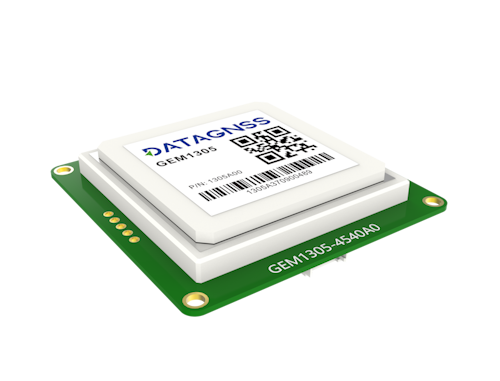
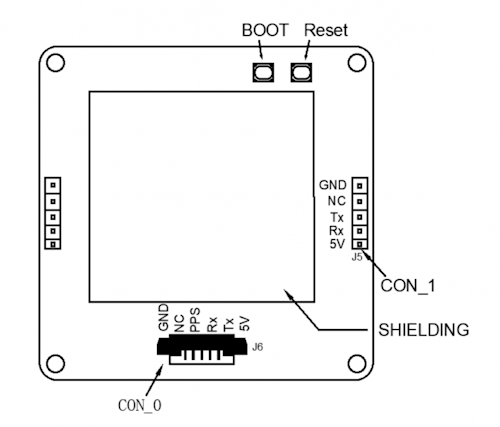

# GEM1305 RTK module with built-in antenna

## Overview

GEM1305 is a high performance dual-band RTK module with build-in antenna, which is based on CYNOSURE series chipset.
It supports BDS-3 signals, along with global civil navigation systems, including GPS, BDS, GLONASS, Galileo, QZSS, and SBAS.

If you are working in the field of UAV, you can refer to the following links:

- [Ardupilot guide](https://ardupilot.org/copter/docs/common-datagnss-gem1305-rtk.html)
- [PX4 guide](https://docs.px4.io/main/en/gps_compass/rtk_gps_gem1305.html) 

### Features

- Supports GPS, BDS, GLONASS, Galileo, QZSS, and SBAS
- Integrated Real Time Kinematics (RTK)
- State-of-the-art low power consumption design
- Supports multi-band multi-system high precision raw data output, easy for 3rd party integration
- The best cost-effective high precision GNSS positioning solution integrated with antenna
- Compact size with high performance

### Specifications

#### Antenna

| Item | Specs |
| --- | --- |
| Frequency Range(MHz) | GPS/QZSS L1/L2/L5, BDS B1/B2I/B2a, GLONASS L1, GALILEO E1/E5a/E5b |
| Polarization | Right-hand circular |
| Gain(dBi) | 90° L1≥5.5 L2≥5 L5≥2.5 |
| Phase center error(mm) | ≤±2.0 |
| Axial Ratio (dB) | 90°≤3.0 |
| LNA Gain(dB) | 30±2 |
| V.S.W.R | ≤2.0 |
| Noise Figure (dB) | ≤1.8 |
| DC Voltage (V) | 5.0～5.5 |
| Current (mA) | ≤80mA |
| Impedance(Ω) | 50 |
| Relative Humidity | 95% |
| Operating Temperature(℃) | -40～+85 |
| Storage Temperature (℃) | -55～+85 |
| Dimensions(mm) | 55 x 55 x 13 |
| Weight (g) | 50g |

#### GNSS

| Parameter | Specifications |
| --- | --- |
| Constellations | BDS, GPS, QZSS, GLONASS, Galileo, NavIC, SBAS |
| Channel | 128 hardware channels |
| Update rates | 5Hz default, max up to 10Hz |
| Position accuracy | GNSS 1.0m CEP SBAS ＜1.0m CEP |
| RTK | 1.0 cm + 1 ppm (H) 2.0 cm + 1 ppm (V) |
| Velocity & Time accuracy | GNSS 0.05 m/s CEP 1PPS 20ns RMS |
| TTFF | Hot start 1s Cold start 27s |
| RTK | Convergence time <10s |
| Reliability | ＞99.9% |
| Sensitivity | Cold start -148 dBm Hot start -155 dBm Reacquisition -158 dBm Tracking & navigation -165 dBm |
| Protocol | NMEA-0183 RTCM 2.X, RTCM 3.X |
| Baudrate | 230400 bps, by default |
| Operating condition | Main supply 4.75-5.25V Digital I/O supply 1.75V to 3.63V Backup supply 1.62V to 3.63V |
| Power consumption | Tracking GNSS 30 mA @ 3.3V Single system 18 mA @ 3.3V Standby Data backup 16 uA RTC 1.4 uA |
| Serial interface | UART 2 SPI 2 I2C 2 |
| Operating limit | Velocity 515 m/s Altitude 18,000m |
| Environmental conditions | Operating temp. -40°C to +85°C Storage temp. -40°C to +90°C Humidity 95% RH |

[1] tested with a good external LNA
[2] Supported upon request with special firmware

## Hardware

CON_0(J6): 1.25mm pitch 6P connector Pinout:

- GND
- NC
- Rx0 of GNSS module
- Tx0 of GNSS module
- 5V, input,max current:200mA

CON_1(J5): Pin header connector 2.54mm

- GND
- NC
- Tx1 of GNSS module
- Rx1 of GNSS module
- 5V

UART0 can be used for firmware upgrade, while UART1 cannot.

## Applications

[GEM1305 with Ardupilot](https://ardupilot.org/copter/docs/common-datagnss-gem1305-rtk.html)
[GEM1305 with PX4](https://docs.px4.io/main/en/gps_compass/rtk_gps_gem1305.html)

## Package list

- GEM1305 receiver
- USB-to-Serial test cable (CH340-based,Red:5V Black:GND Green:Tx White:Rx)
- 6P 1.25mm cable

## Resources

- [GEM1305 2D Drawing](../../../assets/drawing_files/GEM1305-2D-Drawing.pdf)
- [Allystar GNSS binary protocol](../../../common/common_allystar_binary_protocol)
