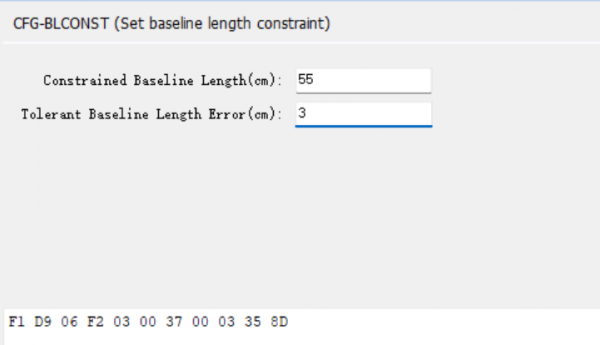

# HED-10L Heading RTK module

## Overview

## NANO Dual-Antenna RTK Receiver

### PINOUT

6P 1.25mm connector (from left to right):

- 5V
- Rx
- Tx
- PPS
- PPS
- GND

> **Default configuration**
>- USB UART Baud rate: 230400bps
>- 6P UART Baud rate: 230400bps
>- Output protocol: Rover mode, NMEA 1Hz(GGA,GSA,GSV,ZDA,GST,RMC,PALYSBLS)
>- Default baseline length: 0.96m

### Quick guide

The HED-10L is designed for simplicity. For first-time use, simply install and secure the antennas, then power on the device.

Both 2 antennas should be placed in an open-sky environment, with a distance of approximately 0.95–1.05 meters between them.

After securing the antennas, connect the main board's Type-C port to your computer's USB port. Open the Device Manager on Windows to check the corresponding USB COM port number. Then, launch the Satrack software, select the correct port, set the baud rate to 230400 bps, and connect.

Open the "View - Baseline Information View" window in the menu to begin testing.

>Related link:
>- Download [Satrack latest version](../../../assets/software/satrack_latest.zip).

### DIP Switcher

the pin 3 and 4 connected to the M module for USB type C, output positioning data and heading data. so if you want to output data via usb, please keep 3 and 4 to ON position.

### Protocol 

**PALYSBLS Message** for heading data

>$PALYSBLS,025217.000,-0.577,1.030,0.782,1.416,119.25,33.55,F*4A

### How to Install

#### Installation

The figure below is a typical installation method for UAV, where the baseline length is the distance between the centers of two antennas, which needs to be measured to obtain this value.

#### Config baseline

After installation, the baseline length needs to be configured.

Then open [Satrack software](../../../assets/software/satrack_latest.zip) , "View" - "AS Message View", choose "CFG-BLCNST" to config the baseline length and tolerant like below screenshot, then press "send":

>If the distance between the two antennas remains unchanged, this setting only needs to be done once.

#### Configuration for Ardupilot

If we install according to the diagram above, the dimensions are also as shown in the picture.
The parameters of Ardupilot need to be set as follows:

GPS_POS1_X = 0
GPS_POS1_Y = +0.25
GPS_POS1_Z = -0.14

>We used self-compiled firmware for the above test, as the standard official AP firmware does not yet support this module.

## Resources

- [AN2024-HED10L-001](../../../assets/datasheet/AN-HED10L-240927.pdf)
- [Allystar GNSS binary protocol](../../../common/common_allystar_binary_protocol)
- [Satrack_User_Manual](../../../assets/datasheet/Satrack_User_Manual.pdf)