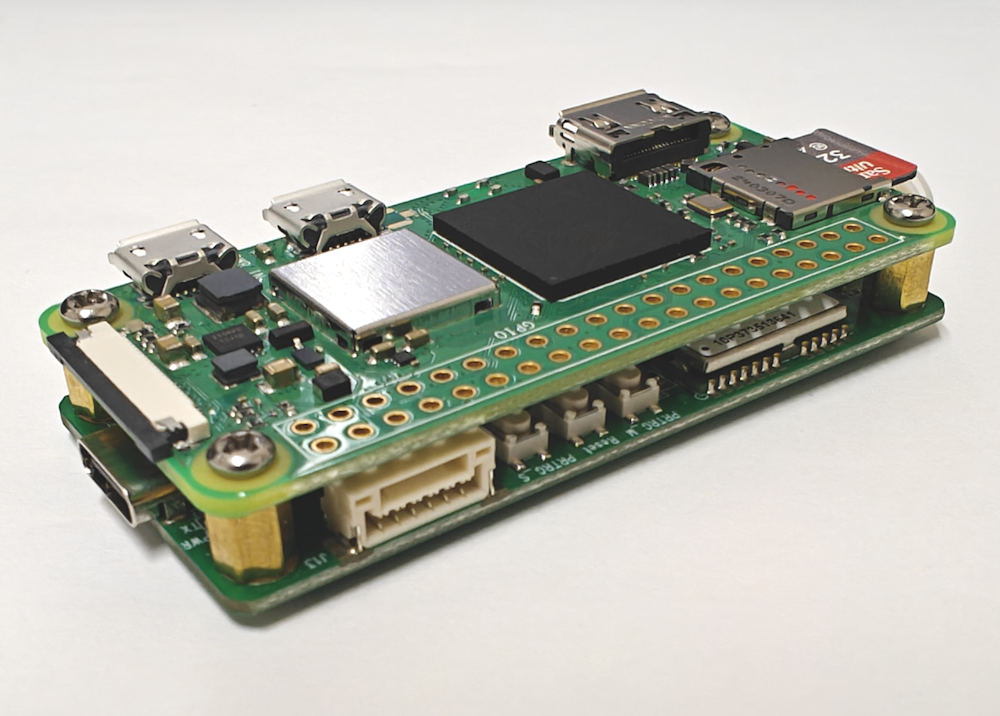

# MA-10P MADOCA GNSS Receiver for Pi Zero

## Overview

The MA-10P Series is a product line from DATAGNSS that supports QZSS PPP services, enabling centimeter-level positioning using MADOCA/CLAS PPP technology.

The [MA-10P PPP Receiver](https://docs.datagnss.com/gnss/rtk_receiver/MA-10P/) can achieve MADOCA PPP positioning through its built-in algorithms.

The MA-10P-PiZero, based on the MA-10P evaluation kit, works seamlessly with the Raspberry Pi Zero to provide [MALIB](https://github.com/JAXA-SNU/MALIB) PPP positioning. It is ideal for MALIB evaluation or research purposes.

The MA-10P-PiZero connects directly to the Pi Zero mainboard's USB interface via a board-to-board Pogo Pin connector. The entire EVK requires only a Type-C interface for power supply, and data output is available through network, UART, and other interfaces.

The Pi Zero system is pre-configured with overlay technology, allowing for power interruptions at any time without affecting system stability.

>*The MA-10P-PiZero is designed to evaluate use with the MALIB project.*

## Features

- Seamless integration with Pi Zero
- Supports custom system functions
- Fully compatible with the MALIB project
- Ready to use upon power-up, no additional setup required
- Supports WiFi connectivity

## Specifications

### GNSS

| Parameter | Specifications |
| --- | --- |
| Constellations | GPS L1+L5,  QZSS L1+L5,  GLONASS G1+G2,  Galileo E1+E5a,  BDS B1I+B2a |
| Channel | 128 hardware channels |
| Update rates | 1Hz default |
| Position accuracy | GNSS 1.5m CEP |
| PPP | ~10.0 cm (PPP)  5.0 cm ( PPP-AR ) Coverage time: 3-15 minutes |
| Velocity & Time accuracy | GNSS 0.05 m/s CEP 1PPS 20ns RMS |
| TTFF | Hot start 1s Cold start 27s |
| Reliability | ＞99.9% |
| Sensitivity | Cold start -148 dBm Hot start -155 dBm Reacquisition -158 dBm Tracking & navigation -165 dBm |
| Protocol | NMEA-0183 |
| Baudrate | 230400 bps, by default |
| Operating condition | Main supply 4.75-5.25V|
| Power consumption | Tracking GNSS 30 mA @ 3.3V Single system 18 mA @ 3.3V Standby Data backup 16 uA RTC 1.4 uA |
| Serial | UART, 6 pins, 1.25mm pitch|
| USB | Power supply |
| Environmental conditions | Operating temp. -40°C to +85°C Storage temp. -40°C to +90°C Humidity 95% RH |
| Dimensions(mm) | 65 x 30 |
| Weight (g) | 30 |

### PINOUT

The MA-10P series supports USB power supply and 6-pin connector UART output.

The 6-pin connector UART is preset for PPP Position NMEA output.

## Quick guide

1. Power up

Use the supplied USB power adapter to power the Type C port of the MA-10P-PiZero. **Do not** power the system through the MicroUSB port on the Pi Zero, and **do not** use the Pi Zero's OTG port for power.

It is recommended **not** to power the system directly from a PC's USB port.

You can use a power bank to power the system.

2. Connect to antenna

3. After startup, it takes about 10-15 seconds for the UART interface to start outputting NMEA positioning data.

## Resource
- [MALIB Project](https://github.com/JAXA-SNU/MALIB)
- [MALIB for PiZero Project](https://github.com/datagnss/MALIB-PIZERO)

