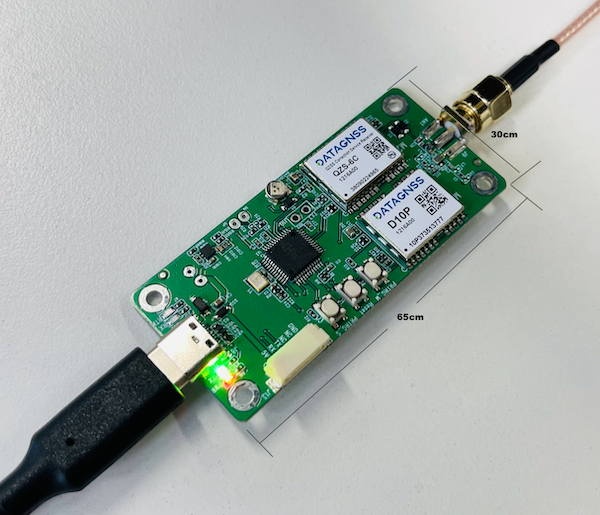
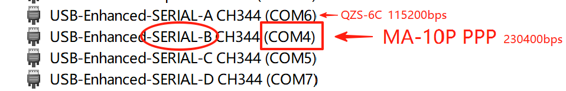

# Overview

The MA-10P GNSS Receiver is a high-precision PPP receiver based on the D10P module, supporting Japan's QZSS PPP service.

It supports navigation systems including GPS/QZSS, GALILEO, BDS and GLONASS, and receives signals on L1/L5 frequencies.

With a built-in PPP positioning engine, it enables PPP positioning based on the MADOCA/CLAS service. When conditions permit, PPP-AR positioning is also achievable.

The MA-10P can be widely used in various positioning projects within the coverage area of the MADOCA service.

The MA-10P PPP Receiver consists of the MA-10P module and the QZS-6C module. The MA-10P module performs PPP positioning, while the QZS-6C module handles the reception and processing of QZSS MADOCA Correction.

# Specifications

## GNSS

| Parameter | Specifications |
| --- | --- |
| Constellations | GPS, QZSS, GLONASS, Galileo |
| Channel | 128 hardware channels |
| Update rates | 1Hz default |
| Position accuracy | GNSS 1.5m CEP |
| PPP | ~30.0 cm (PPP)  5.0 cm ( PPP-AR ) |
| Velocity & Time accuracy | GNSS 0.05 m/s CEP 1PPS 20ns RMS |
| TTFF | Hot start 1s Cold start 27s |
| Reliability | ＞99.9% |
| Sensitivity | Cold start -148 dBm Hot start -155 dBm Reacquisition -158 dBm Tracking & navigation -165 dBm |
| Protocol | NMEA-0183 |
| Baudrate | 230400 bps, by default |
| Operating condition | Main supply 4.75-5.25V|
| Power consumption | Tracking GNSS 30 mA @ 3.3V Single system 18 mA @ 3.3V Standby Data backup 16 uA RTC 1.4 uA |
| Serial | UART, 6 pins, 1.25mm pitch|
| USB | CP210x serial port |
| Environmental conditions | Operating temp. -40°C to +85°C Storage temp. -40°C to +90°C Humidity 95% RH |
| Dimensions(mm) | 65 x 30 |
| Weight (g) | 30 |

## PINOUT

MA-10P support USB UART and 6P connector UART output.
Download [USB Driver](../../../assets/driver/CH343SER.zip)

6P connector UART only support output, not input.

# How to use it

Please download Satrack software to test the function of MA-10P.
Download Satrack from [here](../../../assets/software/satrack_latest.zip)

## Instructions

1. Connect your MA-10P to PC/LAPTOP via USB cable. Download [USB Driver](../../../assets/driver/CH343SER.zip)
2. Check your ports for MA-10P receiver, for example the following picture:

If usb driver installed, there is 4 ports in device managerf,USB A,B,C and D.

- USB A : **Aux port**, QZS-6C, for QZSS correction service, baud rate 115200bps
- USB B : **Main port**, D-10P, PPP receiver, baud rate 230400bps
- USB C and D : not available

USB B is the port you need to use. Check which COM port corresponds to USB B; in the picture above, it is COM4.

This means you can open COM4 in Satrack and set the baud rate to 230400bps.

After the MA-10P receiver obtains PPP correction data, it starts PPP processing and displays the **RTK Float** status. If PPP-AR is successful, it will display the **RTK Fixed** status.
> As of August 2025, the current firmware version does not support PPP-AR.
