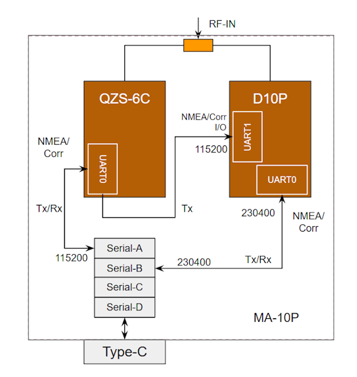
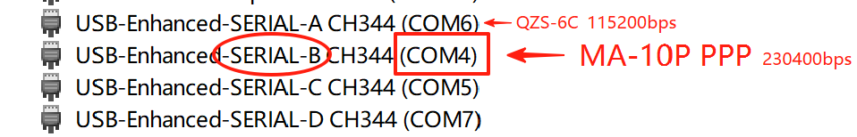

# Overview

The MA-10P PPP GNSS Receiver is designed to support QZSS MADOCA/CLAS PPP positioning services.

MA-10P/DGM10-PPP fully supports QZSS MADOCA/CLAS PPP positioning, enabling both PPP and PPP-AR modes.

For more details on QZSS MADOCA PPP services, please refer to [Multi-GNSS Advanced Orbit and Clock Augmentation - Precise Point Positioning (MADOCA-PPP)](https://qzss.go.jp/en/overview/services/sv13_madoca.html).

The MA-10P/DGM10-PPP receiver can independently receive L6 service data, decode it, and achieve PPP and PPP-AR/RTK positioning.

MA-10P/DGM10-PPP receiver is also seamlessly compatible with the Raspberry Pi Zero, allowing you to run your own PPP algorithms and develop additional applications on the Pi Zero.

This document applies to both the MA-10P and DGM10-PPP product series. Products in both series support either MADOCA or CLAS services.

# Specifications

## GNSS

| Parameter | Specifications |
| --- | --- |
| Constellations | GPS, QZSS, BDS, Galileo |
| Channel | 128 hardware channels |
| Update rates | 1Hz default |
| Position accuracy | GNSS 1.5m CEP |
| PPP | ~30.0 cm (PPP)  5.0 cm ( PPP-AR ) |
| Velocity & Time accuracy | GNSS 0.05 m/s CEP 1PPS 20ns RMS |
| TTFF | Hot start 1s Cold start 27s |
| Reliability | ＞99.9% |
| Sensitivity | Cold start -148 dBm Hot start -155 dBm Reacquisition -158 dBm Tracking & navigation -165 dBm |
| Protocol | NMEA-0183 |
| Baudrate | 230400 bps, by default |
| Operating condition | Main supply 4.75-5.25V|
| Power consumption | Tracking GNSS 30 mA @ 3.3V Single system 18 mA @ 3.3V Standby Data backup 16 uA RTC 1.4 uA |
| Serial | UART, 6 pins, 1.25mm pitch|
| USB | CP210x serial port (MA-10P series)|
| Environmental conditions | Operating temp. -40°C to +85°C Storage temp. -40°C to +90°C Humidity 95% RH |

## PINOUT

MA-10P support USB UART and 6P connector UART output.

[MA-10P USB Driver](../../../assets/driver/CH343SER.zip)

6P connector [JST-GH-1.25mm, 6P] UART only support output, not input.

DGM10-PPP support 6P connector output (JST-GH-1.25mm).
Each pin is defined and labeled on the cable's marking. Specifically, M1_TX and M1_RX are the ports used by the MADOCA/CLAS module.

You can directly connect to a computer or mobile device using the included 6P-UART-USB converter board via a standard USB Type-C cable for UART communication.

The default baud rate is 230400 bps.

Whether it's the MA-10P or the DGM10-PPP series, both output data in the NMEA format.

### Blockgram

# How to use it

Please download Satrack software to test the functions of MA-10P/DGM10-PPP receiver.

Download Satrack from [here](../../../assets/software/satrack_latest.zip)

## Instructions

For MA-10P, please refer to the following instructions:

1. Connect your MA-10P to PC/LAPTOP via USB cable. Download [USB Driver](../../../assets/driver/CH343SER.zip)
2. Check your ports for MA-10P receiver in device manager, for example the following picture:
   

If usb driver installed, there is 4 serial ports in device managerf, USB Serial A,B,C and D.

- USB Serial A : **Aux port**, QZS-6C, for QZSS correction service, baud rate 115200bps
- USB Serial B : **Main port**, D-10P, PPP receiver, baud rate 230400bps
- USB Serial C : not connected
- USB Serial D : not connected

USB Serial B is the main port you need to use. Check which COM port corresponds to USB Serial B; in the picture above, it is COM4.

This means you can open COM4 in Satrack and set the baud rate to 230400bps.

After the MA-10P receiver obtains PPP correction data, it starts PPP processing and displays the **RTK Float** status. 

For DGM10-PPP, connect the type c to your PC or laptop, there is only one USB uart port, baud rate is 230400bps.

Then it will output NMEA data.

For MADOCA services, typically within 1-3 minutes, a fast RTK Float solution is achieved (indicated by a GPS quality of 5 in the NMEA GGA statement). The initialization time, which depends on the environment, generally ranges from 10 to 30 minutes. Once initialized, accuracy can reach approximately 0.1-0.6 meters.

For CLAS services, typically within 1-3 minutes, a fast transition to RTK Float mode is observed (indicated by a GPS quality of 5 in the NMEA GGA statement). Depending on the environment, this is followed by the RTK convergence phase, which generally takes 2-3 minutes for initialization. Once initialized, accuracy can reach approximately 0.06-0.12 meters.

# Test report

Please download this [MADOCA test report](./MA10P-TEST-REPORT-2512.pdf)
