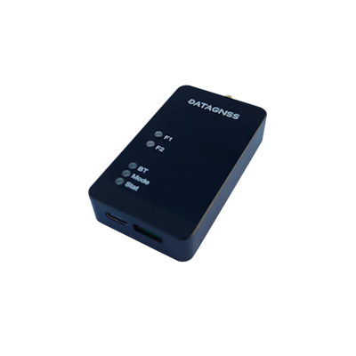
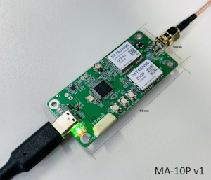
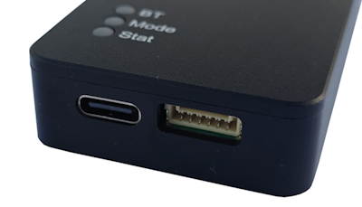
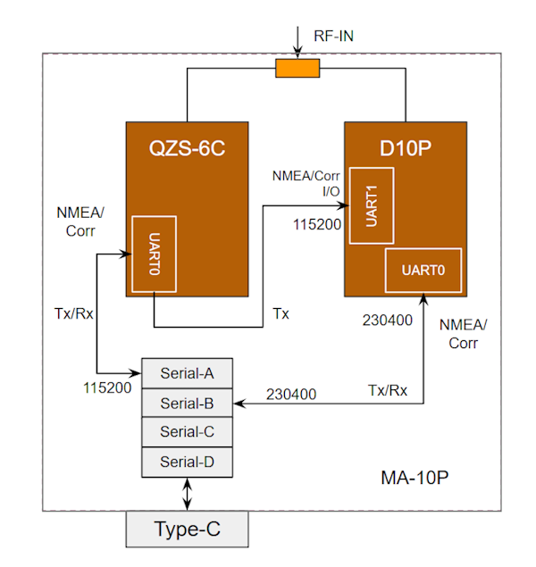
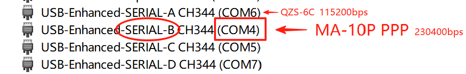

# Overview

The MA-10P Series PPP GNSS Receiver is designed to support QZSS MADOCA and CLAS PPP services.

MA-10P series 的硬件现在已经升级到 v2 版本.

如果你使用的是 v1 版本，请参考这里 [MA-10P v1](../MA-10P-V1/)

如果你使用的是 DGM10-PPP series 请参考这里 [DGM10-PPP](../DGM10-PPP)

MA-10P series v2 有以下2款:

| Item Desc.   | P/N              | Remark                 |
| ------------ | ---------------- | ---------------------- |
| MADOCA PPP   | MA10P-02-PPP-00  | MADOCA/PPP, L1+L5,L6   |
| CLAS PPP-RTK | MA10P-02-CLAS-00 | CLAS/PPP-RTK, L1+L5,L6 |

MA-10P v2 support USB serial and TTL UART output.

建议使用 [AT400 L1/L2/L5/L6](https://www.datagnss.com/collections/rtk-antenna/products/at400-multi-band-antenna-for-rtk) 作为MA-10P v2的接收天线。

# Specifications

## GNSS

| Parameter                | Specifications                                                                                                     |
| ------------------------ | ------------------------------------------------------------------------------------------------------------------ |
| Constellations           | GPS, QZSS, BDS, Galileo                                                                                            |
| Channel                  | 128 hardware channels                                                                                              |
| Update rates             | 1Hz                                                                                                                |
| Position accuracy        | GNSS 1.5m CEP                                                                                                      |
| CLAS/PPP-RTK**           | ~0.065m (H) ~0.095m (V)                                                                                            |
| Converage(CLAS)          | 40s (RTK Float), 60-120s (RTK Fixed)                                                                               |
| Reliability              | ＞99.9%                                                                                                            |
| Protocol                 | NMEA-0183                                                                                                          |
| Baudrate                 | 230400 bps (USB Serial) by default, 115200 bps (6P UART) by default                                                |
| Operating condition      | Main supply 4.75-5.25V                                                                                             |
| Power consumption        | Tracking GNSS 30 mA @ 3.3V ` `Single system 18 mA @ 3.3V ` `Standby Data backup 16 uA ` `RTC 1.4 uA |
| Serial                   | UART, 6 pins, 1.25mm pitch                                                                                         |
| USB                      | USB serial                                                                                                         |
| Environmental conditions | Operating temp. -40°C to +85°C ` `Storage temp. -40°C to +90°C ` `Humidity 95% RH                    |

**tested in open sky environment, use AT400 antenna

## PINOUT

### MA-10P

MA-10P support USB UART (230400 bps) and 6P connector UART output (115200 bps).

[MA-10P USB Driver](../../../assets/driver/CH343SER.zip)

6P connector [JST-GH-1.25mm, 6P] UART only support output, not input.

> **6P UART (J13) output**
> Baudrate 115200 bps in default.

### DGM10-PPP

DGM10-PPP support 6P connector output (JST-GH-1.25mm).
Each pin is defined and labeled on the cable's marking. Specifically, M1_TX and M1_RX are the ports used by the MADOCA/CLAS module.

You can directly connect to a computer or mobile device using the included 6P-UART-USB converter board via a standard USB Type-C cable for UART communication.

The default baud rate is 230400 bps.

Whether it's the MA-10P or the DGM10-PPP series, both output data in the NMEA format.

### Blockgram

# How to use it

Please download Satrack software to test the functions of MA-10P/DGM10-PPP receiver.

Download Satrack from [here](../../../assets/software/satrack_latest.zip)

## Instructions

### MA-10P

For MA-10P, please refer to the following instructions:

1. Connect your MA-10P to PC/LAPTOP via USB cable. Download [USB Driver](../../../assets/driver/CH343SER.zip)
2. Check your ports for MA-10P receiver in device manager, for example the following picture:
   

If usb driver installed, there is 4 serial ports in device managerf, USB Serial A,B,C and D.

- USB Serial A : **Aux port**, QZS-6C, for QZSS correction service, baud rate 115200bps
- USB Serial B : **Main port**, D-10P, PPP receiver, baud rate 230400bps
- USB Serial C : not connected
- USB Serial D : not connected

USB Serial B is the main port you need to use. Check which COM port corresponds to USB Serial B; in the picture above, it is COM4.

This means you can open COM4 in Satrack and set the baud rate to 230400bps.

After the MA-10P receiver obtains PPP correction data, it starts PPP processing and displays the **RTK Float** status.

### DGM10-PPP

For DGM10-PPP, connect the type c to your PC or laptop, there is only one USB uart port, baud rate is 230400bps.

Then it will output NMEA data.

### MADOCA/CLAS

For MADOCA services, typically within 1-3 minutes, a fast RTK Float solution is achieved (indicated by a GPS quality of 5 in the NMEA GGA statement).

The initialization time, which depends on the environment, generally ranges from 10 to 30 minutes. Once initialized, accuracy can reach approximately 0.1-0.6 meters.

For CLAS services, typically within 1-3 minutes, a fast transition to RTK Float mode is observed (indicated by a GPS quality of 5 in the NMEA GGA statement).

Depending on the environment, this is followed by the RTK convergence phase, which generally takes 2-3 minutes for initialization. Once initialized, accuracy can reach approximately 0.06-0.12 meters.

It supports 1Hz only for solutuion output now.

# Test report

Please download this [MADOCA test report](./MA10P-TEST-REPORT-2512.pdf)
