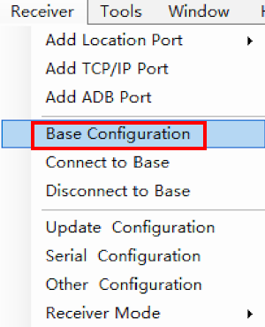
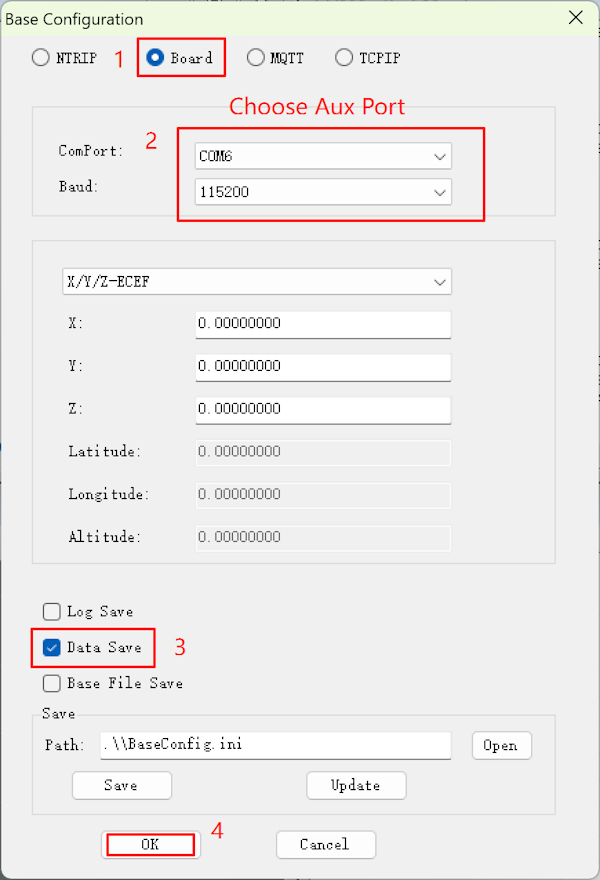
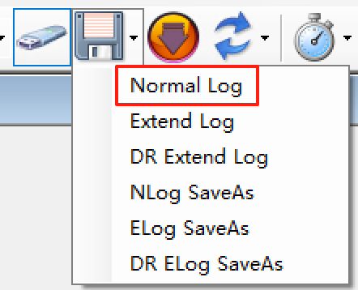
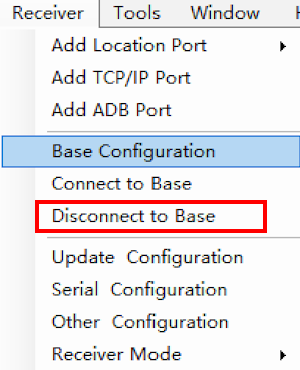

# Log data for MA-10P[only for test]

## Instructions

1. Open Satrack and connect your MA-10P to your PC/Laptop via USB cable.
2. Connect to the main port (USB-Serial B, as listed in Device Manager) of the MA-10P, with a baud rate of 230400bps.
3. Check the data using the port monitor view and signal view to confirm the output of NMEA data.
4. Click the "Receiver" menu and select "Base Configuration" to open the Base Configuration window.

Here, select the Aux Port (USB-Serial A, as listed in Device Manager).
> Please note that in step 3 shown in the screenshot, you must check the box.

5. Click the "Receiver" menu and select "Connect to Base".

6. Return to the main UI and click the "normal log" icon.

The data will be logged in the "logs" folder in the Satrack installation directory.
When you finish logging, press the log icon again to stop logging.

7. Click the "Receiver" menu and select "Disconnect to Base" to disconnect from the Aux Port.

The above steps, especially the Base configuration, are for testing purposes only. Normally, you do not need to configure the Base when using the MA-10P receiver. After finishing, please make sure to disconnect the Base connection.

Then zip the log data and send to info@datagnss.com.

Thanks for you assistant.