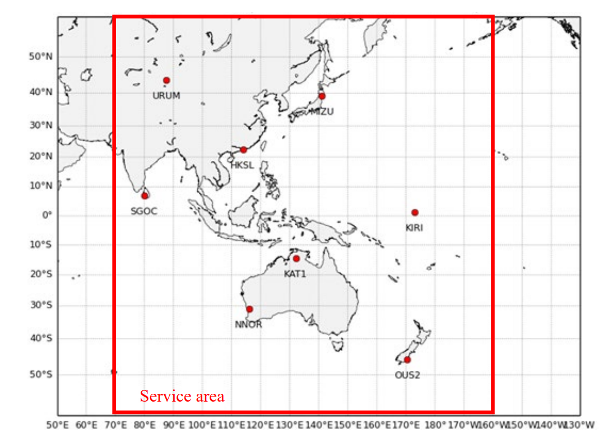
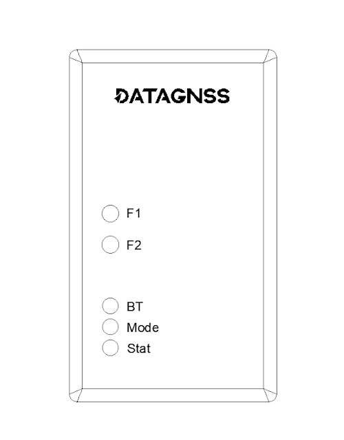
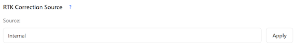

# MA-10P V2 Wiki

## Overview

MA-10P V2 is a high-precision GNSS PPP receiver based on the D10P module.
It is designed for Japan's QZSS PPP services and supports GPS, QZSS, Galileo, BDS, and GLONASS on L1/L5 frequencies.

Within the QZSS service coverage area, including major parts of the Asia-Pacific region and Australia as shown in the coverage map below, the receiver enables convenient real-time PPP positioning without requiring any local correction service.

After initialization and convergence, PPP positioning accuracy can typically reach 0.1–0.6 m. Outside the QZSS service coverage area, PPP positioning can be achieved through network-based correction services, such as NTRIP.

With its built-in positioning engine, it enables robust PPP positioning based on MADOCA services, making it ideal for various positioning projects within the service coverage area.

The MA10P-V2 supports both Bluetooth Low Energy (BLE) and USB connectivity, and can also output positioning data via a serial interface.

It is compatible with a wide range of popular GIS and field data collection applications.

### Supported Software

- SW Maps: free GIS and mobile mapping app for geographic data collection, mapping, KML, shapefiles, and more.
- QField: professional mobile GIS application for field surveying, geospatial data collection, and management.
- ROLAVICam: mobile capture application for photogrammetry, videogrammetry, and field documentation.

## Key Features

- D10P-based high-precision PPP receiver
- Supports QZSS PPP services via QZS6C
- Supports GPS, QZSS, Galileo, BDS, and GLONASS on L1/L5
- Works with MADOCA correction services
- Supports USB serial and TTL UART output
- Designed for real-time positioning applications

## Specifications

| Parameter                | Specifications                                                                                  |
| ------------------------ | ----------------------------------------------------------------------------------------------- |
| Constellations           | GPS, QZSS, BDS, Galileo                                                                         |
| Channel                  | 128 hardware channels                                                                           |
| Update rates             | 1Hz                                                                                             |
| Position accuracy        | GNSS 1.5m ` ` PPP 0.1-0.6m, coverage time 5-15 minutes                                     |
| Reliability              | ＞99.9%                                                                                         |
| Protocol                 | NMEA-0183                                                                                       |
| Baudrate                 | 230400 bps, by default                                                                          |
| Operating condition      | Main supply 4.75-5.25V                                                                          |
| Serial                   | UART, 6 pins, 1.25mm pitch                                                                      |
| Interface                | BLE serial,USB,UART                                                                             |
| Environmental conditions | Operating temp. -40°C to +85°C ` `Storage temp. -40°C to +90°C ` `Humidity 95% RH |

## Hardware

MA10P-V2 must use a GNSS antenna that supports L1, L2, L5, and L6. The L6 band is used to receive PPP correction service signals.

The bundled AT400 antenna supports reception across all bands and all signals.

If you use another antenna, please check the antenna specifications carefully.

## Quick start

This page is for the MA10P-V2 product only. For the MA-10P series, please refer to [here](../MA-10P-V1/).

The MA10P-V2 front panel is shown below:

- The F1/F2 buttons currently have no function. They may be supported in a future firmware update.
- The BT LED indicates the Bluetooth connection. MA10P-V2 supports BLE, and you can connect with apps such as SW Maps, QField, or RolaviCam. SW Maps and QField also support iOS.
- The Mode LED indicates the operating mode. For MA10P-V2, only the green mode is used.
- The Stat LED indicates the current positioning status. Red means single-point positioning, flashing green means RTK Float, and solid green means RTK Fixed.

Limitations:

- The current firmware does not support outputting raw measurement data (RTCM3).
- When external QZSS/correction data are input, only DGS-format data streams are supported. Raw L6D Frame data are not currently supported.

### WiFi connection

Search for the `NANO_RTK_xxxx` WiFi hotspot and connect using the password `datagnss`. 

After connecting, open `192.168.4.1` to configure the web page.

MA10P-V2 supports CLAS/MADOCA positioning using corrections provided by the built-in QZS6C service. Supported positioning modes may vary by model.

### QZSS / L6 correction

By default, L6 correction data comes from `Internal`, as shown below:

You can also select other data sources, such as `TCP Client`, `NTRIP Client`, or `Bluetooth`.

When `Bluetooth` is selected, you can use Android or iOS devices to inject correction data through an app.

DATAGNSS provides free DGS-format L6D/L6E NTRIP data stream services for customers in Japan. To use this service, apply for an NTRIP client account at https://caster.gnsslab.net.

### Data output

By default, NMEA sentences are output over USB and BLE. The USB baud rate is 230400 bps. Be sure to select the port labeled `SERIAL-A` （check the com-port in device manager）.

By default, NMEA can also be output through the 6P UART for use with other TTL devices. If you do not need this function, you can ignore it.

L6 correction data can also be output through the 6P UART. In that case, configure `Forward GNSS2 Data to External Port` on the `http://192.168.4.1/advanced.html` page.

## Notes

- Use the receiver in an open-sky environment for best PPP performance.
- Accuracy and convergence time depend on antenna quality, sky visibility, and service conditions.
- For field use, verify the actual correction service and connection settings before deployment.
