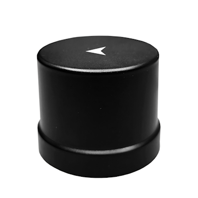
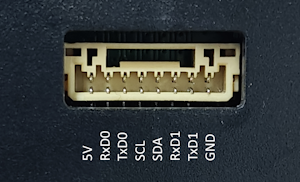
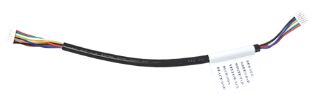

## NANO H10P RTK Receiver

### Overview

The NANO H10P RTK Receiver is a high-performance dual-band RTK receiver with an integrated compass, based on the CYNOSURE series chipset. It supports global civil navigation systems, including GPS, BDS, GLONASS, Galileo, QZSS, and SBAS.

This receiver is equipped with a **compass** and is designed for UAV, RTK, and other applications. It supports both base and rover modes.

### Features

- Supports GPS, BDS, GLONASS, Galileo, QZSS, and SBAS
- Integrated Real-Time Kinematics (RTK)
- State-of-the-art low power consumption design
- Supports dual-band L1+L5 or L1+L2
- Equipped with **compass** IST8310
- Lightweight and compact size

### Specifications

| Parameter             | Specifications                                                                 |
|-----------------------|-------------------------------------------------------------------------------|
| Constellations        | BDS, GPS, QZSS, GLONASS, Galileo, NavIC, SBAS                                |
| Update rates          | 10Hz                                                                         |
| Channels              | 128 hardware channels                                                       |
| Position accuracy     | GNSS: 1.0m CEP   SBAS: ＜1.0m CEP   RTK:   1.0 cm + 1 ppm (H) 2.0 cm + 1 ppm (V) |
| Velocity & Time accuracy | GNSS: 0.05 m/s CEP   1PPS: 20ns RMS                                     |
| TTFF                  | Hot start: 1s   Cold start: 27s                                           |
| RTK               | Convergence time <10s                                                        |
| Reliability           | ＞99.9%                                                                      |
| Sensitivity           | Cold start: -148 dBm   Hot start: -155 dBm   Reacquisition: -158 dBm   Tracking & navigation: -165 dBm |
| Protocol              | NMEA-0183   RTCM 3.X, raw measurements                                    |
| Baudrate              | 230400 bps, by default                                                       |
| Compass               | IST8310                                                                      |
| LNA gain              | 28 dB                                                                       |
| Operating condition   | Main supply 1.75V to 3.63V   Digital I/O supply 1.75V to 3.63V   Backup supply 1.62V to 3.63V |
| Power consumption     | Tracking GNSS 30 mA @ 3.3V   Tracking Single system 18 mA @ 3.3V   Standby Data backup 16 uA   Standby RTC 1.4 uA |
| Serial interface      | UART x 2   6P and 4P connector                                            |
| Operating limit       | Velocity 515 m/s   Altitude 18,000m                                       |
| Environmental conditions | Operating temp. -40°C to +85°C   Storage temp. -40°C to +90°C   Humidity 95% RH |
| Weight                | 15g                                                                         |
| Size                  | ⌀48*35mm                                                                    |

### PINOUT

8P JST connector, UART0 and UART1, compass I2C interface.

From left to right:

- 5V
- RxD0
- TxD0
- SCL
- SDA
- RxD1
- TxD1
- GND

Typically, only RxD0 and TxD0 of UART0 are required for use.

### Package List

- H10P RTK Receiver
- GH-8P-6P-125-04
- 3M adhesive tape
