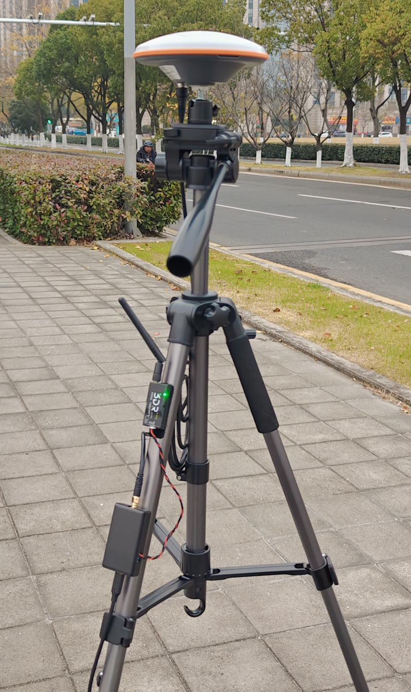
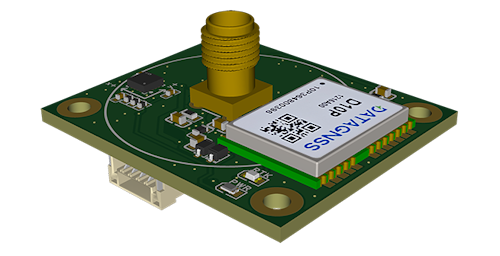

# D10P RTK Test Kits

## Overview

The D10P test kits include the following:

Base station: 
- NANO RTK Receiver (base mode) 
- 3DR X6 telemetry radio
- 4P connector for radio
- Power type C cable
- Antenna

Rover:
- NANO HRTK Receiver (rover mode)
- 3DR X6 telemetry radio
- 4P connector for radio and receiver
- Helix antenna
- 6P connector for output NMEA

## How to use

### Base station

For base station, you can use the installation method shown in the figure 1 directly.

Place the antenna on a high, flat surface, away from any obstructions or interference, such as the top of a car.
It is best to have a large, flat ground plane under the antenna to receive more and stable satellite signals.

Then use a Power bank or other USB power supply to power the NANO RTK Receiver.
Generally, the NANO RTK receiver you receive is pre-configured. After power on, it will automatically configure and start working, about 1 minute later, and start sending RTCM messages data to the other end via telemetry radio.

In default, the uart baud rate is 115200bps.(some special firmware may be different with 230400bps, please find the uart baud rate outside of the box)

Connect all base station components as shown in the figure.
After connecting, plug in the Power bank and it will be ready to use.

Note: The test kits you received may not include a bracket, and the antenna model may also be different.

### Rover

For rover, you can use the installation method shown in the figure 2 directly.

If your rover is NANO Helix RTK receiver, like the following picture:

1. connect the radio to the receiver via the 4P connector
2. connect the NANO Helix RTK receiver to your device via the 6P connector

Note: The NANO Helix RTK receiver need be powered by your device via the 6P connector. The level of the power supply is 4.75-5.25V. It is recommended to use a power bank or other USB power supply.

if you need prepare for the 6P cable for your device, you can refer to the following picture:

Note: please notice the Rx and Tx with your device. 4P for radio and 6P for NMEA data output for your device.