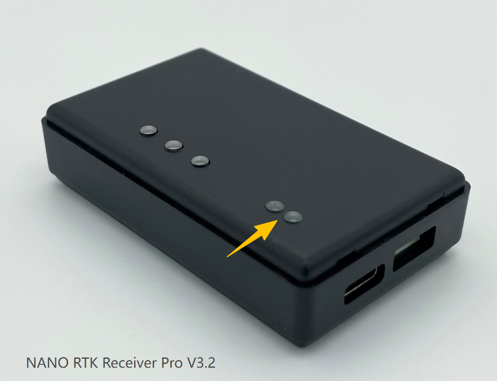
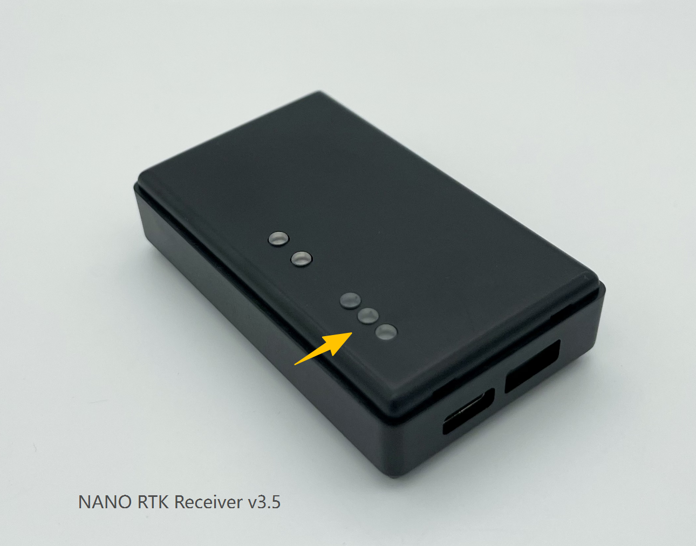
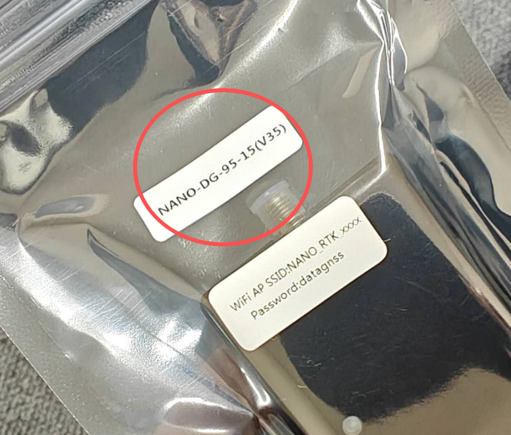

## How to Identify V3.2 and V3.5

You can check the version number in the `System Info` section of the NANO RTK web page. V3.2 and V3.5 are different.

| Hardware Version | Web Page Version | Latest Version |
| --- | --- | --- |
| V3.2 | NANO RTK Receiver Pro | nano.rtk.s3.15.1.0.7.rc.794 |
| V3.5 | NANO RTK Receiver v3.5 | 1.0.7.rc.1434, 2026 May 6 16:32:51 |

If the device web page shows `NANO RTK Receiver Pro`, it is V3.2.
If the device web page shows `NANO RTK Receiver v3.5`, it is V3.5.

## Image List

The image file names indicate the matching hardware version:

### V3.2

### V3.5

