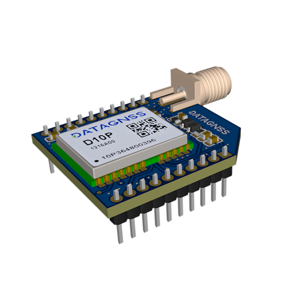
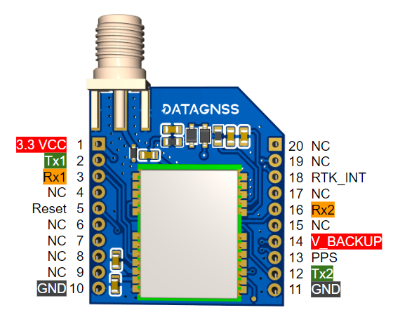
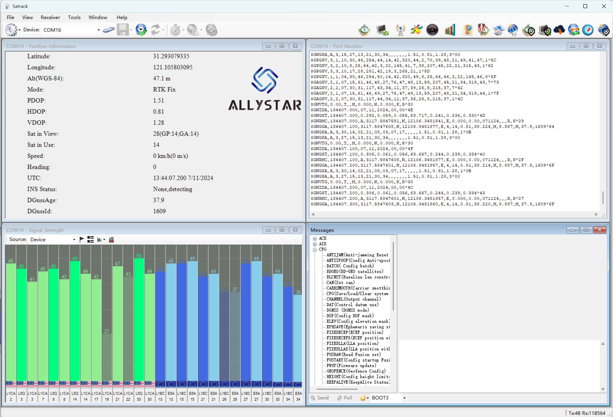

# NANO AGR RTK Receiver

## Overview

NANO AGR RTK Receiver is a multi-constellation, multi-frequency RTK receiver. It is based on Allystar's new generation dual-core GNSS SoC and supports up to **10Hz data output**.
NANO AGR RTK Receiver supports conventional RTK **base and rover** functions. It supports a maximum of **128 hardware channels** and can receive almost all visible satellites.

> **Default configuration**
>- UART Baud rate: 230400bps
>- Output protocol: Rover mode, NMEA 5Hz(GGA,GSA,GSV,ZDA,GST,RMC)

## Features

- Output rate 5Hz default, max up to 10Hz
- Support Multi-bands Multi-constellations
- Support RTCM output and input
- Support NMEA output
- Support setup base staion automaticlly
- Support dual-UART interface

## Specifications

### GNSS

- GNSS Constellation
  - GPS/QZSS L1, L5
  - GALILEO E1, E5a
  - GLONASS G1
  - BDS B1I B2a
- Frequencies: L1+L5
- Channels: 128 hardware channels
- Protocol
  - NMEA output, GGA/GSA/GSV/VTG/ZDA/GLL/RMC/GST/TXT
  - RTCM v3 input and output (support MSM7 output, MSM4/MSM5/MSM7 input)
- Output rate: 1/5/10 Hz
  - 5Hz default (Dual-band, GPS/GALILEO/BDS/QZSS)
  - 10Hz (Dual-band, GPS/GALILEO/BDS/QZSS, GGA/RMC/VTG 10Hz other messages 1Hz)

### Accuracy

- Single Positioning
  - 1.5m CEP
- RTK Positioning
  - H: 1cm + 1PPM
  - V: 3cm + 1PPM

### Interface

- UART: 2 UART, default 230400bps
- RF: SMA-K connector
- 2.54mm Pin Header, 20 pins

### Electronic

- Input Vcc: **3.3V** (Typical)
- TTL level: 1.8~3.6V

### Environment

- Operational temp.:  -20~85℃

## Pinout

## GNSS Antenna recommendation

There is a built-in LNA and SAW in the module. It is recommended to use an active antenna with gain **less than 30 dB** and the noise figure **less than 1.5 dB**. However, if you are using a longer cable, this gain can be increased appropriately.

## Test utilities

## Resources

- Download [Satrack latest version](../../../assets/software/satrack_latest.zip).
- [How to update firmware](../../../common/common_firmware_update)
- [Satrack_User_Manual](../../../assets/datasheet/Satrack_User_Manual.pdf)