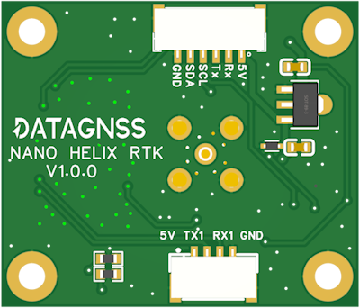

# NANO Helix RTK receiver

## Overview

NANO Helix RTK receiver is a high performance dual-band RTK receiver with compass, which is based on CYNOSURE series chipset.
It supports BDS-3 signals, along with global civil navigation systems, including GPS, BDS, GLONASS, Galileo, QZSS, and SBAS.

NANO Helix RTK receiver support **compass**.
NANO Helix RTK receiver is designed for UAV, RTK, and other applications.

## Features

- Supports GPS, BDS, GLONASS, Galileo, QZSS, and SBAS
- Integrated Real Time Kinematics (RTK)
- State-of-the-art low power consumption design
- Supports dual-band L1+L5 or L1+L2
- Supports **compass** IST8310
- Lightweight and compact size

## Specifications

| Parameter | Specifications |
|-----------|---------------|
| Constellations | BDS, GPS, QZSS, GLONASS, Galileo, NavIC, SBAS |
| Update rates | 10Hz |
| Channels | 128 hardware channels |
| Position accuracy | GNSS: 1.0m CEP   SBAS: ＜1.0m CEP   RTK:   1.0 cm + 1 ppm (H) 2.0 cm + 1 ppm (V) |
| Velocity & Time accuracy | GNSS: 0.05 m/s CEP   1PPS: 20ns RMS |
| TTFF | Hot start: 1s   Cold start: 27s |
| RTK[^1] | Convergence time <10s |
| Reliability | ＞99.9% |
| Sensitivity | Cold start: -148 dBm   Hot start: -155 dBm   Reacquisition: -158 dBm   Tracking & navigation: -165 dBm |
| Protocol | NMEA-0183   RTCM 3.X, raw measurements |
| Baudrate | 230400 bps, by default |
| Compass | IST8310 |
| Operating condition | Main supply 1.75V to 3.63V   Digital I/O supply 1.75V to 3.63V   Backup supply 1.62V to 3.63V |
| Power consumption | Tracking GNSS 30 mA @ 3.3V   Tracking Single system 18 mA @ 3.3V   Standby Data backup 16 uA   Standby RTC 1.4 uA |
| Serial interface | UART x 2   6P and 4P connector|
| Operating limit | Velocity 515 m/s   Altitude 18,000m |
| Environmental conditions | Operating temp. -40°C to +85°C   Storage temp. -40°C to +90°C   Humidity 95% RH |
| Weight | 5g (without antenna) |
| Size | 35x30mm |

[^1]: test with the professional antenna with good LNA gain

## Pinout

Standard JST-GH 1.25 6P / 4P connector.

- 6P connector: 5V Rx Tx SCL SDA GND
- 4P connector: 5V Tx Rx GND

## Application

### Ardupilot setup

NANO Helix RTK Receiver support to use on autopilot.
For example,NANO is connected to the autopilot's SERIAL4 port, it should work with :

- [SERIAL4_PROTOCOL](https://ardupilot.org/dev/docs/AP_Periph-Parameters.html#serial4-protocol-serial4-protocol-selection) = 5
- [GPS1_TYPE](https://ardupilot.org/copter/docs/parameters.html#gps1-type-gps-type) = 5

## Ordering Information

| P/N | Description |
|-----------|---------------|
| NANO-HRTK-00 | NANO receiver, L1+L5, Helix antenna |
| NANO-HRTK-01 | NANO receiver, L1+L5 |

## Package List

- NANO Helix RTK receiver
- Helix antenna (optional)
- JST-GH 1.25 6P connector

## Resources

- [Allystar GNSS binary protocol](../../../../common/common_allystar_binary_protocol)
- [Satrack_User_Manual](../../../assets/datasheet/Satrack_User_Manual.pdf)