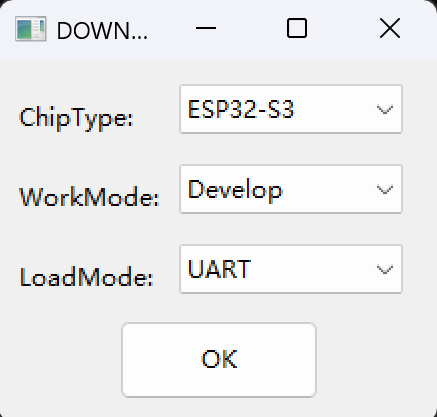
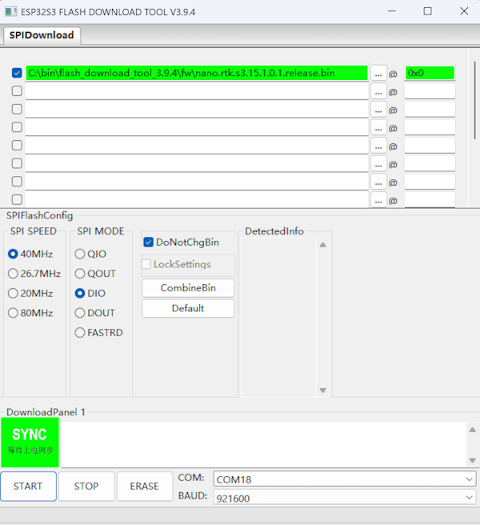

# update firmware using Flash Download Tool

This section demonstrates how to flash firmware using the official ESP32 Flash Download Tool.

Download the Flash Download Tool from here: [Flash Download Tool 3.9.4](../../../nano-s3-rtk/flash_download_tool_3.9.4.zip)

When opening the software, the system will prompt you to select a platform. Here, you need to choose **ESP32-S3**.

Then open the software and proceed with the configuration.

When the green "SYNC" text appears on the UI, press the Boot button on the board to enter Download mode and proceed with the firmware flashing.

Once the flashing is complete, the "FINISH" text will be displayed. At this point, click "STOP" and then exit the program.

