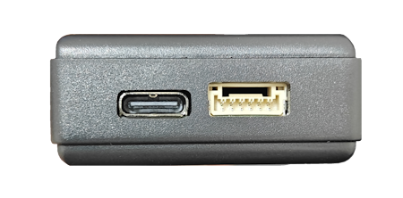
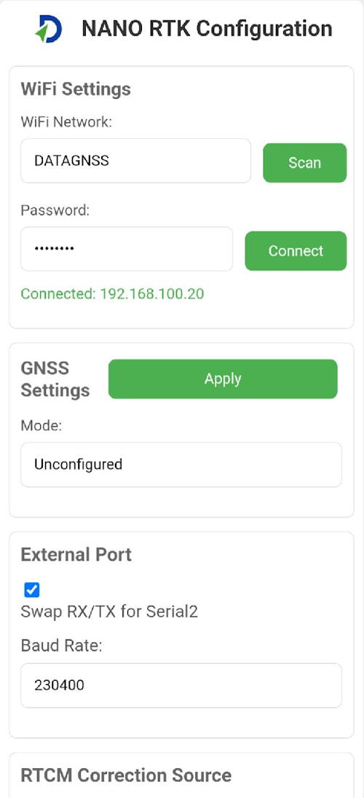
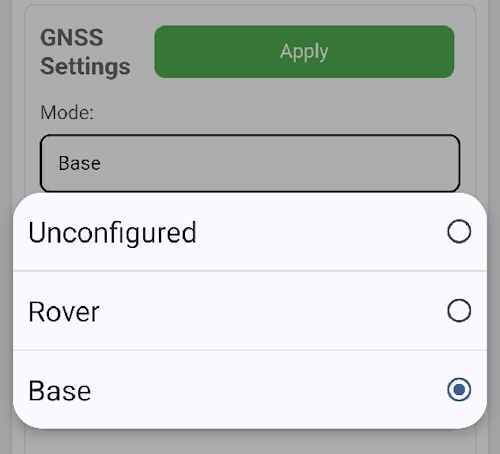
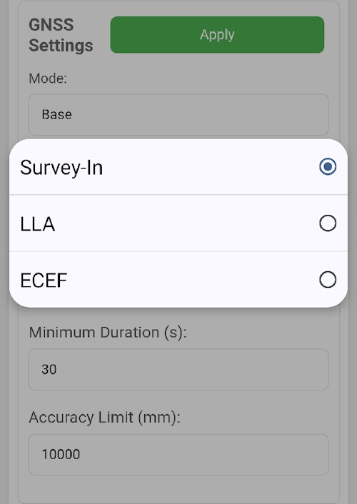

## 1. Overview

We redesigned the new generation NANO RTK Receiver.

The new version is based on the same D10P RTK module with ESP32-S3 chipset and has more powerful performance.

Even you can develop your own application with this receiver.

It supports Bluetooth (BLE serial).

It support working with iPad and iPhone devices.

It supports USB serial port, 6P connector serial port.

Base on the powerful performance of ESP32S3, the new generation NANO RTK Receiver can support more features.

For example, you can set it to connect to a Wi-Fi hotspot directly, and then view and set its various parameters through a web page.

## 2. Features

- WiFi AP mode for easy setup
- Web page for configuration and status monitoring
- Support working with iPad and iPhone devices

## 3. Quick Start

The NANO RTK Receiver Kits include the following items:

- NANO RTK Receiver
- Type-C cable, 1m
- OTG adapter
- 6P GH 1.25 cable, 20/30cm

The OTG adapter is used to directly connect the NANO RTK Receiver to Android phones. It can also be used to power the NANO RTK Receiver when connected to an iPhone or iPad.

The 6P cable is used to connect the NANO RTK Receiver to other devices, such as Ardupilot or PX4.

### 3.1 PINOUT

For the NANO RTK Receiver, the PIN definitions of the cable are as follows:

- **Red**: 5V
- **Black**: GND
- **White**: RxD
- **Yellow**: TxD
- **Blue**: SCL
- **Green**: SDA

From Left to right:

`5V` `RxD` `TxD` `SCL` `SDA` `GND` 

Connector model NO. : JST,GH1.25,6P

### 3.2 Key

NANO RTK Receiver board features four keys: F2, F1, Boot, and Reset.  
- F1 and F2 are currently reserved.  
- Boot is used to enter flashing mode.  
- Reset is used to reboot the device.

> **Note:** To use these keys, you must open the cover.

### 3.1 Type-C USB port

Type-C USB port is used for power supply and data transmission.

Type-C serial port connect to the D10P RTK module or ESP32 chipset port for debug output, switched by the DIP switch on the board.

By default, Type C is directly connected to the module's UART0, allowing direct operation of the RTK module through the Type C connection.

#### 3.1.1 Debug Mode (ESP32)

If you want to debug esp32 chipset, you could config the DIP switcher like the picture below:

1 and 2 ON, 3 and 4 OFF
Now, the Type-C port is connected to the ESP32 chipset debug port (uart0).

#### 3.1.2 D10P RTK Mode

But if you want to connect to the D10P RTK module directly from the Type-C port, you could config the DIP switcher like the picture below:

1 and 2 OFF, 3 and 4 ON
Now, the Type-C port is connected to the D10P RTK module directly.

#### 3.1.3 Recommend configuration

For normal use, we recommend setting the DIP switches according to section 3.1.2: keep switches 1 and 2 in the OFF position, and switches 3 and 4 in the ON position.

### 3.2 Work with Android device

Follow the 3.1.2 steps, and then connect your Android device to the Type-C port by OTG USB cable.

For Android devices, we recommend connecting NANO RTK Receiver via Type C cable, which is better and stable than Bluetooth connection.

OTG USB cable refer to this link in datagnss store: [USB OTG cable](https://www.datagnss.com/collections/accessories/products/usb-otg-cable)

### 3.3 Work with iPad and iPhone devices

> **Note:** Whatever you set the DIP switch to D10P RTK mode or ESP32 chipset debug mode, you could connect your iPad or iPhone devices to the NANO RTK Receiver via Bluetooth LE .The only thing you need to do is powered supply the NANO RTK Receiver with a USB Type-C cable from your iPad or iPhone or Power Bank.

The details operation steps refer to the below link:

[NANO RTK Receiver Surveying and Mapping Kits](https://docs.datagnss.com/gnss/rtk_receiver/surveying-and-mapping-kits/)

### 3.4 Connect NANO RTK Receiver via WiFi

**Note:** NANO RTK Receiver support WiFi AP and Sta mode.

When powered on, the NANO RTK Receiver will automatically operate in AP mode, creating a hotspot with the SSID `NANO_RTK_XXXX` and the password `datagnss`.

You can connect to this hotspot using your smartphone or laptop. Then, open a browser and enter the URL `192.168.4.1` to access the web page of the NANO RTK Receiver.

After opening, the webpage appears as shown below:

#### 3.4.1 WiFi Sta settings

Tap `Scan` Button, to scan and get the WiFi SSID list:

Then select the SSID, input the password, then press `connect` or `save and reboot`.
#### 3.4.2 GNSS settings

For the GNSS section, there are three modes available in the dropdown menu: `Base`, `Rover`, and `Unconfigured`.

- **Base**

In Base mode, the module will automatically be set to Base mode upon startup. At this time, you can also configure how the Base coordinate is obtained.

The Base Coordinate supports three modes:

- **Rover**

In Rover mode, the module will automatically be set to Rover mode upon startup.

- **Unconfigured**

In Unconfigured mode, the module will not perform any operations upon startup.

This mode is suitable for scenarios where users need to control the module themselves. 

In this case, users can connect the Type-C port to a computer, use Satrack to configure the module, and save the configuration. Upon the next startup, the module's configuration will remain unchanged.

#### 3.4.3 External UART port settings

The external UART port has two main settings:

- **Baud rate settings**: This is primarily used to address baud rate compatibility with external devices, such as external radios or other equipment.

- **Swap Rx and Tx**: This option is mainly for advanced users to handle scenarios where the Rx and Tx pin order of the cable differs.

For example, we need to output data to a radio through the External 6P UART port:

#### 3.4.4 RTCM Correction Source

This option configures the source of RTCM correction data. It supports the following three sources:

#### 3.4.5 NTRIP settings

The NANO RTK Receiver supports both NTRIP Server and NTRIP Client modes.

Both can work simultaneously.

#### 3.4.6 System Information

### 4. Flash firmware[Advanced]

The NANO RTK Receiver is based on the ESP32-S3 platform, offering powerful data processing capabilities and supporting various connectivity options such as WiFi and Bluetooth.

By flashing different firmware onto the NANO RTK Receiver, additional functionalities can be achieved.

This section demonstrates how to flash firmware using the official ESP32 Flash Download Tool.

Download the Flash Download Tool from here: [Flash Download Tool 3.9.4](../../../nano-s3-rtk/flash_download_tool_3.9.4.zip)

When opening the software, the system will prompt you to select a platform. Here, you need to choose ESP32-S3.

Then open the software and proceed with the configuration.

When the green "SYNC" text appears on the UI, press the Boot button on the board to enter Download mode and proceed with the firmware flashing.

Once the flashing is complete, the "FINISH" text will be displayed. At this point, click "STOP" and then exit the program.

Then, press RESET button on the board to reboot NANO RTK Receiver.

#### 4.1 Firmware

- Stable [1.0.1 Release](../../../nano-s3-rtk/nano.rtk.s3.15.1.0.1.release.zip)
- Test [1.0.5 RC2](../../../nano-s3-rtk/nano.rtk.s3.15.debug.1.0.5.rc2-debug.161.bin.zip) 
- [Changelog](../../../nano-s3-rtk/changelogs.md)

