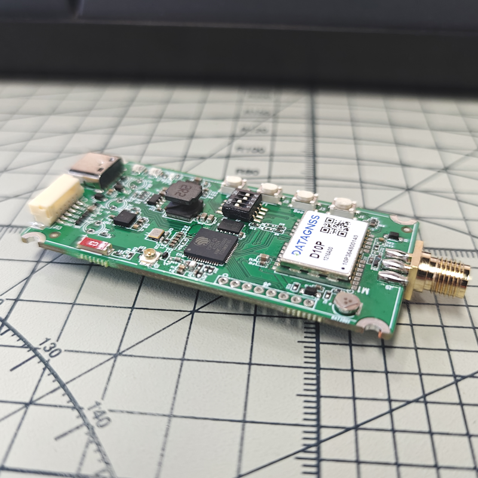

## 1. Overview

We redesigned the new generation NANO RTK Receiver.

The new version is based on the same D10P RTK module with ESP32-S3 chipset and has more powerful performance.

Even you can develop your own application with this receiver.

It supports Bluetooth (BLE and Bluetooth Classic SPP).

It support working with iPad and iPhone devices.

It supports USB serial port, 6P connector serial port.

Base on the powerful performance of ESP32S3, the new generation NANO RTK Receiver can support more features.

For example, you can set it to connect to a Wi-Fi hotspot directly, and then view and set its various parameters through a web page.

> **Note:** Due to the shortage of the case, the current order may not ship with the case, only with the heat shrink protection sleeve. If you have any questions, please contact us.

## 2. Features
- WiFi AP mode for easy setup
- Web page for configuration and status monitoring
- Support working with iPad and iPhone devices

## 3. Quick Start

### 3.1 Type-C USB port

Type-C USB port is used for power supply and data transmission.

Type-C serial port connect to the D10P RTK module or ESP32 chipset port for debug output, switched by the DIP switch on the board.

#### 3.1.1 Debug Mode (ESP32)

If you want to debug esp32 chipset, you could config the DIP switcher like the picture below:

1 and 2 ON, 3 and 4 OFF
Now, the Type-C port is connected to the ESP32 chipset debug port (uart0).

#### 3.1.2 D10P RTK Mode

But if you want to connect to the D10P RTK module directly from the Type-C port, you could config the DIP switcher like the picture below:

1 and 2 OFF, 3 and 4 ON
Now, the Type-C port is connected to the D10P RTK module directly.

#### 3.1.3 Recommend configuration

For normal use, we recommend setting the DIP switches according to section 3.1.2: keep switches 1 and 2 in the OFF position, and switches 3 and 4 in the ON position.

### 3.2 Work with Android device

Follow the 3.1.2 steps, and then connect your Android device to the Type-C port by OTG USB cable.

For Android devices, we recommend connecting NANO RTK Receiver via Type C cable, which is better and stable than Bluetooth connection.

OTG USB cable refer to this link in datagnss store: [USB OTG cable](https://www.datagnss.com/collections/accessories/products/usb-otg-cable)

### 3.3 Work with iPad and iPhone devices

> **Note:** Whatever you set the DIP switch to D10P RTK mode or ESP32 chipset debug mode, you could connect your iPad or iPhone devices to the NANO RTK Receiver via Bluetooth LE .The only thing you need to do is powered supply the NANO RTK Receiver with a USB Type-C cable from your iPad or iPhone or Power Bank.

The details operation steps refer to the below link:

[NANO RTK Receiver Surveying and Mapping Kits](https://docs.datagnss.com/gnss/rtk_receiver/surveying-and-mapping-kits/)

