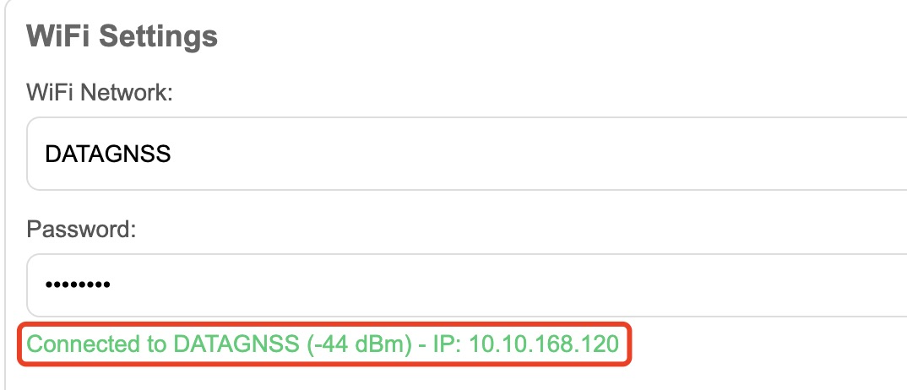
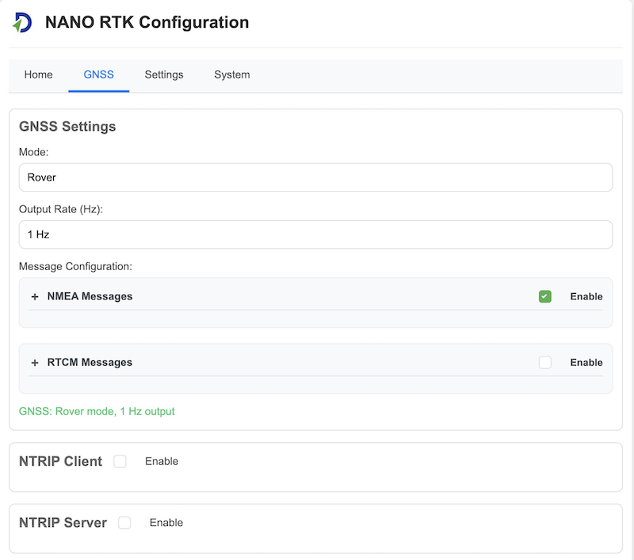
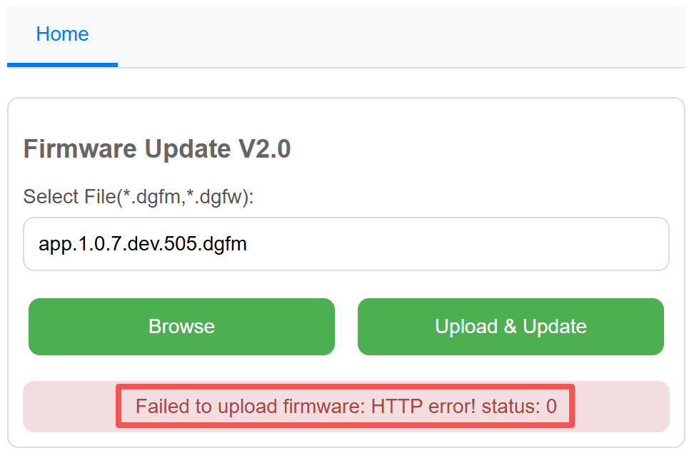
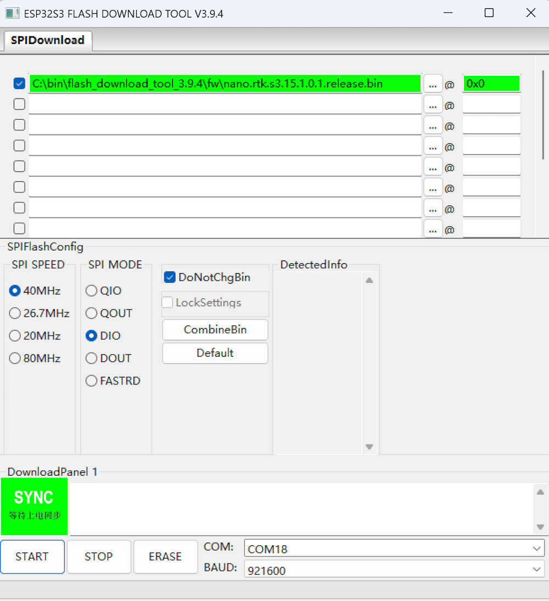

## 1. Overview

We redesigned the new generation NANO RTK Receiver.

The new version is based on the same D10P RTK module with ESP32-S3 chipset and has more powerful performance.

Even you can develop your own application with this receiver.

It supports Bluetooth (BLE serial).

It support working with iPad and iPhone devices.

It supports USB serial port, 6P connector serial port.

Base on the powerful performance of ESP32S3, the new generation NANO RTK Receiver can support more features.

For example, you can set it to connect to a Wi-Fi hotspot directly, and then view and set its various parameters through a web page.

## 2. Features

- WiFi AP mode for easy setup
- Web page for configuration and status monitoring
- Support working with iPad and iPhone devices

## 3. Quick Start

> Note: Many screenshots and descriptions below are based on firmware from version 1.0.6.dev.300. If your version differs, please refer to the actual behavior of your device's firmware.

The NANO RTK Receiver Kits include the following items:

- NANO RTK Receiver
- Type-C cable, 1m
- OTG adapter
- 6P GH 1.25 cable, 20/30cm

The OTG adapter is used to directly connect the NANO RTK Receiver to Android phones. It can also be used to power the NANO RTK Receiver when connected to an iPhone or iPad.

The 6P cable is used to connect the NANO RTK Receiver to other devices, such as Ardupilot or PX4.

> **Note:** Please note, on the case, the buttons from top to bottom are Boot, F1, and F2.

> **Default configuration**
>- USB UART Baud rate: 230400bps
>- 6P UART Baud rate: 230400bps
>- Output protocol: Rover mode, NMEA 1Hz(GGA,GSA,GSV,ZDA,GST,RMC)

### 3.1 Configuration and PINOUT

From Left to right:

`5V` `RxD` `TxD` `SCL` `SDA` `GND` 

Connector model : JST, GH1.25, 6P

>**Note**
>- 6P connector is used to connect to other devices, such as radio devices, or Ardupilot.
>- 6P UART Baud rate: 230400bps

Type C connector is used to connect to Host devices, such as Phone, iPad, or PC.

USB driver is required to be installed when connecting to PC.

[CH34x USB Serial Port Driver](../../../rtk-board/files/drivers/Windows-CH340-Driver.zip)

>**Note**
>- USB UART Baud rate: 230400bps
>- If you want to change this baud rate, please refer to this link: [change baud rate](../../../common/common_config_uart_baud_rate.md)

### 3.2 Connect your NANO RTK Receiver

NANO RTK Receiver can be connected via:
- USB
- Bluetooth (BLE)
- WiFi connection

#### 3.2.1 **Bluetooth (BLE) connection**

NANO RTK Receiver supports Bluetooth (BLE) connection. 
>**Note:** we recommend using the SW Maps software to connect to the NANO RTK Receiver.

SW Maps is a free professional GIS data collection software that supports Bluetooth (BLE) connection. It supports RTK devices, such as the NANO RTK Receiver.

You can download it from the **Google Play Store** or **App Store**.

It supports Android and iOS devices.

Please refer to the below to find details on how to use SW Maps to connect to the NANO RTK Receiver.

For Android device, SW Maps support **Bluetooth (BLE)** and **USB serial** connection.

For iOS device, SW Maps only support **Bluetooth (BLE)** connection.

The default BLE broadcast name is "NANO_RTK_xxxx", where "xxxx" is the last 4 digits of the MAC address.

#### 3.2.2 **WiFi connection**

NANO RTK Receiver supports WiFi connection. It support WiFi AP mode and WiFi sta mode.

In WiFi AP mode, you could connect the NANO RTK Receiver's WiFi from your phone or PC, which is act as a device like router. 

WiFi sta mode is used to let the NANO RTK Receiver toconnect to a WiFi hotspot or office WiFi SSID. Then NANO RTK Receiver will get the IP address from the WiFi router or your hotspot.

NANO RTK Receiver support above two modes by default.

In default configuration, the NANO RTK Receiver will start a WiFi AP with SSID: "NANO_RTK_xxxx" and password: "datagnss".

When powered on, the NANO RTK Receiver will automatically operate in AP mode, creating a hotspot with the SSID `NANO_RTK_XXXX` and the password `datagnss`.

You can connect to this hotspot using your smartphone or laptop. Then, open a browser and enter the URL `192.168.4.1` to access the web page of the NANO RTK Receiver.

After opening, the webpage appears as shown below:

>**Note** 
> you cannot use a phone to both connect to the NANO's AP and act as the Wi‑Fi hotspot at the same time. You will need two devices: one to connect to the NANO and another to serve as the Wi‑Fi hotspot.

Tap `Settings` - `Scan` Button, to scan and get the available  WiFi SSID list:

Then select the SSID, input the password, then press `connect` or `save and reboot`.

When wifi sta connected, the NANO RTK Receiver will start to get the IP address from the router. The IP address will be displayed on the web page.

You could see the IP address(10.10.168.120) on the above screenshot.

Now you can open web browser, input the IP address (http://10.10.168.120) to view the NANO RTK Receiver's status with a PC or phone in the same LAN network.

#### 3.2.3 **USB connection**

NANO RTK Receiver supports USB UART connection on Android phone or Android tablet, or PC.

### 3.3 Config NANO RTK Receiver

#### 3.3.1 Satrack

Satrack is a user-friendly software that supports NANO RTK Receiver. It could be used to configure and monitor the NANO RTK Receiver. You could use it configure the Baud rate, change the output rate, and more.

1. Connect NANO RTK Receiver to PC via Type-C cable.
2. Open the device manager, find the COM port
3. Open Satrack software, choose the COM port and set the baud rate to 230400bps. then press connect button.
4. If the connection is successful, the software will display the NMEA sentences information.

You could refer to the below link to fine details on how to use Satrack software.

[Satrack operation manual](https://docs.datagnss.com/common/common_satrack_guide/)

#### 3.3.2 Config NANO RTK Receiver via Web page

In both WiFi AP mode or WiFi Sta mode, you could login to the NANO RTK Receiver's web page to configure the NANO RTK Receiver.

Login to the NANO RTK Receiver's web page.

- **Homepage**

- **GNSS**

For the GNSS section, there are three modes available in the dropdown menu: `Base`, `Rover`, `RAW` and `Unconfigured`.

In default, the mode is `Rover`.

>**Base**
In Base mode, the module will automatically be set to Base mode upon startup. At this time, you can also configure how the Base coordinate is obtained.

The Base Coordinate supports three modes:

>**Rover**
In Rover mode, the module will automatically be set to Rover mode upon startup.

>**Raw**
In Raw mode, the module will automatically be set to Raw mode output MSM7 RTCM3 data and EPHE data.

>**Unconfigured**
In Unconfigured mode, the module will not perform any operations upon startup.
This mode is suitable for scenarios where users need to control the module themselves. 
In this case, users can connect the Type-C port to a computer, use Satrack to configure the module, and save the configuration. Upon the next startup, the module's configuration will remain unchanged.

- **Settings**

In settings, you can configure the following parameters:

>**WiFi Settings**
Configure the WiFi SSID and password.

>**RTCM Correction Source**
Configure the RTCM correction source.

>**External Port**
>Configure the external port.
>- Swap Rx and Tx
>- Baud rate, in default, it is 230400bps.

- **System**

### 3.4 Feed RTCM correction data to NANO RTK Receiver

NANO RTK Receiver support to get RTCM data from the following source: 
- Bluetooth
- USB UART
- WiFi
- 6P Connector.

#### 3.4.1 Feed RTCM data via Bluetooth

If you connect the NANO RTK Receiver via Bluetooth(BLE), you could feed RTCM data to the NANO RTK Receiver via software like SW Maps.

Then after the RTCM data is received, the NANO RTK Receiver will start to do **RTK positioning**.

#### 3.4.2 Feed RTCM data via USB UART

If you connect the NANO RTK Receiver via USB UART in SW Maps, you could feed RTCM data to the NANO RTK Receiver via software like above section **3.4.1 Feed RTCM data via Bluetooth**.

#### 3.4.3 Feed RTCM data via WiFi connection

If you have configured the NANO RTK Receiver to connect to a WiFi hotspot, you could let NANO RTK Receiver to get RTCM data to from NTRIP caster by NANO RTK Receiver itself.

The NANO RTK Receiver will start to get RTCM data from NTRIP caster automatically when it is connected to a WiFi hotspot.

Follow the **3.2.2 WiFi connection** to connect the NANO RTK Receiver to a WiFi hotspot or MiFi.

Then open web browser, input the IP address (like our example  http://10.10.168.120)

Then navigate to the `GNSS` page, and set the `NTRIP client` to be enabled. then input the ntrip client parameters.

Then Apply it.

The NANO RTK Receiver will start to get RTCM data from NTRIP caster automatically.

Now you could navigate to main page, and you will see the ntrip client connection status is `Connected` and Rx data rate.

### 3.5 Work with Android device

Follow the 3.1.2 steps, and then connect your Android device to the Type-C port by OTG USB cable.

For Android devices, we recommend connecting NANO RTK Receiver via Type C cable, which is better and stable than Bluetooth connection.

OTG USB cable refer to this link in datagnss store: [USB OTG cable](https://www.datagnss.com/collections/accessories/products/usb-otg-cable)

### 3.6 Work with iPad and iPhone devices

The details operation steps refer to the below link:

[NANO RTK Receiver Surveying and Mapping Kits](https://docs.datagnss.com/gnss/rtk_receiver/surveying-and-mapping-kits/)

## 4. Update firmware

### 4.1 update firmware from web [Recommended]

The NANO RTK Receiver is based on the ESP32-S3 platform, offering powerful data processing capabilities and supporting various connectivity options such as WiFi and Bluetooth.

> **Note:** Starting from firmware version 1.0.6.300, upgrading firmware directly from the web page is supported.

By flashing different firmware onto the NANO RTK Receiver, additional functionalities can be achieved.

Choose firmware (*.dgfm, *.dgfw)

Then press "Upload & Update"

When the progress bar reaches 100%, the upgrade is complete.

> **Note:** 
After upgrading to 100%, there is a small chance that the following message may appear: "Failed to upload firmware: HTTP error! status: 0." In this case, you can ignore the message and press "Home" to return to the homepage.

More detailed guide about flash firmware manually...

### 4.2 update firmware using Flash Download Tool

This section demonstrates how to flash firmware using the official ESP32 Flash Download Tool.

Download the Flash Download Tool from here: [Flash Download Tool 3.9.4](../../../nano-s3-rtk/flash_download_tool_3.9.4.zip)

> **Note:** 
Before upgrading, please confirm that DIP switch positions 1 and 2 are set to ON, and positions 3 and 4 are set to OFF.

When opening the software, the system will prompt you to select a platform. Here, you need to choose ESP32-S3.

Then open the software and proceed with the configuration.

When the green "SYNC" text appears on the UI, press the Boot button on the board to enter Download mode and proceed with the firmware flashing.

Once the flashing is complete, the "FINISH" text will be displayed. At this point, click "STOP" and then exit the program.

Then, press RESET button on the board to reboot NANO RTK Receiver.

>**Note:** 
After the upgrade is complete, it is recommended to set DIP Switch positions 1 and 2 to OFF, and positions 3 and 4 to ON.

## 5. FAQS

- **Q: How to change baud rate?**
  **A: Please refer to this link: [change baud rate](../../../common/common_config_uart_baud_rate.md)**

- **Q: How to connect my office's WiFi?**
  **A: Please refer to the section `3.2.2 WiFi connection`.**

- **Q: How to connect the external radio link device, such as 3DR radio?**
  **A: Please refer to the section `___`.**

## 6. Resource

### 6.1 Related links

### 6.2 Firmware

- Latest Firmware:[1.0.7 dev.505](../../../nano-s3-rtk/nano.rtk.s3.15.1.0.7.dev.505.zip) 

 