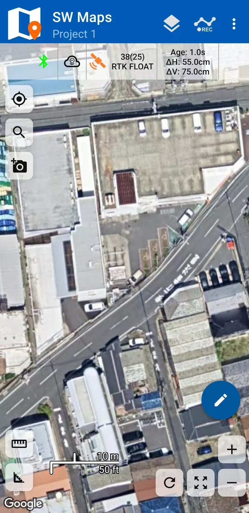

# NANO RTK Receiver Pro Quick Guide

## Overview

If you are using the NANO RTK Receiver Pro with a base station for RTK high-precision work, keep the following items ready:

- NANO RTK Receiver Pro
- GNSS antenna for RTK
- iPhone or Android phone
- Base station NTRIP access account
- Type-C to Type-C cable with OTG support
- Software

We generally recommend the well-known SW Maps app because it supports both iOS and Android and covers most basic field data-collection workflows.

We recommend connecting the NANO RTK Receiver Pro to your phone via Bluetooth LE.

## Quick guide

The simplest operation consists of the following steps:

### 1.Connect NANO to your Phone

Connect your phone and the NANO RTK Receiver Pro with the Type-C to Type-C cable.

The phone then powers the receiver. When the NANO RTK boots, the blue LED flashes to indicate that Bluetooth is waiting, and the green LED flashes to show the unit is in rover mode and has completed initialization.

### 2.SW Maps

Launch SW Maps on either iPhone or Android.

Create a new project, tap the leftmost button on the toolbar, choose Connection Mode → Bluetooth LE, and tap the refresh icon. Nearby devices will appear; select the device named NANO_RTK_xxxx and tap Connect.

Keep the Instrument Model setting at the default Generic NMEA.

After pairing, the system reports "Connected."

### 3.Configure the base station data stream

RTK work requires an NTRIP-formatted base station stream. Contact your local base station provider for the server address, port, mountpoint, username, password, and other parameters.

On the SW Maps main screen, at the top of the map view tap the cloud icon to the right of the Bluetooth icon, then add a new NTRIP connection.

Set NTRIP version to v1 unless your provider explicitly states v2.

Finally, enable Send NMEA GGA to Base station (this reports your position to the caster so it can deliver corrections from the nearest reference station).

Save the profile and connect.

If necessary, enable Apply Base Antenna PCO.

### 4.RTK Status

If no other issues exist, tap the third icon from the left on the toolbar to view the current solution status, which should now show RTK Float or RTK Fixed.

RTK Float indicates the ambiguity is not yet resolved, so horizontal accuracy may range from 0.1 m to 0.5 m.

RTK Fixed indicates the highest-precision RTK solution, with accuracy around 0.02 m.

## Base station mode

The NANO RTK Receiver Pro can operate in base station mode, allowing you to build a dedicated reference station.

In this mode, plan how to distribute the base station corrections over a communication link.

Common link options include:

- Radio links such as LoRa
- Network transport

For radio link, see [Setup your owned base station](../../casestudy/setup-owned-base-and-rover).

When transporting data over a network, the most common protocol is NTRIP. Streaming base station corrections in this case requires an NTRIP Server setup and the associated connection credentials.
