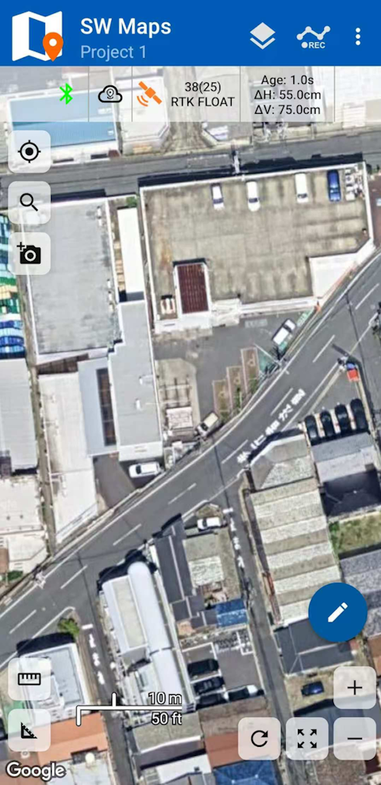

# NANO RTK Receiver Pro Quick Guide

## Overview

This guide shows how to use the NANO RTK Receiver Pro with a base station for RTK high-precision positioning.

Before you start, make sure you have the following items ready:

- NANO RTK Receiver Pro
- GNSS antenna for RTK
- iPhone or Android phone
- Base station NTRIP access account
- Type-C to Type-C cable with OTG support
- Software

We recommend using SW Maps because it supports both iOS and Android and covers the most common field data-collection workflows.

For the best mobile experience, connect the receiver to your phone via Bluetooth LE.

## Quick Start

The basic workflow is:

### 1. Power the receiver from your phone

Connect your phone and the NANO RTK Receiver Pro with the Type-C to Type-C cable.

The phone powers the receiver. When the NANO RTK boots, the blue LED flashes to indicate Bluetooth is ready, and the green LED flashes to show the unit is in rover mode and has completed initialization.

### 2. Connect SW Maps via Bluetooth LE

Launch SW Maps on either iPhone or Android.

Create a new project, tap the leftmost button on the toolbar, choose `Connection Mode` -> `Bluetooth LE`, and tap the refresh icon.

Nearby devices will appear. Select the device named `NANO_RTK_xxxx` and tap `Connect`.

Keep the `Instrument Model` setting at the default `Generic NMEA`.

After pairing, the system reports "Connected."

### 3. Configure the base station stream

RTK work requires an NTRIP correction stream. Contact your base station provider for the server address, port, mountpoint, username, password, and other required parameters.

On the SW Maps main screen, tap the cloud icon to the right of the Bluetooth icon, then add a new NTRIP connection.

Set the NTRIP version to `v1` unless your provider explicitly requires `v2`.

Enable `Send NMEA GGA to Base station` so the caster can provide corrections from the nearest reference station.

Save the profile and connect.

If needed, enable `Apply Base Antenna PCO`.

### 4. Check RTK status

If everything is configured correctly, tap the third icon from the left on the toolbar to view the current solution status.

The status should show `RTK Float` or `RTK Fixed`.

`RTK Float` means the ambiguity is not yet resolved, so the horizontal accuracy is usually around 0.1 m to 0.5 m.

`RTK Fixed` means the ambiguity has been resolved and the receiver has reached the highest-precision RTK solution, typically around 0.02 m.

## Base station mode

The NANO RTK Receiver Pro can also operate in base station mode, allowing you to build a dedicated reference station.

In this mode, you need to decide how to deliver base station corrections to the rover.

Common link options include:

- Radio links such as LoRa
- Network transport

For radio links, see [Setup your owned base station](../../casestudy/setup-owned-base-and-rover).

For network transport, the most common protocol is NTRIP. In this case, you need an NTRIP Server setup and the related connection credentials.
