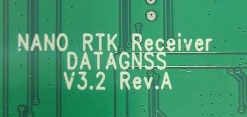
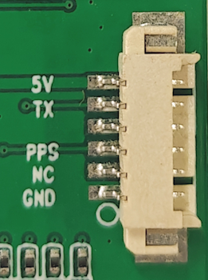
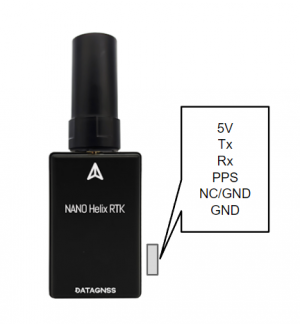
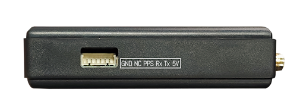
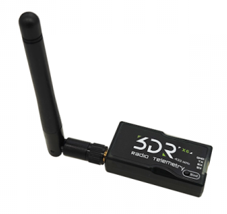
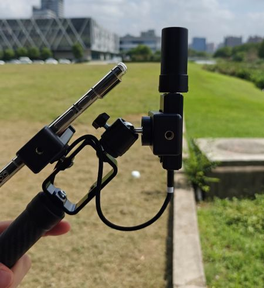

# NANO RTK Receiver

## Overview

NANO RTK Receiver is the latest high-precision RTK receiver based on Allystar's latest generation GNSS SoC.
It can simultaneously support tracking all visible navigation satellites, including GPS, QZSS, BDS, GALILEO, GLONASS, and IRNSS.

It support RTK base and rover options.

You could choose Helix antenna and Survey antenna for your applications.

> **Note:** If your NANO RTK Receiver is V3.2 Rev.A or later, please jump to the following page:

[NANO RTK Receiver V3.2 Rev.A guide](../nano-rtk-receiver-esp32)

It has two interface: USB serial port and 6P connenctor.
It support Bluetooth (BLE and Bluetooth Classic SPP).

Note: only SKU: NANO-BT-00 support bluetooth.

Compaible with:

 

 

### Key Features

- Full constellation, multi-frequency GNSS satellite receiver
- Support RTK base and rover options
- Standard UART serial interface
- Lightweight only 26g
- Output rate up to 5Hz
- High performance antenna

### Specifications

#### Frequencies

- GPS/QZSS: L1 C/A, L5
- GLONASS: L1OF
- BEIDOU: B1I, B2a
- GALILEO: E1, E5a

#### GNSS

- Allystar CYNOSURE IV GNSS SOC
- 128 hardware channels
- 3D accuracy: 1.5m CEP
- RTK accuracy: 1cm +1PPM(H), 3cm+1PPM(V)

#### Interface

- UART, 230400bps default
- SMA-K connector for antenna
- Output rate 5Hz default
- Main power supply,4.7~5.2V

#### Protocol

- NMEA-0183 output
- RTCMv3 input/output

#### Environment

- Operating temp. -20~85℃

#### Dimession and weight

- 70*42*18mm
- 26g (NANO with Helix)

#### Pinout

The board is connected to the autopilot via UART interface.

By default, NANO series supports three types of external connections: Bluetooth, UART, and USB connection.

For SKU: NANO-BT-00 Receiver, support the following connection:

| Connection | Remark | 
| --- | --- |
| USB C | Input: RTCM, Binary, Command   Output: Binary, RTCM, NMEA |
| Bluetooth | Input: RTCM, Binary, Command   Output: Binary, RTCM, NMEA |
| 6P UART | Input: -   Output: RTCM, NMEA |

Other NANO series (the following sku) do not support Bluetooth connection, but the 6P UART can fully support data input and output.

NANO-DG-xx, NANO-HRTK-00

| Connection | Remark | 
| --- | --- |
| USB C | Input: RTCM, Binary, Command   Output: Binary, RTCM, NMEA |
| Bluetooth | - |
| 6P UART | Input: RTCM, Binary, Command   Output: Binary, RTCM, NMEA |

## Application

### Work with other devices

Telemetry radio for Base station
Connect telemetry radio device with RTK Receiver via 6P connector.

### Ardupilot setup

NANO RTK Receiver support to use on autopilot. 
For example,NANO is connected to the autopilot's SERIAL4 port, it should work with :

[SERIAL4_PROTOCOL](https://ardupilot.org/dev/docs/AP_Periph-Parameters.html#serial4-protocol-serial4-protocol-selection) = 5

[GPS1_TYPE](https://ardupilot.org/copter/docs/parameters.html#gps1-type-gps-type) = 5

### Surveying and Mapping Kit

If you are interested in the use of NANO RTK Receiver in the surveying application, you can refer to the following page.

[NANO RTK Surveying and Mapping Kit](../../surveying-and-mapping-kits)

## Resources

- [Allystar GNSS binary protocol](../../../../common/common_allystar_binary_protocol)
- [CP210x Drivers](../../../assets/drivers/CP210x_Windows_Drivers.zip)
- [Satrack_User_Manual](../../../assets/datasheet/Satrack_User_Manual.pdf)
