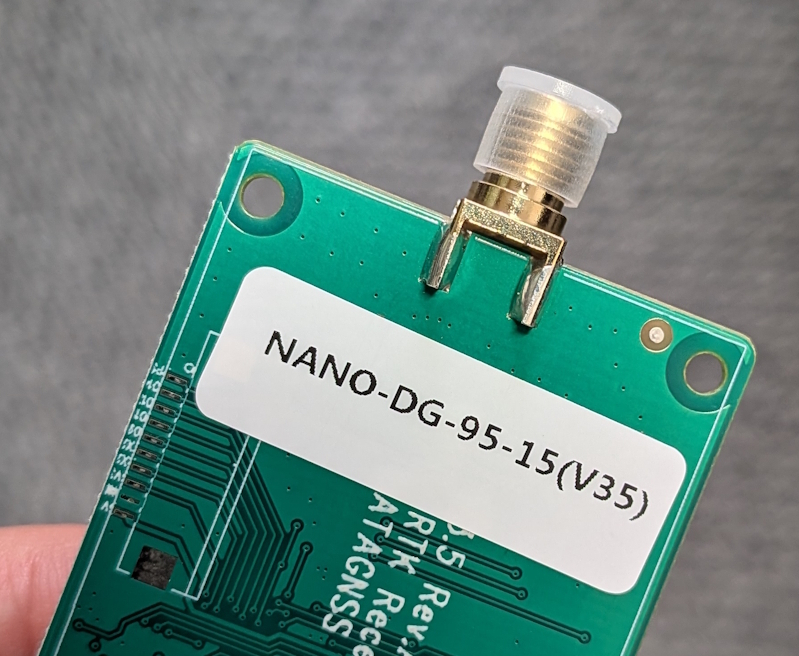
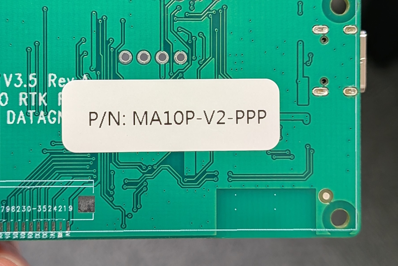
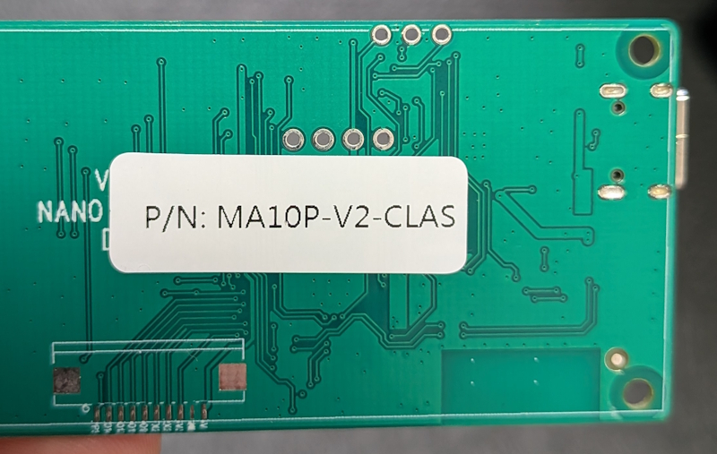
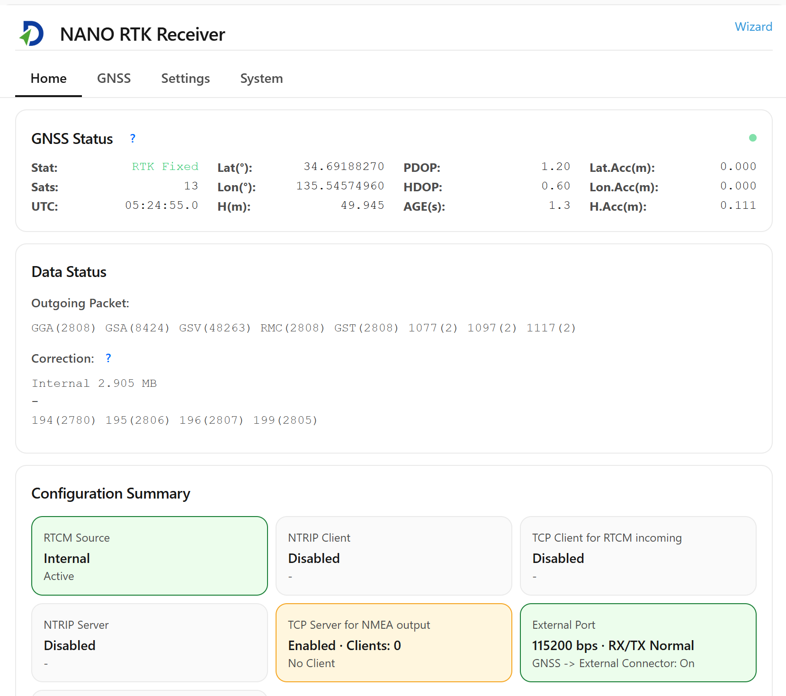
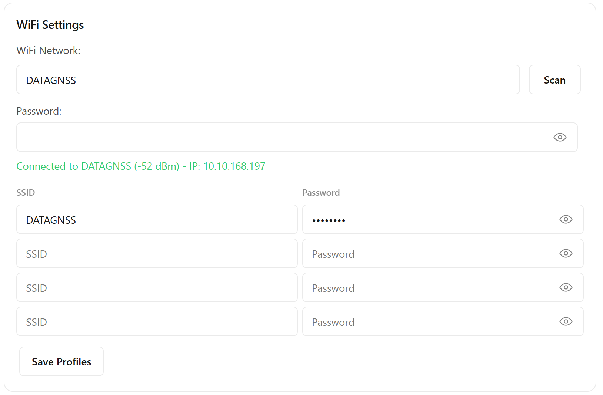
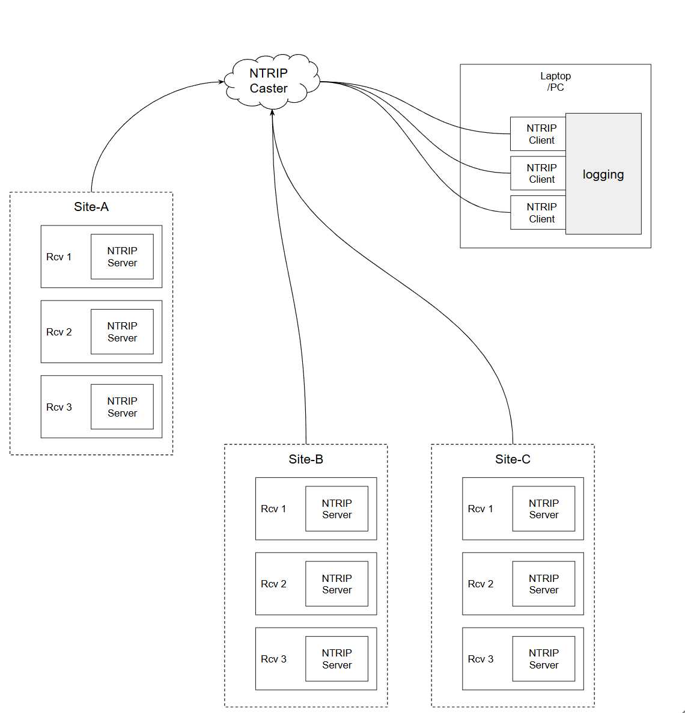
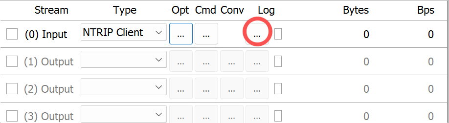
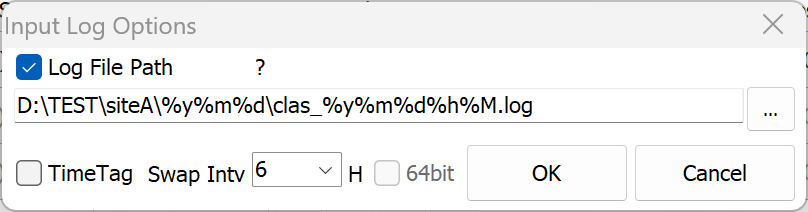

# クイックガイド

## 1. ハードウェア

- AT400 GNSSアンテナ
- RF分配器 1入力4出力
- RFケーブル
- NANO受信機（NANO-DG-95-15、RTCM3出力）
- MA10P-V2-PPP（MADOCA）
- MA10P-V2-CLAS-00（CLAS）
- Type-C USBケーブル

### 1.1 NANO RTK受信機

NANO RTK受信機は、デフォルトでRTCM3メッセージを出力するように設定されている（MSM7およびエフェメリスデータ）。

- 1077, 1087, 1097, 1117, 1127
- 1019, 1020, 1046, 1044, 1042

### 1.2 MA10P-V2-PPP

MA10P-V2-PPPはMADOCA/PPP測位をサポートし、1HzでNMEAデータを出力する。

測位精度はおおむね0.1〜0.6 m程度である。

### 1.3 MA10P-V2-CLAS-00

MA10P-V2-CLASはCLAS/PPP-RTK測位をサポートし、1HzでNMEAデータを出力する。

測位精度はおおむね0.05〜0.1 m程度であり、環境によって変動する。

## 2. 接続

3種類の受信機は、WiFi、USB、UARTの接続をサポートする。

すべての接続方式で同じデータを出力可能である。

### 2.1 USB

Type-CケーブルをPCに接続すると、USBシリアルポートとして認識される。

デバイスマネージャーで「SERIAL-A」という文字列を含むCOMポート番号を確認できる。

そのCOMポートを使用してデータを記録できる。

USBインターフェースはデータ転送と電源供給の両方をサポートする。

### 2.2 UART

6P UART（TTL）は電源供給とデータ出力の両方をサポートする。

### 2.3 WiFi

NANO受信機はWiFi接続においてAPモードとStationモードの両方をサポートする。

電源投入時には、NANO_RTK_xxxxという名前のアクセスポイントが表示される（末尾の4桁は各機器ごとに異なる）。

PCまたは携帯電話からこのAPに接続し、ブラウザーを開いてhttp://192.168.4.1にアクセスすると、NANOの設定Webページを開くことができる。

その後、WiFiのSSIDとパスワードを設定することで、NANOをローカルネットワークに接続できる。

ローカルWiFiへ接続後、IPアドレスが表示されるので、記録しておく。

## 3. データ取得

複数の観測点のデータを記録する場合、以下の構成を採用することを推奨する。

各受信機に組み込みのNTRIPサーバー設定を行い、ネットワークへ接続する。

データは遠隔のNTRIPキャスターへ送信される。

その後、1つの集中管理地点（例えばある観測点）に、ネットワーク通信が可能な環境があれば、複数のNTRIPクライアントを起動して個別にデータ収集を行う。

この用途には、strsvr（RTKLIBのストリーム収集ユーティリティ）を使用することを推奨する。

以下のような構成である。

データ管理には、次の命名規則を使用する。

`D:\TEST\siteA\%y%m%d\clas_%y%m%d%h%M.log`

この方法により、各収集地点は自分のデータをアップロードするだけで済み、同じ場所でまとめて収集・管理を行うことができる。

この設計では、各観測点に対して安定した信頼性の高いネットワーク環境と電源供給があれば十分である。

> DATAGNSSの無料casterサービス（https://caster.gnsslab.net）は、1ユーザーあたり最大2つのアップロードノードをサポートする。利用する場合は、該当サイトで申請を行う。
