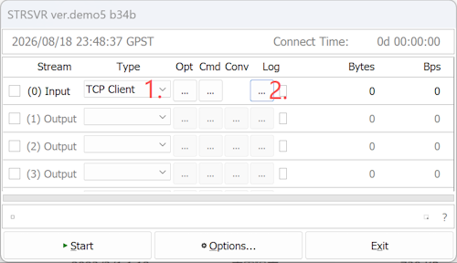
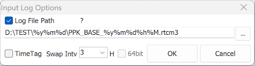
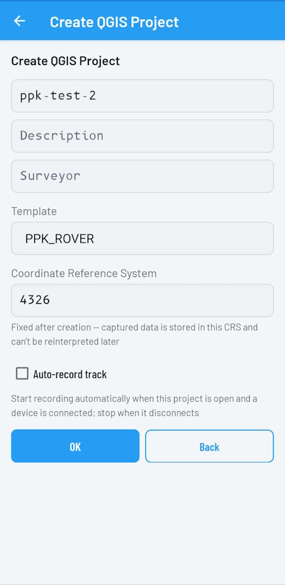
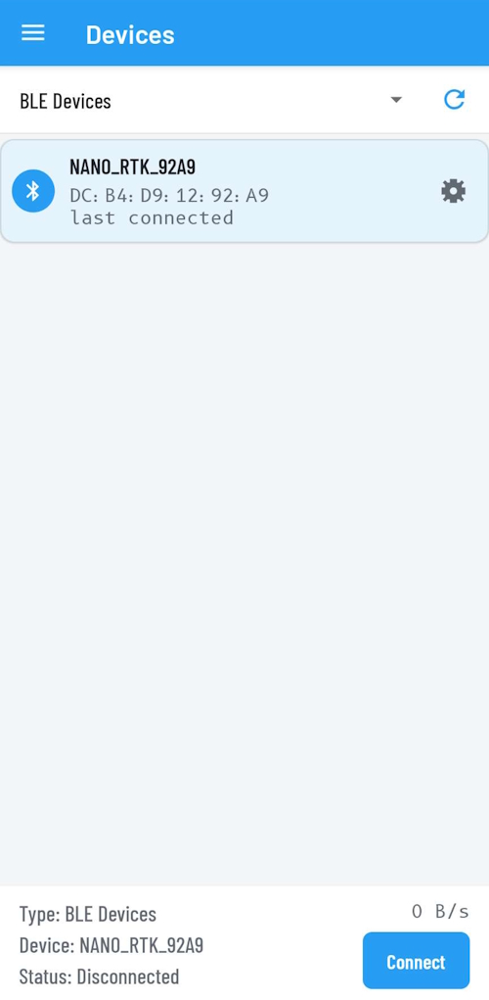
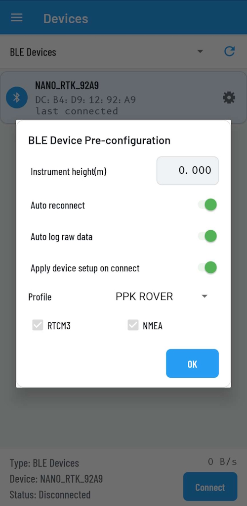
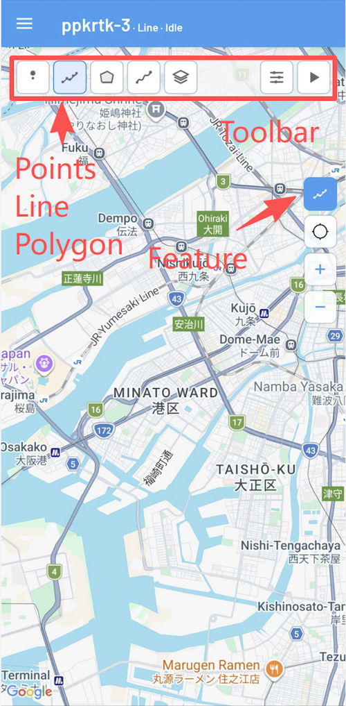
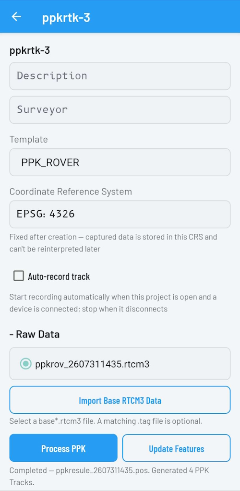

# Easy-to-Setup PPK Solution

## Overview

PPK stands for Post-Processing Kinematic. In this workflow, base station data is recorded first and then used later for post-processing on the rover side.

This case study shows a simple PPK workflow built around the NANO RTK Receiver and the RTKBridge Android app.

## Required Hardware and Software

- NANO RTK Receiver, currently only V3.5 is supported
- RTKBridge Android app
- Android phone

For V3.5, make sure the firmware is updated to at least `1.0.8.1493`. 

If it is not, use the online update tool, [Online flasher](https://nano.gnsslab.net/flasher/), 

or download the firmware and update it from the NANO RTK web page: [1.0.8.1493](../../../nano-s3-rtk/nano.rtk.15.v3_5.1.0.8.1493.84cb65.zip).

## Base Station

### Config base NANO

Set the NANO RTK Receiver to Base mode and enable the TCP Server service on port `9009`.

### Record base raw data for PPK

If the base station is located somewhere with Wi-Fi access, you can use the following method to record the base station raw data.

Download `strsvr` from RTKLIB, then open it and select `TCP client` as the input. Set the server address to the NANO RTK Receiver IP address and the port to `9009`.

Then click `Log` and set the save path for the base station raw data. You can use a filename pattern like the one shown below:

`D:\TEST\%y%m%d\PPK_BASE_%y%m%d%h%M.rtcm3`

Click `Start` to begin recording. `strsvr` will save the data according to the filename pattern, where `%y%m%d` is used as the folder name and `PPK_BASE_%y%m%d%h%M.rtcm3` is the output filename.

After everything is confirmed, you can start recording before each field survey. If disk space is sufficient, you can also leave `strsvr` running continuously.

## Rover

### Install Android app

Download and install the RTKBridge Android app. It is not yet available on Google Play, so you need to install the APK directly [click to download RTKBridge](../../../assets/software/rtkbridge/rtkbridge.apk).

After installation, grant the required permissions to RTKBridge.

## PPK for field

Open RTKBridge and create a new project.

Enter the required project information and set the template to `PPK_ROVER`. Leave the other settings at their defaults.

Then select the BLE device. Make sure the firmware is at least `1.0.8.1493`, which is required for BLE support.

Click the gear icon on the right side of the device to configure it, as shown below.

Then connect the BLE device.

After the connection is established, you can start collecting field data.

On the map home page, open the toolbar on the right side, tap the top `Feature` button, choose point, line, or polygon from the top `Feature` toolbar, and then use the buttons on the right to start the selection or collection action.

During point, line, and polygon collection, the system will automatically record raw data.

When all data collection is complete, disconnect the device.

## PPK Processing

Open the `Projects` page and click the properties button on the right side of the current project. The interface should look like this:

a. Copy the base station RTCM3 file to this Android device. 

b. on the screen shown above, select `Import Base RTCM3 Data`. 

c. the `Process PPK` button below will become active. Tap it to start processing. The progress will be shown below.

Once processing is finished, tap `Update Features`. 

All features in the project that correspond to the processed PPK rover file will then have their coordinates updated.

