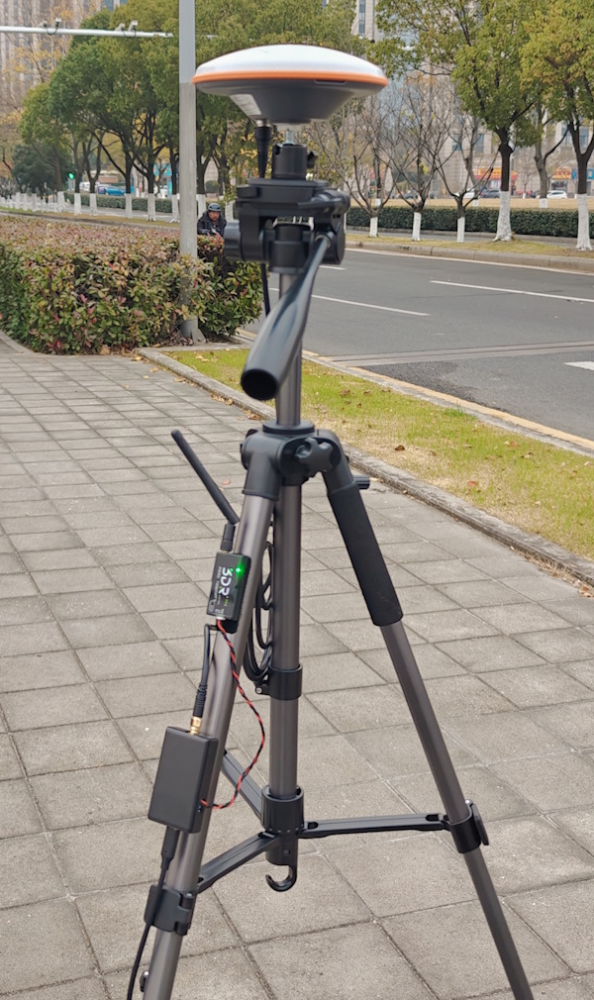
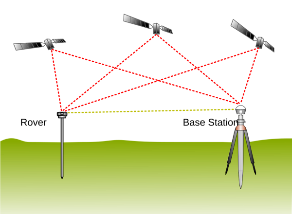
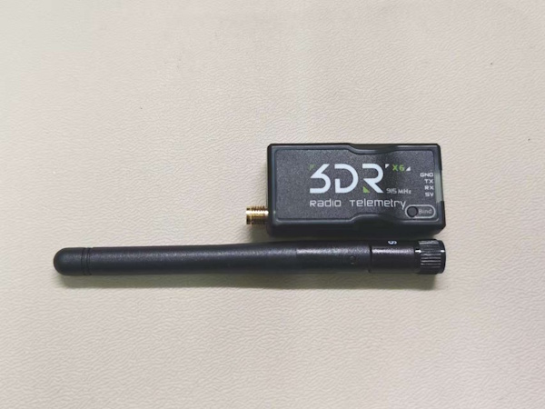
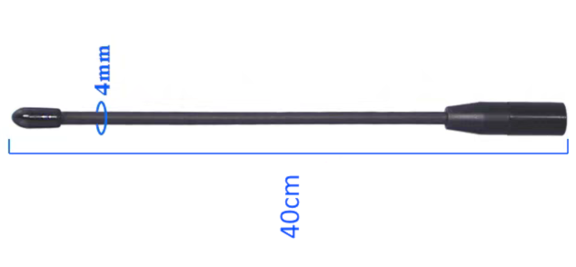
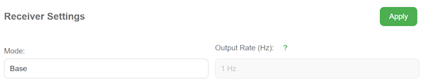
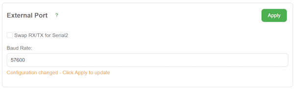
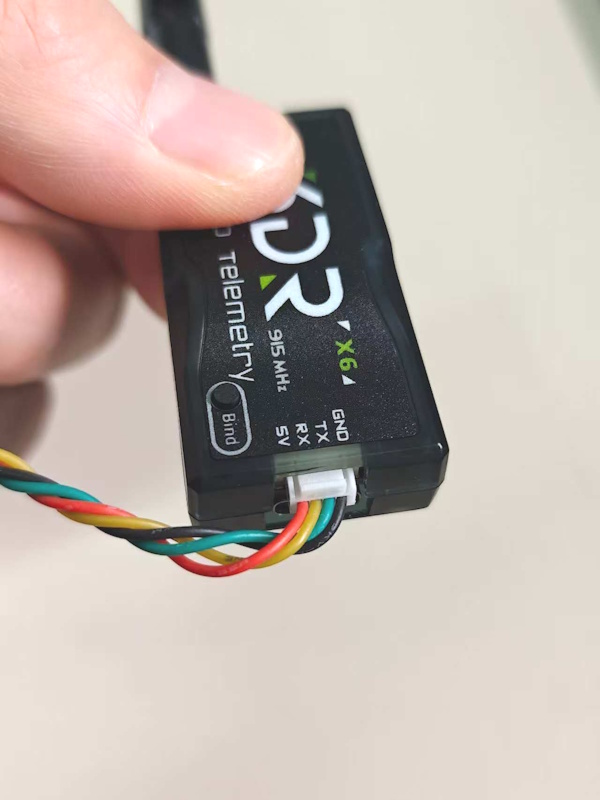
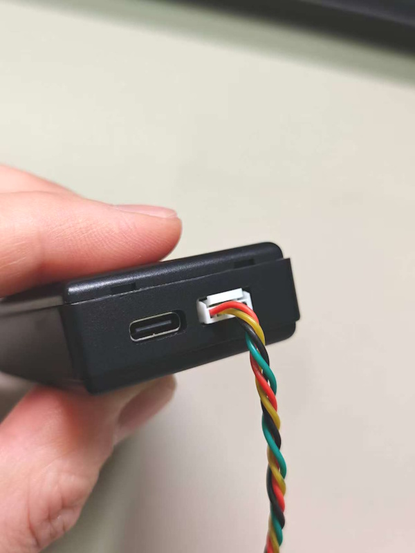
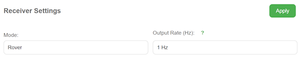
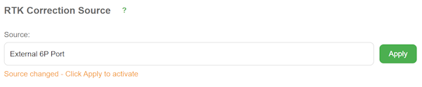

# Setup owned base station

## Overview

[Order link](https://www.datagnss.com/collections/evk/products/multi-band-rtk-receiver-package?variant=40933450809379)

The NANO RTK Receiver can be conveniently used for surveying and mapping applications. It supports RTK positioning, providing real-time centimeter-level accuracy.
It is compatible with common free surveying and mapping software like SW Maps and Mapit GIS.

However, to achieve high-precision RTK positioning, base station data services are required. If there are service providers in your area, that's great; you just need to pay to activate an account. They will provide you with a set of server information and an access account, allowing you to obtain their data in real-time and thus perform RTK positioning.

If not, or if you want to use your own, that's also fine. You can establish your own base station.





By <a href="//commons.wikimedia.org/wiki/User:Kavelgrisen" title="User:Kavelgrisen">TS Eriksson</a> - <span class="int-own-work" lang="en">Own work</span>, <a href="https://creativecommons.org/licenses/by-sa/4.0" title="Creative Commons Attribution-Share Alike 4.0">CC BY-SA 4.0</a>, <a href="https://commons.wikimedia.org/w/index.php?curid=98134945">Link</a>


Of course, based on this diagram, if we want to perform RTK positioning, we need to obtain data from the base stations on the rover device. If we need owned base stations, we have to consider how to transfer the data from the base stations to the rover devices.

The network aspect is relatively simple; we can use a server (such as ntrip caster) to upload the base station data to a remote caster, and then our rover device can retrieve the data from the remote server. This seems feasible. 

However, our data would have to be transmitted from our home to a server that may be located thousands of kilometers away, and then the rover device would need to fetch the data from that same remote server. If the network is good, the latency will be low and acceptable. But if the network is poor, the data transmission delay time could be significant.

The biggest advantage of this approach is that once the base stations are set up, we can perform fieldwork even dozens of kilometers away from them. Generally, the effective coverage of RTK base stations can reach several dozen kilometers, although it’s best to be within 15 kilometers.

However, if you are only working within a range of 1-2 kilometers near your home, then the need for data transmission back and forth may not be as essential. In that case, we could use telemetry radio to transfer the data directly.

## Hardware

For this setup you'll need:

- 2 × NANO RTK Receivers  
- 2 × RTK antennas  
- 2 × Telemetry radios (paired)  
- cables

If you bought a set kits, simply connect by port type — if the connectors fit, it usually works without issues.

Check the label on your Telemetry radios for the communication baud rate — this is important because the baud rate must match the NANO device’s corresponding port for communication to work.

The picture below shows a pair of Telemetry radios with two antennas: one long antenna (~40 cm) with about 15 dB gain (typically used for transmitting at the base station), and one short antenna (~12cm) with about 5 dB gain (used on the receiving end).


(Telemetry radio with 5dB gain radio antenna)


(15dB gain radio antenna)


## Quick use

### Base station configuration

- Configure one NANO RTK as the **Base** via its web interface (select **Base Mode**).  




- In **Settings**, find **External 6P Port** and set its baud rate to match your radio’s baud rate (for example, **57600**) then **Apply**.  



- Unless you made your own cable and know what you’re doing, **ignore the “Swap Rx/Tx” option**.  

- Connect the NANO RTK’s 6P port (next to the USB port) to the Radio’s port (also next to the radio’s USB port) using the supplied cable.  






- Mount the NANO RTK and the RTK antenna. For base stations we recommend an **AT400** antenna.  

- If the base is mounted outdoors (roof, etc.), fix the antenna outside and route the antenna cable indoors. The radio antenna can also be mounted outside and cabled indoors.  
- Power the NANO via USB (power bank or AC adapter). For long-term operation we recommend using a power bank connected to mains power as a UPS-like arrangement.  
- Once everything is set, the Telemetry radio’s transmit LED should blink, indicating it’s actively transmitting data.

### Rover configuration

- Configure the rover NANO via the web interface to **Rover mode** (this is the factory default, so just check it).  



- Set **RTK Correction source** to **External 6P Port** and **Apply**.  



- In **External 6P Port**, set the baud rate to the radio’s labeled baud rate (e.g., **57600**) and **Apply**.  


- From the home page you can check the positioning status — if configured correctly, the rover typically reaches **RTK Fixed** within ~30 seconds.

### Configuration checkpoints ⚠️

1. **Baud rate** — This is critical. Both ends of each interface must use the same baud rate for correct data transfer. Ensure the baud rate between NANO ↔ External Port ↔ Telemetry Radio is identical.

```
For base: NANO RTK (Base mode) -- External Port (57600) -- (57600) Telemetry Radio
For rover: Telemetry Radio (57600) -- (57600) External Port -- NANO RTK (Rover mode)
```

2. For a NANO RTK Rover using a Telemetry radio to receive base data, make sure **RTK Correction Source** is set to **External Port** so the NANO knows to read corrections from that port.

3. To increase telemetry range, mount the radio antenna as high as reasonably possible.


