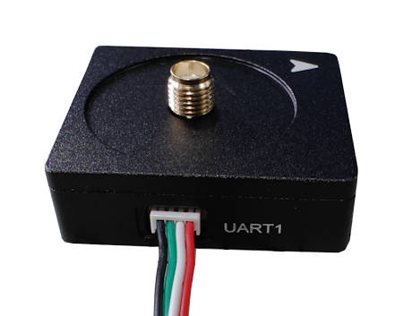
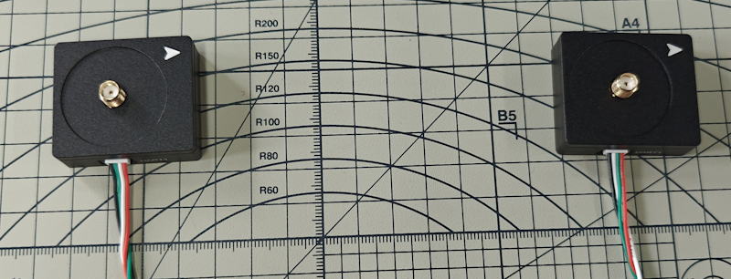
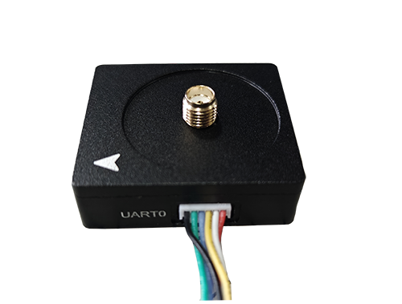

## Quick guide

### Preparation

The HED-10K Kit includes the following:

- HED-10M-K *1
- HED-10S-K *1
- 4P-125-GH-150 cable *1
- 6P *1
- Helix Antenna *2

By default, the communication baud rate for both UART interfaces of the product you receive is set to 230400 bps.  

UART0 is used for data output (NMEA, heading data), while UART1 is used for internal RTK Heading data transmission, which generally does not require user intervention.

The HED-10M-K serves as the primary receiver for data output, whereas the HED-10S-K is used as an auxiliary device. In most cases, you only need to connect to its UART1 interface with the 4P cable.

Normally, we also include a 4P USB serial cable and a 6P-GH Dupont test board.

The following image shows how to connect the USB serial cable to the Dupont test board.

For the USB serial cable, on the Dupont connector side, red is 5V, black is GND, green is Tx, and white is Rx.

### Device Connection

The 4P cable is used to connect the UART1 ports of the HED-10M-K and HED-10S-K. Simply plug it in until you hear a click, indicating a successful connection.

The 4P cable is 1 meter long, so we recommend placing the two antennas no more than 1 meter apart.

Upon closer inspection, you will notice that the Tx and Rx pins on the two ends of the 4P connector are swapped. This connects the UART ports of the two RTK modules for communication.

### Installation

Refer to the image below for installation. It is recommended to maintain a minimum distance of 1 meter between the antennas. The greater the distance, the higher the heading accuracy.

The HED-10S-K should point in the direction of the bow of the ship, which is the heading direction.

If the installation distance exceeds 1 meter, you will need to prepare a longer 4P cable yourself. Alternatively, you can consult us when placing your order.

### Data Output

Heading and positioning data are output from the UART0 port of the HED-10M-K. The UART0 pinout is as follows:

You can connect it to your device using the 6P connector. Alternatively, you can use the included USB serial cable for testing output.

Refer to the image above for the connection method between the USB serial cable and the 6P Dupont test board.

### Protocol

Please refer to [Heading Protocol](../rtk_receiver/HED-10L)

### Testing

If the installation distance between the two devices is approximately 1 meter, no configuration is required. Simply power them on to use.

Note that data output is from the UART0 port of the HED-10M-K.

If you are using Windows, you can test with the Satrack software. In Satrack, open the "Baseline Information" window to view the data.
