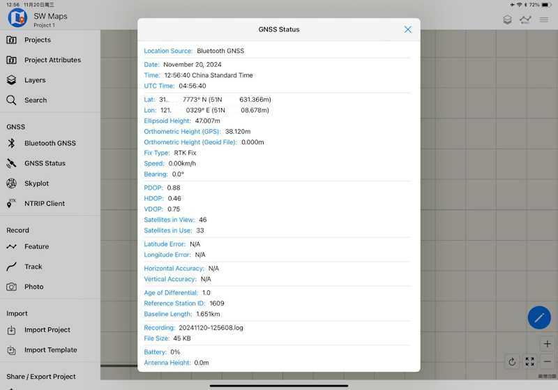

## Overview

The NANO RTK Receiver can be conveniently used for surveying and mapping applications. It supports RTK positioning, providing real-time centimeter-level accuracy.
It is compatible with common free surveying and mapping software like SW Maps and Mapit GIS.

The NANO RTK Receiver surveying kit offers an out-of-the-box solution for mapping applications.

## Features

- Support RTK positioning
- Support GPS, GLONASS, BDS, Galileo, QZSS, SBAS
- Support Telemetry Radio (optional)
- Support PPK post-processing
- Support iPhone / iPad, Android
- Compatible with SW Maps, Mapit GIS, etc.
- NANO RTK Receiver can be powered directly by Android devices or iPad, no additional power-bank needed
  
We provide an OTG cable, which can be used to connect NANO RTK Receiver to Android devices.
On iPhone / iPad, the OTG cable can support power from iPad / iPhone, no additional power-bank needed.

**Please note that this OTG cable has two Type C interfaces on both ends, but it is not a normal USB Type C cable. It supports device connection on Android devices. Or it can be powered the NANO RTK Receiver from iPhone / iPad.**

## With Android devices

On Android devices, NANO RTK Receiver can be used as a USB device, supporting USB serial mode.
We strongly recommend using USB Serial mode on Android devices to ensure stable and reliable data collection.

If you purchase the surveying kit, you will receive the following components:

- NANO RTK Receiver
- OTG Cable
- Handheld Tripod

Using SW Maps as an example, the steps to use NANO RTK Receiver for measurement and mapping are as follows:

1. Select "**USB Serial GNSS**"

2. GNSS Receiver Settings

If your SW Maps doesn't have the "**NANO RTK**" option, you can select "**ublox RTK**" instead, as they are compatible.

3. Config **NTRIP connection**

If you select the instrument type as RTK, the left toolbar will display an "**NTRIP Connection**" option, used to input NTRIP information.

Then Press "**Connect**" to establish the connection.

## With iPhone / iPad

### for iPhone

If you use an iPhone, you can use the installation method shown in the figure 1 directly.

### for iPad

If you use an iPad, you can use the installation method shown in the figure 2 directly.

First, attach the 3M adhesive tape provided with the kit to the back side of the iPad. Note the usage habits, usually sticking to the upper right position of the back side of the iPad, and pay attention not to block the camera.

Then, connect NANO RTK Receiver to the iPad via the OTG cable.

### Connection

On iPad / iPhone, you can only use the Bluetooth connection method to connect.

In SW Maps, select "Bluetooth GNSS" to connect.

On iPad / iPhone, we need to use the BLE mode to connect, as shown in the figure below:

## Field Work Gallery

