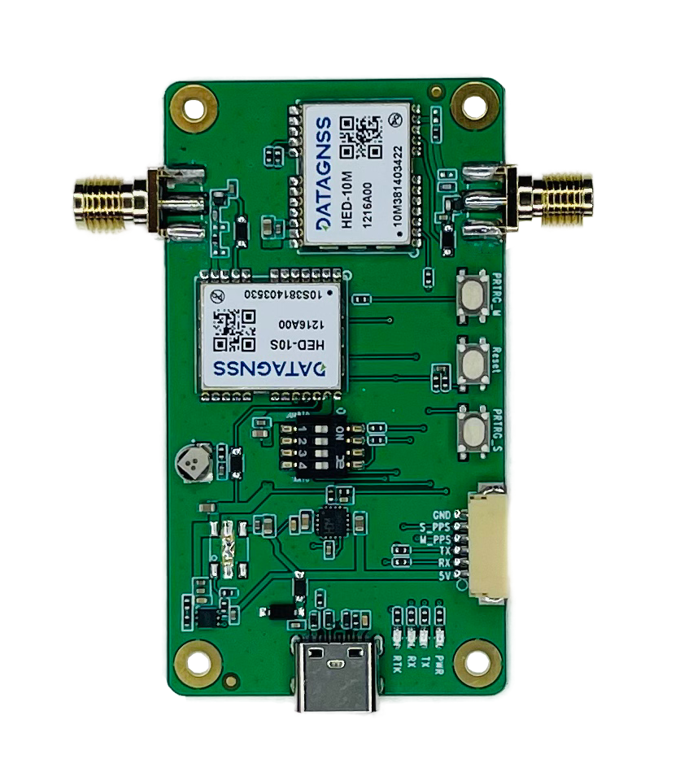
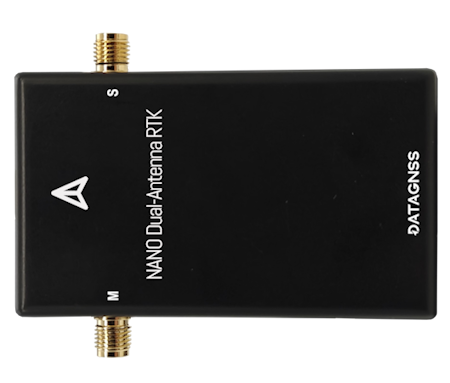
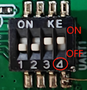
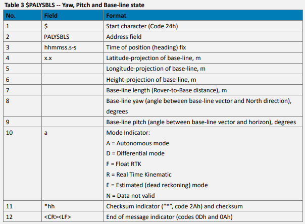
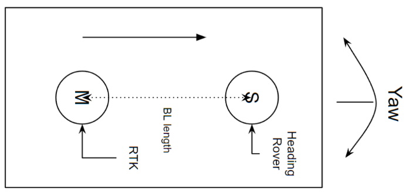
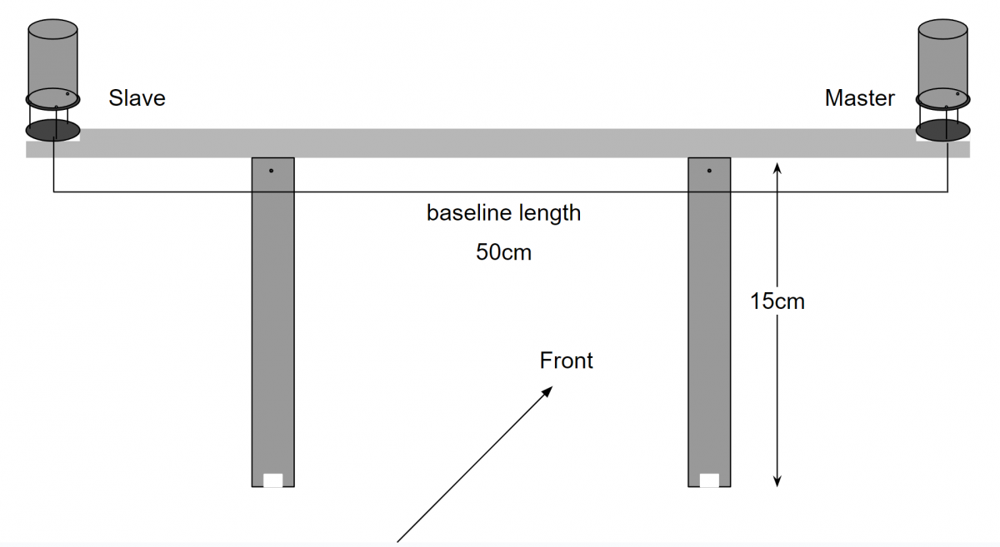
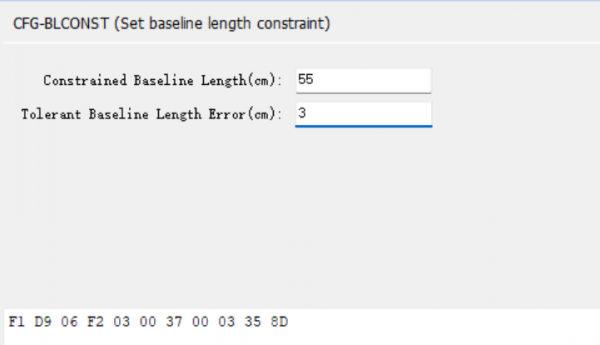

## Overview

## NANO Dual-Antenna RTK Receiver

### PINOUT

6P 1.25mm connector (from left to right):

- GND
- NC
- PPS
- Rx
- Tx
- VCC

>**Note:** On the V1.0 version of the board, if you need to use a 6P connector, please note: The Rx position is printed as NC, and it is usually connected by flying wire to the module's Rx. 
>This issue will be corrected in subsequent versions of the board after 1.0.
>At this time, Type C can only be used for data output.

NOTE: If using Type C as the main input/output port, please switch DIP 4-switch to the OFF position. 
If using 6P connector as the main input/output port, then switch DIP 4-switch to the ON position.

However, in general, it will be pre-set at the factory and usually does not need to be handled.

### Protocol 

**PALYSBLS Message** for heading data

>$PALYSBLS,025217.000,-0.577,1.030,0.782,1.416,119.25,33.55,F*4A

### How to Install

#### Installation

The figure below is a typical installation method for UAV, where the baseline length is the distance between the centers of two antennas, which needs to be measured to obtain this value.

#### Config baseline

After installation, the baseline length needs to be configured.

Then open [Satrack software](../../../assets/software/satrack_latest.zip) , "View" - "AS Message View", choose "CFG-BLCNST" to config the baseline length and tolerant like below screenshot, then press "send":

>If the distance between the two antennas remains unchanged, this setting only needs to be done once.

#### Configuration for Ardupilot

If we install according to the diagram above, the dimensions are also as shown in the picture.
The parameters of Ardupilot need to be set as follows:

GPS_POS1_X = 0
GPS_POS1_Y = +0.25
GPS_POS1_Z = -0.14

>We used self-compiled firmware for the above test, as the standard official AP firmware does not yet support this module.

## Resources

- [HED-10L-datasheet](../../../assets/datasheet/HED-10L-DATASHEET-00.pdf)
- [AN2024-HED10L-001](../../../assets/datasheet/AN-HED10L-240927.pdf)
- [Allystar GNSS binary protocol](../../../common/common_allystar_binary_protocol.md)
