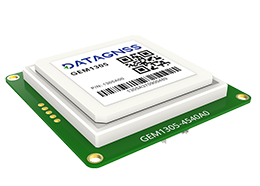

Welcome to support center

 
 
 Choose your device 

 [{: style="width: 260px;margin-right:20px;"} ](https://wiki.datagnss.com/index.php/GEM1305)
 [{: style="width: 260px;"} ](https://wiki.datagnss.com/index.php/EVK-DG-1206)

 - Download the latest Satrack [v1.31.007](rtk-board/files/Satrack_client_V1.31.007.zip) 
 - [CP210x Windows Drivers](rtk-board/files/CP210x_Universal_Windows_Driver.zip) 
 - CH34x Windows Drivers [Windows](rtk-board/files/drivers/Windows-CH340-Driver.zip) / [Mac](rtk-board/files/drivers/CH341SER_MAC.ZIP) / [Linux](rtk-board/files/drivers/CH341SER_LINUX.ZIP) 
 - Virtual Com Port [com0com Windows Drivers](rtk-board/files/com0com-3.0.0.0-i386-and-x64-signed.zip)

   
